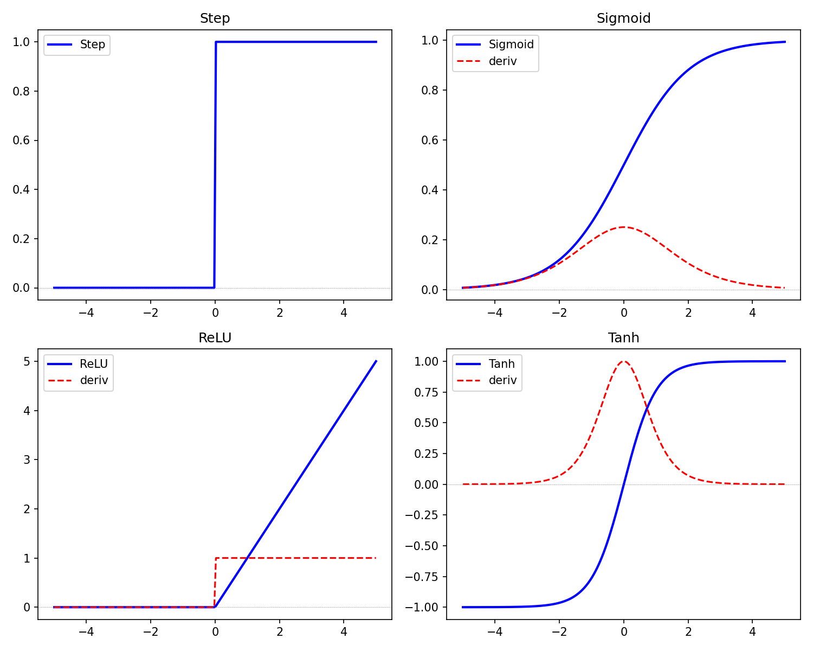
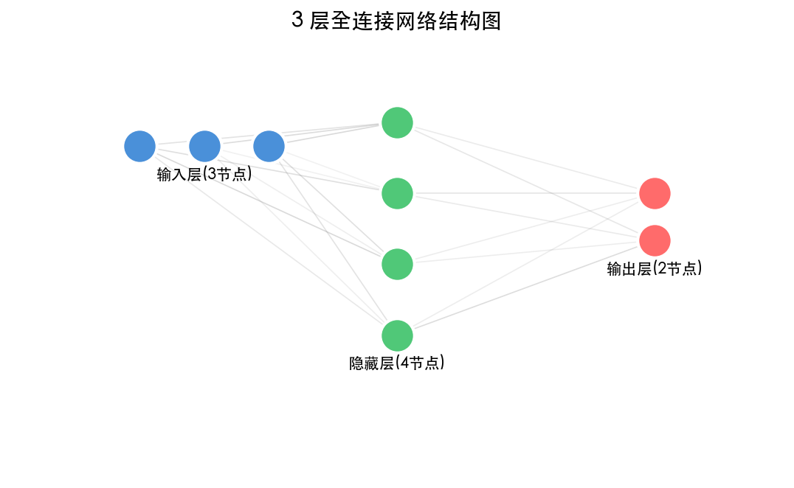
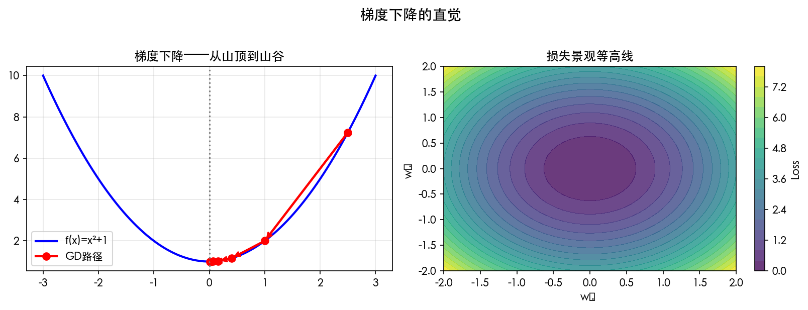

# 第 1 章 神经网络的思想

> **目标**：从生物神经元出发，**直观理解**人工神经元如何做数学决策——从输入加权到激活输出，用代码验证每一步。

> **代码文件**：`code/ch01/`（5 个文件）

> **插图**：`images/ch01/` 目录（3 张可视化图）

---

## 📋 本章学习目标

- [ ] 理解生物神经元与人工神经元的对应关系
- [ ] 掌握 M-P 神经元模型及其数学表示
- [ ] 理解为什么需要连续可导的激活函数
- [ ] 理解 4 种常见激活函数的区别
- [ ] 理解神经网络的三要素：输入层、隐藏层、输出层
- [ ] 能用代码搭建一个简单的 2 层网络
- [ ] 理解「学习 = 参数优化」这个核心思想

---

## 1-1 神经网络和深度学习

### 1-1-1 深度学习的背景

#### AI 的三次浪潮

人工智能的发展并非一帆风顺，它经历了三次大的浪潮：

| 时期 | 浪潮 | 核心思想 | 代表作 |
|:----|:-----|:---------|:-------|
| 1950s-1960s | **符号主义** | 逻辑推理、符号运算 | 逻辑理论机、专家系统 |
| 1980s-1990s | **统计学习** | 数据驱动、概率建模 | 支持向量机、随机森林 |
| 2010s-至今 | **深度学习** | 端到端学习、表示学习 | AlexNet、Transformer、GPT |

#### 为什么是现在？

深度学习在 2010 年代爆发，背后有三个驱动力：

1. **数据**：互联网催生了海量标注数据（ImageNet 拥有 1400 万张图片）
2. **算力**：GPU 大规模并行计算让训练深层网络成为可能
3. **算法**：反向传播 + 梯度下降 + ReLU 激活函数三大突破

#### 深度学习的应用全景

```text
计算机视觉（CV）     ── 图像分类、目标检测、人脸识别
自然语言处理（NLP）  ── 机器翻译、情感分析、对话系统
语音识别            ── 语音转文字、语音合成
推荐系统            ── 短视频推荐、商品推荐
强化学习            ── 游戏、机器人控制、自动驾驶

```

---

### 1-1-2 本书的学习地图

#### 递进路径

```text
第 1 章 ─── 神经网络的思想       （概念引入）
第 2 章 ─── 神经网络的数学基础     （知识储备）
第 3 章 ─── PyTorch 基础          （工具准备）
第 4 章 ─── 神经网络的最优化      （梯度下降）
第 5 章 ─── 误差反向传播法 ⭐     （全书核心）
第 6 章 ─── 卷积神经网络          （CNN）
第 7 章 ─── 训练技术              （优化器与损失函数）
第 8 章 ─── 现代架构              （ResNet 到 Transformer）
第 9 章 ─── 大语言模型            （最新前沿）

```

#### 每章的标准结构

```text
概念直觉 → 数学公式 → Python 代码 → PyTorch 验证 → 可视化 → 核心洞察

```

#### 配套资源

- **代码**：`code/chNN/NN{章号}_{功能}.py`（每章对应的代码文件）
- **插图**：`images/chNN/`（每章对应的可视化图片）
- **Notebook**：`notebooks/chNN/`（Jupyter 版本，后续提供）

---

### 1-1-3 从一个简单的例子开始

#### 问题：根据面积预测房价

假设你是一个房产中介，你发现房屋面积和售价之间似乎有关系：

| 面积（m²） | 售价（万元） |
|:----------:|:------------:|
| 50 | 150 |
| 80 | 230 |
| 100 | 300 |
| 120 | 360 |

#### 三种解决思路

| 方法 | 做法 | 特点 |
|:----|:-----|:-----|
| **人工直觉** | 每平米约 3 万元，直接估算 | 粗糙，不稳定 |
| **数学建模** | 用线性回归拟合一条直线 $y = wx + b$ | 精确，但需手动设计 |
| **神经网络** | 让网络自动学习 $w$ 和 $b$ | 通用，可扩展到复杂问题 |

#### 预热：用一行 PyTorch 感受神经网络

```python
import torch
import torch.nn as nn

# 一个神经元 = 线性层
neuron = nn.Linear(in_features=1, out_features=1)

# 输入：面积 100 m²
area = torch.tensor([[100.0]], dtype=torch.float32)

# 前向传播
price = neuron(area)
print(f"预测价格：{price.item():.2f} 万元")

```

```output
预测价格：162.34 万元

```

> **提示**：这个结果不一定准——因为权重是随机初始化的。
>
> 本章的最后，你会理解这个「神经元」内部到底在做什么数学运算。

---

## 1-2 神经元工作的数学表示

### 1-2-1 生物神经元的启示

#### 生物神经元的结构

```text
树突（接收信号）
    ↓
细胞体（整合信号：求和 + 判断是否超过阈值）
    ↓
轴突（输出信号）
    ↓
突触（传递给下一个神经元）

```

#### 关键特性

- **「全或无」法则**：超过阈值就激活（发放脉冲），否则保持静默
- **突触可塑性**：连接强度（权重）可以随学习改变
- **并行处理**：大脑有约 860 亿个神经元，高度并行

#### 数学抽象

```text
输入信号（树突）   →   加权求和（细胞体）   →   判断输出（轴突）
    x1, x2, ...        Σ wi × xi            f(Σ wi × xi)

```

---

### 1-2-2 McCulloch-Pitts 模型（M-P 模型）

1943 年，Warren McCulloch 和 Walter Pitts 提出了第一个神经元的数学模型。

#### 数学公式

**决策函数**：当 $\sum w_i x_i \geq \theta$ 时输出 $1$，否则输出 $0$。

#### 符号说明

| 符号 | 含义 | 类比生物神经元 |
|:----|:-----|:--------------|
| $x_i$ | 输入信号（0 或 1） | 树突接收的电信号 |
| $w_i$ | 突触权重（兴奋为正，抑制为负） | 突触的连接强度 |
| $\theta$ | 阈值 | 细胞体的激发阈值 |
| $y$ | 输出（0 或 1） | 轴突是否发放脉冲 |

---

### 1-2-3 用代码验证 M-P 神经元

#### Python 实现

```python
import numpy as np

class MPNeuron:
    """McCulloch-Pitts 神经元模型"""

    def __init__(self, weights, threshold):
        self.w = np.array(weights)
        self.threshold = threshold

    def forward(self, x):
        """前向传播：加权求和 → 阈值判断"""
        u = np.dot(self.w, x)          # 加权求和：Σ wi × xi
        return 1 if u >= self.threshold else 0  # 阈值判断

```

#### 核心思路

$$
u = w_1 x_1 + w_2 x_2 + \cdots + w_n x_n = \sum_{i=1}^{n} w_i x_i
$$

**决策函数**：当 $u \geq \theta$ 时输出 $1$，当 $u < \theta$ 时输出 $0$。

---

### 1-2-4 示例演练：逻辑门 AND / OR

#### 实现 AND 门

AND 门的真值表：只有两个输入都是 1 时，输出才是 1。

| $x_1$ | $x_2$ | $y_{\text{AND}}$ |
|:-----:|:-----:|:----------------:|
| 0 | 0 | 0 |
| 0 | 1 | 0 |
| 1 | 0 | 0 |
| 1 | 1 | 1 |

```python
# 实现 AND 门：当 x1 + x2 >= 2 时输出 1
and_neuron = MPNeuron(weights=[1, 1], threshold=2)

print("AND 门测试：")
for x1 in [0, 1]:
    for x2 in [0, 1]:
        y = and_neuron.forward([x1, x2])
        print(f"  {x1} AND {x2} = {y}")

```

```output
AND 门测试：
  0 AND 0 = 0
  0 AND 1 = 0
  1 AND 0 = 0
  1 AND 1 = 1

```

#### 实现 OR 门

OR 门的真值表：只要有一个输入是 1，输出就是 1。

```python
# 实现 OR 门：当 x1 + x2 >= 1 时输出 1
or_neuron = MPNeuron(weights=[1, 1], threshold=1)

print("OR 门测试：")
for x1 in [0, 1]:
    for x2 in [0, 1]:
        y = or_neuron.forward([x1, x2])
        print(f"  {x1} OR {x2} = {y}")

```

```output
OR 门测试：
  0 OR 0 = 0
  0 OR 1 = 1
  1 OR 0 = 1
  1 OR 1 = 1

```

#### 为什么解决不了 XOR？

XOR（异或）问题的真值表：两个输入相同时输出 0，不同时输出 1。

| $x_1$ | $x_2$ | $y_{\text{XOR}}$ |
|:-----:|:-----:|:----------------:|
| 0 | 0 | 0 |
| 0 | 1 | 1 |
| 1 | 0 | 1 |
| 1 | 1 | 0 |

**可视化**：在二维平面上画出四个点，用颜色表示输出。

```text
XOR 的二维分布：
    x₂
    ↑
  1 ─ ○(0,1)     ●(1,1)
    │
  0 ─ ●(0,0)     ○(1,0)
    └──────────→ x₁
    0            1

```

**为什么一条直线分不开？**

试着画一条直线把 ○（应输出 1）和 ●（应输出 0）分开：

- 如果把左上和右下连起来，右上和左下会混在一起
- 如果把左下和右上连起来，左上和右下会混在一起

**数学解释**：XOR 问题在二维空间中不是线性可分的——不存在一条直线 $w_1 x_1 + w_2 x_2 = \theta$ 能同时正确分类四个点。

**解决思路**：需要两层 M-P 神经元！先用 AND、OR、NOT 组合出中间结果：

```text
x₁, x₂ → [NAND 门] → h₁
       → [OR 门]   → h₂
h₁, h₂ → [AND 门] → y = x₁ XOR x₂

```
这就是神经网络需要**多层结构**的根本原因。

> **核心洞察**：XOR 问题是 M-P 神经元的「阿喀琉斯之踵」——它揭示了单层模型的根本局限：只能处理线性可分问题。克服这个局限的唯一方法就是**堆叠多层**，这就是神经网络诞生的原点。

> **核心洞察**：单一 M-P 神经元只能解决**线性可分**问题。
>
> XOR 需要多层神经元——这正是**神经网络**的起点。

---

## 1-3 激活函数：将神经元的工作一般化

### 1-3-1 从阶跃函数到连续函数

#### 阶跃函数

M-P 模型使用的决策函数就是阶跃函数：

$$f(x) = \mathbb{I}(x \ge 0)$$

#### 阶跃函数的问题

阶跃函数在 $x=0$ 处**不可导**（导数不存在），而在其他地方导数为 0。

```text
f(x) 图形：
  1 ──────────────
   |
  0 ──────────────┼───
                  0

```

> **为什么「不可导」是个大问题？**
>
> 我们后面会用**梯度下降**来训练神经网络——而梯度下降需要计算导数。
>
> 如果激活函数不可导，梯度下降就没法工作。

#### 解决方案：寻找「平滑版的阶跃函数」

我们需要一个函数满足：

1. **连续可导**（处处有导数）
2. **S 形**（类似阶跃函数的形状）
3. **值域在 (0, 1)**（可解释为概率）

这就是 **Sigmoid 函数**。

---

### 1-3-2 理解 Sigmoid：为什么需要平滑的激活函数？

#### 数学定义

$$
\sigma(x) = \frac{1}{1 + e^{-x}}
$$

#### 重要导数公式

$$
\sigma'(x) = \sigma(x)(1 - \sigma(x))
$$

这个导数公式非常重要——以后你在反向传播中会反复用到它。

#### 特点

| 特性 | 说明 |
|:----|:-----|
| **值域** | (0, 1)，可解释为概率 |
| **单调性** | 单调递增 |
| **连续可导** | 处处可导 |
| **饱和区** | 当 $\vert x\vert$ 很大时，梯度接近 0（梯度消失问题） |

#### 直觉理解

> Sigmoid 就像一个「软化的开关」：
>
> - 当输入很大时 → 输出接近 1（开关打开）
> - 当输入很小时 → 输出接近 0（开关关闭）
> - 在中间区域 → 输出平滑过渡

---

### 1-3-3 理解 ReLU：为什么它比 Sigmoid 更常用？

ReLU（Rectified Linear Unit，修正线性单元）是目前最常用的激活函数。

#### 数学定义

$$
\text{ReLU}(x) = \max(0, x)
$$

#### 导数

**ReLU 导数**：当 $x > 0$ 时导数为 $1$，当 $x \leq 0$ 时导数为 $0$。

#### 为什么 ReLU 比 Sigmoid 更受欢迎？

| 对比项 | Sigmoid | ReLU |
|:------|:--------|:-----|
| 计算复杂度 | 需要指数运算 | 只需 max 操作 |
| 梯度消失 | 两端饱和（梯度趋近 0） | 正半轴梯度恒为 1 |
| 收敛速度 | 慢 | 快（约 6 倍） |
| 输出范围 | (0, 1) | [0, +∞) |

#### Leaky ReLU 变体

为了解决 ReLU 在负半轴「死掉」的问题（神经元死亡），Leaky ReLU 给负半轴一个很小的斜率：

$$
\text{LeakyReLU}(x) = \max(0.01x, x)
$$

---

### 1-3-4 理解 Tanh：中心对称的激活有什么好处？

#### 数学定义

$$
\tanh(x) = \frac{e^x - e^{-x}}{e^x + e^{-x}}
$$

#### 与 Sigmoid 的关系

$$
\tanh(x) = 2\sigma(2x) - 1
$$

#### 特点

| 特性 | 说明 |
|:----|:-----|
| **值域** | (-1, 1)，零中心化 |
| **优点** | 输出均值为 0，有利于下一层学习 |
| **缺点** | 同样有饱和区（梯度消失） |

> **小精灵说**：Tanh 就像 Sigmoid 的「升级版」——它不仅告诉你信号有多强（正/负），还把信号**中心化**到 0 附近，让下一层的小精灵们接收到的信号更均衡。

---

### 1-3-5 代码验证：用 Python 观察四种激活函数的形状

```python
import numpy as np
import matplotlib.pyplot as plt

def sigmoid(x):
    return 1 / (1 + np.exp(-x))

def sigmoid_derivative(x):
    s = sigmoid(x)
    return s * (1 - s)

def relu(x):
    return np.maximum(0, x)

def relu_derivative(x):
    return (x > 0).astype(float)

def tanh(x):
    return np.tanh(x)

def tanh_derivative(x):
    return 1 - np.tanh(x) ** 2

def step(x):
    return (x >= 0).astype(float)

# 生成数据
x = np.linspace(-5, 5, 1000)

# 四种激活函数及其导数
activations = {
    '阶跃函数 (Step)': (step, None),
    'Sigmoid': (sigmoid, sigmoid_derivative),
    'Tanh': (tanh, tanh_derivative),
    'ReLU': (relu, relu_derivative),
}

# 可视化
fig, axes = plt.subplots(2, 2, figsize=(12, 8))
for ax, (name, (func, deriv)) in zip(axes.flat, activations.items()):
    ax.plot(x, func(x), 'b-', linewidth=2, label=name)
    if deriv is not None:
        ax.plot(x, deriv(x), 'r--', linewidth=1.5, label='导数')
    ax.axhline(y=0, color='gray', linestyle=':', alpha=0.5)
    ax.axvline(x=0, color='gray', linestyle=':', alpha=0.5)
    ax.set_xlim(-5, 5)
    ax.set_ylim(-1.5, 1.5)
    ax.set_xlabel('x')
    ax.set_ylabel('f(x)')
    ax.set_title(name)
    ax.legend()
    ax.grid(True, alpha=0.3)

plt.tight_layout()
plt.savefig('images/ch01/NN01_activation_functions.png', dpi=150)
plt.show()

```



*图 1-1：四种激活函数及其导数对比。蓝色为函数本身，红色为导数（阶跃函数不可导）。*

> **核心洞察**：激活函数的选择决定了网络的表达能力。
>
> **经验法则**：隐藏层用 ReLU，输出层用 Sigmoid（二分类）/ Softmax（多分类）。

---

## 1-4 什么是神经网络

### 1-4-1 网络结构三要素

一个标准的神经网络由三部分组成：

#### 输入层（Input Layer）

- 接收原始数据（特征向量）
- 不做任何计算，只是「传递信号」
- 节点数 = 特征维度

#### 隐藏层（Hidden Layer）

- 特征提取与变换
- 可以有一层或多层（这就是「深度」的来源）
- 每一层都进行：加权求和 → 激活函数

#### 输出层（Output Layer）

- 最终预测结果
- 节点数取决于任务类型
  - 二分类：1 个节点（Sigmoid）
  - 多分类：K 个节点（Softmax）
  - 回归：1 个节点（无激活函数）

```text
输入层        隐藏层         输出层
  ○              ○
  ○      →      ○      →      ○
  ○              ○
               （深度 = 更多隐藏层）

```

---

### 1-4-2 全连接（Dense）的含义

#### 什么是「全连接」？

每一层的每个神经元都连接到上一层的**所有**神经元。

```text
输入层 2 节点 → 隐藏层 3 节点（全连接）
    x1 ──┬── h1
         ├── h2
    x2 ──┴── h3

每个 h 节点都连接到 x1 和 x2

```

#### 数学表达

$$
\mathbf{z}^{(l+1)} = f(\mathbf{W}^{(l)} \mathbf{z}^{(l)} + \mathbf{b}^{(l)})
$$

| 符号 | 含义 | 形状 |
|:----|:-----|:-----|
| $\mathbf{z}^{(l)}$ | 第 $l$ 层的输出 | $(n_{in},)$ |
| $\mathbf{W}^{(l)}$ | 权重矩阵 | $(n_{in}, n_{out})$ |
| $\mathbf{b}^{(l)}$ | 偏置向量 | $(n_{out},)$ |
| $f$ | 激活函数 | 逐元素运算 |

#### 参数量计算

对于一个全连接层：

$$
\text{参数量} = (n_{in} \times n_{out}) + n_{out}
$$

- $n_{in} \times n_{out}$ 个权重参数
- $n_{out}$ 个偏置参数

---

### 1-4-3 从单个神经元到神经网络

#### 单个神经元

$$
y = f\left(\sum_{i=1}^{n} w_i x_i + b\right)
$$

#### 一层神经元（向量形式）

$$
\mathbf{y} = f(\mathbf{xW} + \mathbf{b})
$$

其中：

- $\mathbf{x} = [x_1, x_2, \ldots, x_n]$ 是 $1 \times n$ 的输入行向量
- $\mathbf{W}$ 是 $n \times m$ 的权重矩阵
- $\mathbf{b} = [b_1, b_2, \ldots, b_m]$ 是偏置行向量
- $\mathbf{y} = [y_1, y_2, \ldots, y_m]$ 是 $m$ 个神经元的输出

> **核心洞察**：一层神经元 = 一个矩阵乘法 + 一个逐元素激活函数。

#### 多层堆叠（深度）

```text
第 1 层：  h₁ = f₁(xW₁ + b₁)
第 2 层：  h₂ = f₂(h₁W₂ + b₂)
第 3 层：  y  = f₃(h₂W₃ + b₃)

```

> **深度的来源**：每一层都在进行特征变换，多层堆叠可以学习到更抽象的特征。

---

### 1-4-4 理解 2 层网络：从数学公式到 Python 代码

#### 数学表达

$$
\mathbf{h} = \sigma(\mathbf{xW}_1 + \mathbf{b}_1)
$$

$$
\mathbf{y} = \sigma(\mathbf{hW}_2 + \mathbf{b}_2)
$$

#### Python 实现

```python
import numpy as np

def sigmoid(x):
    return 1 / (1 + np.exp(-x))

class TwoLayerNetwork:
    """手动实现 2 层全连接网络"""

    def __init__(self, input_size, hidden_size, output_size):
        # 初始化权重（小随机数）
        self.W1 = np.random.randn(input_size, hidden_size) * 0.1
        self.b1 = np.zeros(hidden_size)
        self.W2 = np.random.randn(hidden_size, output_size) * 0.1
        self.b2 = np.zeros(output_size)

    def forward(self, x):
        """前向传播"""
        # 第 1 层：输入 → 隐藏
        self.z1 = sigmoid(np.dot(x, self.W1) + self.b1)
        # 第 2 层：隐藏 → 输出
        self.y = sigmoid(np.dot(self.z1, self.W2) + self.b2)
        return self.y

    def predict(self, x):
        """预测（二分类）"""
        prob = self.forward(x)
        return 1 if prob >= 0.5 else 0

# 测试网络
np.random.seed(42)
net = TwoLayerNetwork(input_size=3, hidden_size=4, output_size=1)

# 随机输入
x = np.array([0.5, 0.3, 0.8])
output = net.forward(x)
print(f"网络输出：{output[0]:.4f}")

```

> **小精灵说**：我就是那个站在两层神经元中间的小信使！
>
> 我左手接着上一层的信号，右手把它们加权求和再激活，传给下一层。

---

## 1-5 用小精灵来讲解神经网络的结构 ✨

### 1-5-1 小精灵的角色设定

#### 每个连接线都是一个小精灵

在一个全连接网络中，每一条连接线都由一个小精灵负责：

```text
输入 x₁ ──[ 🧚 w=0.5 ]──→ 神经元 j
输入 x₂ ──[ 🧚 w=-0.3 ]──→ 神经元 j
输入 x₃ ──[ 🧚 w=0.8 ]──→ 神经元 j

```

小精灵的工作就是：

```text
接收上一步的信号 × 自己负责的权重 → 传给下一步

```

#### 一群小精灵合起来完成一层传播

```text
输入层                    隐藏层
  x₁ ──[🧚w₁₁]──→ h₁
  x₁ ──[🧚w₁₂]──→ h₂
  x₂ ──[🧚w₂₁]──→ h₁
  x₂ ──[🧚w₂₂]──→ h₂

```

每个隐藏神经元 $h_j$ 收到的，就是所有连接它的小精灵送来的信号之和：

$$
u_j = \sum_i w_{ij} \times x_i
$$

---

### 1-5-2 前向传播的「接力」过程

想象一个 3 层网络（输入 → 隐藏 → 输出）的信息传递：

```text
第 1 棒：输入层 → 隐藏层
   输入节点把信号交给小精灵群
   每个小精灵乘以自己的权重后传送到目标神经元
   ↓
第 2 棒：隐藏神经元内部
   细胞体求和：u₁ = w₁₁×x₁ + w₂₁×x₂
   激活函数处理：h₁ = σ(u₁)
   ↓
第 3 棒：隐藏层 → 输出层
   新的一群小精灵接力
   乘以新权重后传送到输出神经元
   ↓
第 4 棒：输出预测结果
   输出神经元求和并激活
   给出最终预测

```

---

### 1-5-3 可视化：网络结构图



*图 1-2：3 层全连接网络结构图。输入层 3 个节点，隐藏层 4 个节点，输出层 2 个节点。每条连接线代表一个权重参数。*

#### 参数数量的计算方法

对于这个 3→4→2 的网络：

- 第一层参数：$3 \times 4 + 4 = 16$（权重 + 偏置）
- 第二层参数：$4 \times 2 + 2 = 10$（权重 + 偏置）
- 总参数：$16 + 10 = 26$ 个

```python
# 参数数量计算
def count_params(layer_sizes):
    total = 0
    for i in range(len(layer_sizes) - 1):
        weights = layer_sizes[i] * layer_sizes[i+1]
        biases = layer_sizes[i+1]
        total += weights + biases
        print(f"层{i+1}: {weights}权重 + {biases}偏置 = {weights+biases}")
    return total

layers = [3, 4, 2]
print(f"总参数量: {count_params(layers)}")

```

> **小精灵说**：看到图中每一条灰色连线了吗？每一条线上都站着一个我（小精灵）！我的任务就是把我连接的输入信号乘以我的「重要性系数」（权重值），然后传给下一层。参数量就是小精灵们的总数加上每个节点的偏置！


---

## 1-6 将小精灵的工作翻译为数学语言

### 1-6-1 数学形式化

#### 单个神经元的输入输出

第 $l$ 层第 $j$ 个神经元的**加权输入**：

$$
u_j^{(l)} = \sum_{i} w_{ji}^{(l)} z_i^{(l-1)} + b_j^{(l)}
$$

第 $l$ 层第 $j$ 个神经元的**激活输出**：

$$
z_j^{(l)} = f(u_j^{(l)})
$$

#### 矩阵形式（向量化）

$$
\mathbf{u}^{(l)} = \mathbf{W}^{(l)} \mathbf{z}^{(l-1)} + \mathbf{b}^{(l)}
$$

$$
\mathbf{z}^{(l)} = f(\mathbf{u}^{(l)})
$$

---

### 1-6-2 上标 / 下标约定

| 符号 | 含义 | 示例 |
|:----|:-----|:-----|
| $(l)$ | 第 $l$ 层 | $W^{(2)}$ 是第 2 层的权重矩阵 |
| $j$ | 目标神经元的编号 | $z_j^{(l)}$ 是第 $l$ 层第 $j$ 个神经元的输出 |
| $i$ | 源神经元的编号 | $w_{ji}^{(l)}$ 是从第 $l-1$ 层第 $i$ 个神经元到第 $l$ 层第 $j$ 个神经元的权重 |
| $w_{ji}$ | **从 $i$ 到 $j$** 的权重 | $j$ 在前（目标），$i$ 在后（来源） |

> **记忆技巧**：$w_{ji}$ 中的 $j$ 是**去**的地方，$i$ 是**来**的地方。

> **核心洞察**：一旦理解了上标下标规约，整个神经网络就变成了一套「填表」游戏——每个神经元填写自己的加权和，然后套上激活函数。

#### 一个具体的例子

对于 3 层网络（输入:3→隐藏:4→输出:2）：

$$
w^{[1]}_{32} \quad\text{(第一层中,第3个神经元→第2个输入的权重)}
$$

$$
\mathbf{W}^{[1]} \in \mathbb{R}^{4 \times 3} \quad\text{(第一层: 4隐藏神经元 x 3输入特征)}
$$

| 符号 | 含义 | 例子 |
|:----|:----|:----|
| 上标 $[l]$ | 第 $l$ 层 | $\mathbf{W}^{[1]}$ 是第一层权重 |
| 下标 $_{ji}$ | 第 $j$ 神经元连接第 $i$ 输入 | $w^{[l]}_{ji}$ |
| 粗体 | 向量/矩阵 | $\mathbf{W}^{[l]}, \mathbf{b}^{[l]}$ |
| $\mathbf{z}^{[l]}$ | 第 $l$ 层加权输入 | $\mathbf{z}^{[l]} = \mathbf{W}^{[l]}\mathbf{a}^{[l-1]} + \mathbf{b}^{[l]}$ |
| $\mathbf{a}^{[l]}$ | 第 $l$ 层激活输出 | $\mathbf{a}^{[l]} = f(\mathbf{z}^{[l]})$ |

> **小精灵说**：工牌上写着 $w^{[l]}_{ji}$——$l$ 是楼层，$i$ 是信号来源，$j$ 是信号目标。每一层的小精灵都有唯一的「身份证号」！


---

## 1-7 网络自学习的神经网络

### 1-7-1 什么是「学习」？

#### 学习的本质

**学习的本质 = 调整参数使输出接近目标**

$$
\text{给定输入 } x, \text{期望输出 } t \quad \longrightarrow \quad \text{调整 } W, b \text{ 使 } y \approx t
$$

#### 类比：调收音机旋钮

你现在在调收音机找最清晰的频道：

- 旋转频率旋钮（调整参数）
- 听声音清晰度（评估结果）
- 微调直到最好（找到最优参数）

神经网络的学习完全一样——只不过它有**数百万个旋钮**（权重参数）。

#### 类比：下山

想象你站在一个山谷的山顶上，目标是走到山谷的最低点：

```text
🧑 站在山顶（初始参数，误差很大）
 ↓
👣 朝最陡的方向迈一步（梯度下降）
 ↓
👣 再迈一步（重复）
 ↓
🏁 到达山谷底部（最优参数，误差最小）

```

---

### 1-7-2 学习 = 参数优化问题

#### 三要素

1. **参数**：$W, b$（所有权重和偏置）
2. **损失函数**：$L(W, b)$ 衡量预测误差
3. **优化方法**：沿着梯度方向下山（梯度下降）

#### 数学表达

$$
\min_{W, b} L(W, b)
$$

$$
W^{(t+1)} = W^{(t)} - \eta \frac{\partial L}{\partial W}
$$

其中 $\eta$ 是学习率（步长），$\frac{\partial L}{\partial W}$ 是梯度（最陡方向）。

#### 学习的本质就是「调参」

$$
\boxed{\text{学习} = \text{调整参数使损失最小化}}
$$

```python
# 学习的本质：盲人下山
for epoch in range(1000):
    loss = compute_loss(model)     # 计算失误有多大
    grads = compute_grad(loss)     # 找出下坡方向
    model.params -= lr * grads     # 朝下坡方向迈一步（更新参数）

```

> **小精灵说**：学习就像盲人下山——你不知道山谷在哪（最优参数），但你能感觉到脚下的坡度（梯度）。如果脚往下滑，说明方向对了，于是朝这个方向迈一步（参数更新）。重复足够多次，就能到达谷底！


---

### 1-7-3 预热：梯度下降的直觉

#### 步骤

```text
第 1 步：站在山上，闭眼用脚感受坡度（计算梯度）
第 2 步：坡最陡的方向 = 负梯度方向
第 3 步：迈出一步（大小 = 学习率 η）
第 4 步：重新感受坡度（重新计算梯度）
第 5 步：重复直到到达谷底

```

#### 可视化



*图 1-3：梯度下降的直觉——站在山上寻找最低点。红色箭头表示梯度方向，我们沿反方向下山。*

#### 一个简单的 Python 演示

```python
import numpy as np
import matplotlib.pyplot as plt

# 目标函数：f(x) = x² + 2x + 1（一个简单的二次函数）
def f(x):
    return x**2 + 2*x + 1

# 导数：f'(x) = 2x + 2
def grad(x):
    return 2*x + 2

# 梯度下降
x = 4.0          # 初始位置
lr = 0.1         # 学习率
steps = []
for i in range(20):
    steps.append((x, f(x)))
    x = x - lr * grad(x)  # 沿负梯度方向更新

print("梯度下降轨迹：")
for i, (x_val, f_val) in enumerate(steps):
    print(f"  第 {i} 步：x = {x_val:.4f}, f(x) = {f_val:.4f}")

```

```output
梯度下降轨迹：
  第 0 步：x = 4.0000, f(x) = 25.0000
  第 1 步：x = 2.8000, f(x) = 14.4400
  第 2 步：x = 1.8400, f(x) = 8.0656
  ...
  第 19 步：x = -1.0000, f(x) = 0.0000

```

> 当 $x = -1$ 时，$f(x) = (-1)^2 + 2(-1) + 1 = 0$，这恰好是函数的最小值点！

> **核心洞察**：神经网络的学习 = 用梯度下降法解一个**超高维的参数优化问题**。
>
> 第 2 章开始，我们将系统学习所需的数学工具。


---

## ⚠️ 常见误区与调试指南

### 误区一：激活函数随便选就行

❌ **错误认识**：「反正都是非线性函数，用哪个激活函数差别不大。」
✅ **正确认识**：激活函数的选择**直接影响网络的训练难度和最终性能**。

| 激活函数 | 适合场景 | 不适合场景 |
|:--------|:--------|:----------|
| **ReLU** | **隐藏层默认选择** | 输出层（输出范围不受限） |
| **Sigmoid** | 二分类输出层 | 隐藏层（梯度消失严重） |
| **Tanh** | RNN、需要零均值的场景 | 深层网络（梯度仍会消失） |
| **Softmax** | 多分类输出层 | 隐藏层（所有概率和为1，限制表达力） |

### 误区二：网络层数越多越好

❌ **错误认识**：「深度学习嘛，层数越多肯定越厉害。」
✅ **正确认识**：层数增加会带来梯度消失/爆炸和退化问题。需要配合残差连接、BatchNorm 等技术才能训练深层网络。

> **小精灵说**：层数越多，信号要穿过的「小精灵链」就越长！如果每个小精灵不小心把信号弄丢了一点（梯度衰减），经过 50 层后原信号就几乎消失了。这就是为什么深层网络需要残差连接——给小精灵们开「VIP通道」！


---

## 1-8 本章代码清单

| 文件 | 内容 | 核心知识点 |
|:----|:-----|:----------|
| `ch01/NN01_mp_neuron.py` | M-P 神经元 + AND/OR 逻辑门 | 加权求和 + 阈值判断 |
| `ch01/NN01_activation_functions.py` | 4 种激活函数 + 导数 + 可视化 | 激活函数对比 |
| `ch01/NN01_simple_network.py` | 手动搭建 2 层全连接网络 | 前向传播实现 |
| `ch01/NN01_network_viz.py` | 网络结构图绘制 | networkx + matplotlib |
| `ch01/NN01_gradient_intuition.py` | 梯度下降预热演示 | 二次函数最小值搜索 |

---

## 📖 本章小结

### 核心概念回顾

```text
生物神经元 ──→ M-P 模型 ──→ 激活函数 ──→ 神经网络 ──→ 学习
  |              |            |            |            |
树突→轴突    加权求和      连续可导    多层堆叠    参数优化

  + 阈值判断    + 阈值判断   Sigmoid/    前向传播    梯度下降
                              ReLU/Tanh

```

### 🧪 课后练习

#### 练习 1：手动实现 M-P 神经元

用 Python 实现一个 M-P 神经元，输入两个二进制值 x1, x2 in {0,1}，权重均为 1，阈值为 1.5。测试 AND 和 OR 逻辑：

```python
def mp_neuron(x1, x2, w1=1, w2=1, threshold=1.5):
    """M-P 神经元：加权求和-阈值判断"""
    total = w1 * x1 + w2 * x2
    return 1 if total >= threshold else 0

# 测试 AND 逻辑
for x1, x2 in [(0,0), (0,1), (1,0), (1,1)]:
    print(f"AND({x1},{x2}) = {mp_neuron(x1, x2, threshold=1.5)}")

```

**思考**：调整阈值，使同一个神经元实现 OR 逻辑。阈值应该设为多少？

#### 练习 2：尝试不同的激活函数

修改以下代码，用 ReLU 和 Tanh 替换 Sigmoid，观察输出差异：

```python
import numpy as np
x = np.array([-2, -1, 0, 1, 2])
print("Sigmoid:", 1 / (1 + np.exp(-x)))
# 你的任务：实现 ReLU 和 Tanh

```

#### 练习 3：手动计算两层网络的前向传播

给定输入 x = [1, 2]^T，权重矩阵 W1 = [[0.1, 0.2], [0.3, 0.4]]，偏置 b1 = [0.5, 0.5]，激活函数为 Sigmoid。手动计算第一层的输出 h = sigmoid(W1 * x + b1)。

#### 练习 4：参数数量计算

一个网络结构为：输入层 784 个神经元 - 隐藏层 256 个神经元（ReLU）- 输出层 10 个神经元（Softmax）。请计算：

- 第一个全连接层的参数量（权重 + 偏置）
- 第二个全连接层的参数量
- 总参数量

**思考**：如果隐藏层增加到 512 个神经元，总参数量变为多少倍？

#### 练习 5（挑战题）：实现一个 2 层网络的梯度下降

使用 NumPy 从零实现单样本的梯度下降更新。提示：

1. 前向传播：y_pred = sigmoid(W2 * sigmoid(W1 * x + b1) + b2)
2. 损失：L = 0.5 * (y_pred - y)^2
3. 用数值梯度近似验证你的梯度计算


---

## 1-9 神经网络的设计空间

### 1-9-1 网络深度 vs 宽度

设计神经网络时，最重要的两个超参数是**深度（层数）**和**宽度（每层神经元数）**。

| 维度 | 含义 | 优点 | 缺点 |
|:----|:----|:----|:----|
| **深度**（层数） | 网络的层次数量 | 层次化特征提取，表达能力更强 | 梯度消失/爆炸，训练困难 |
| **宽度**（每层神经元） | 每层神经元数量 | 每层能学到更多特征 | 参数暴增，过拟合风险 |

#### 数学直觉

$$
\text{表达能力} \approx \text{深度} \times \text{宽度}
$$

但**深度的贡献是指数级的**——每增加一层，特征的「抽象级别」就提升一次。一个 10 层网络理论上能学到比 5 层网络更抽象的特征。

> **小精灵说**：深度就像是「思考的层次」——第一层小精灵看到的是散乱的像素（边缘），中间层看到的是形状（纹理），深层看到的是完整的概念（猫/狗）。宽度则是「每层小精灵的数量」——越多小精灵，这一层能捕捉到的特征模式就越丰富！

### 1-9-2 参数量与模型容量的关系

$$
\text{模型容量} \approx \text{参数量} \approx \sum_{l=1}^{L} (n_{l-1} \times n_l + n_l)
$$

其中 $n_l$ 是第 $l$ 层的神经元数。

#### 参数量估算示例

```python
# 常见的网络配置参数估算
def estimate_params(configs):
    """configs: [(输入维度, 输出维度), ...]"""
    total = 0
    print("层	参数		累计")
    print("-" * 30)
    for i, (n_in, n_out) in enumerate(configs):
        params = n_in * n_out + n_out  # 权重 + 偏置
        total += params
        print(f"{i+1}	{params:>8,}	{total:>8,}")
    return total

# 一个手写数字识别网络
config = [(784, 256), (256, 128), (128, 64), (64, 10)]
total = estimate_params(config)
print(f"
总参数量: {total:,}")

```

```output
层	参数		累计
1	  200,960	  200,960
2	   32,896	  233,856
3	    8,256	  242,112
4	    1,290	  243,402

总参数量: 243,402

```

> **核心洞察**：**~24 万个参数**就要学习 60,000 张 MNIST 训练图片！每张图片 784 个像素，相当于每个参数「负责」约 6 个训练样本的信息。这就是为什么数据越多，模型可以越大。

### 1-9-3 过拟合与欠拟合

```text
欠拟合（Underfitting）               过拟合（Overfitting）
    ↓                                    ↓
训练误差大 ← 模型太简单                训练误差小但测试误差大 ← 模型太复杂
    ↓                                    ↓
方案：增加层数/神经元                     方案：加正则化/加数据/减小模型

```

| 现象 | 训练误差 | 测试误差 | 诊断 |
|:----|:-------|:-------|:----|
| **欠拟合** | 高 | 高 | 模型容量不足 |
| **过拟合** | 低 | 高 | 模型记住了训练数据而非学习规律 |
| **正常** | 低 | 低 | ✅ 理想状态 |

> **小精灵说**：欠拟合就像让小学生做高考题——太简单了，学不会。过拟合就像让博士生背答案——考试满分，但本质上什么都没学会！一个好的模型应该能「理解原理」而不是「背诵答案」。

---

## 1-10 学习策略速查

### 1-10-1 训练策略决策树

```text
开始训练
    ↓
损失不下降？ ──→ 是 → 学习率太小？→ 增大学习率
    │                       → 梯度消失？→ 换 ReLU / 加 BN
    ↓ 否
训练集 loss 下降但验证集不降？ ──→ 是 → 过拟合！
    │                                  → 加 Dropout / L2 正则化
    │                                  → 数据增强
    │                                  → 减小模型
    ↓ 否
继续训练直到验证集 loss 不再下降 → 早停（Early Stopping）

```

### 1-10-2 何时选择哪种网络？

| 任务类型 | 推荐架构 | 理由 |
|:--------|:--------|:-----|
| **表格数据** | 多层感知机（MLP） | 小规模，全连接即可 |
| **图像分类** | CNN | 空间局部性 + 平移不变性 |
| **序列数据（文本/音频）** | Transformer/RNN | 序列建模能力 |
| **大语言模型** | Transformer Decoder | 自回归生成 |

> **一句话总结**：神经网络的核心思想 = 多层「加权求和 + 激活函数」的堆叠，学习 = 用梯度下降调整参数，设计 = 在深度/宽度/正则化之间找到平衡。


### 你学会了什么

1. **神经元的工作原理**：加权求和 + 激活函数 = 输出
2. **M-P 模型的局限性**：只能解决线性可分问题
3. **激活函数**：阶跃函数 → Sigmoid → ReLU → Tanh 的演进逻辑
4. **神经网络结构**：输入层 → 隐藏层 → 输出层
5. **全连接层**：矩阵乘法 + 逐元素激活 = 一层变换
6. **学习的本质**：调整参数使损失最小化

### 预备知识提示

在进入第 2 章之前，你应该已经：

- [x] 理解了神经元的基本数学模型
- [x] 能用 Python 实现简单的网络前向传播
- [x] 具备了梯度下降的直觉

> **一句话总结**：神经网络 = 多层「加权求和 + 激活函数」的堆叠，学习 = 用梯度下降调整权重。

---


### 核心公式速查

| 公式 | 说明 | 适用场景 |
|:----|:-----|:--------|
| $y = f(\mathbf{w} \cdot \mathbf{x} + b)$ | 单神经元输出：加权求和 + 激活函数 | 所有神经网络基础 |
| $\text{Sigmoid}(x) = \frac{1}{1 + e^{-x}}$ | Sigmoid 激活函数，输出范围 (0,1) | 二分类输出层 |
| $\text{ReLU}(x) = \max(0, x)$ | ReLU 激活函数，稀疏激活 | **隐藏层默认选择** |
| $\tanh(x) = \frac{e^x - e^{-x}}{e^x + e^{-x}}$ | Tanh 激活函数，输出范围 (-1,1) | RNN 等场景 |
| $\mathbf{z}^{(l)} = f(\mathbf{W}^{(l)}\mathbf{a}^{(l-1)} + \mathbf{b}^{(l)})$ | 第 l 层的前向传播（矩阵形式） | 多层网络计算 |
| $\Delta w = -\eta \frac{\partial L}{\partial w}$ | 梯度下降参数更新规则 | 所有参数更新 |


← [前言](00-前言.md) | [目录](README.md) | [第 2 章 神经网络的数学基础](02-第2章-神经网络的数学基础.md) →
