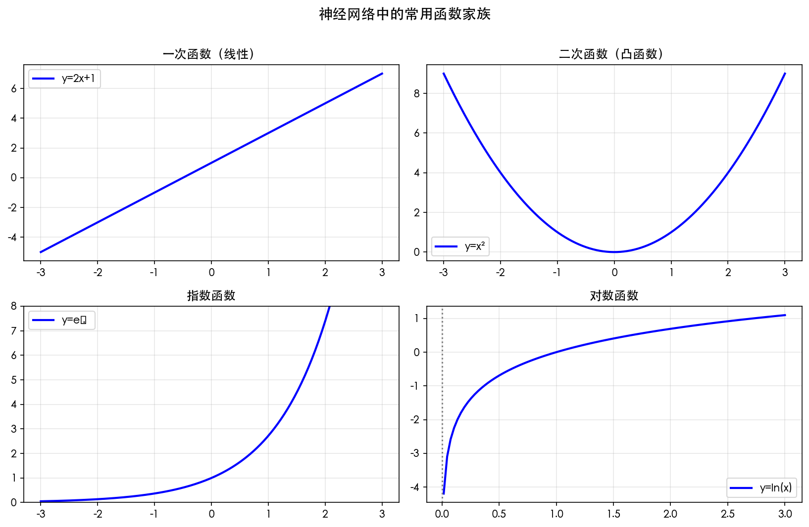
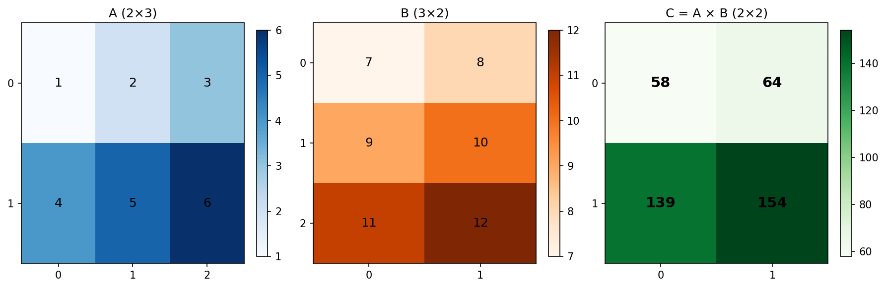
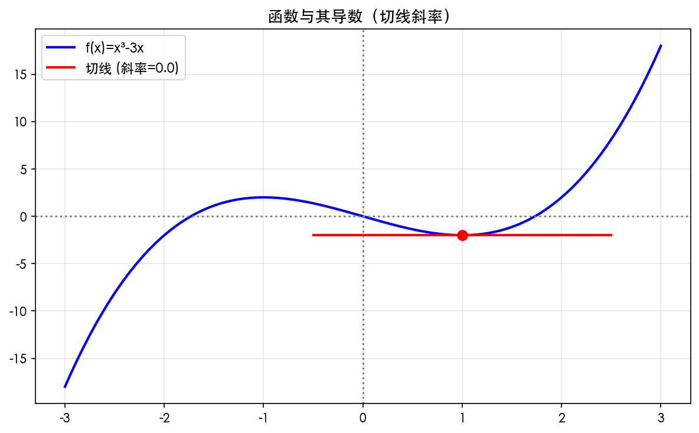
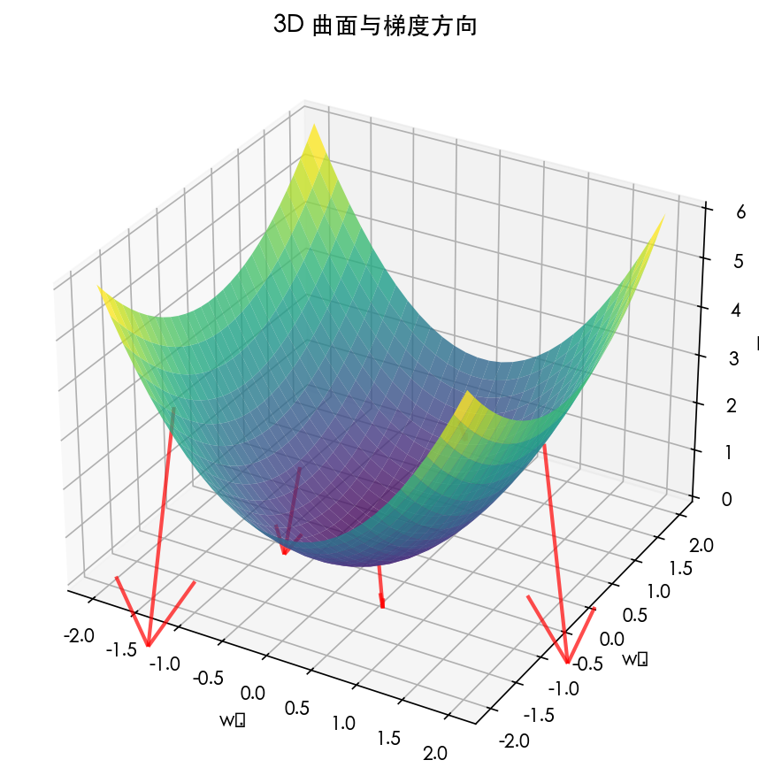
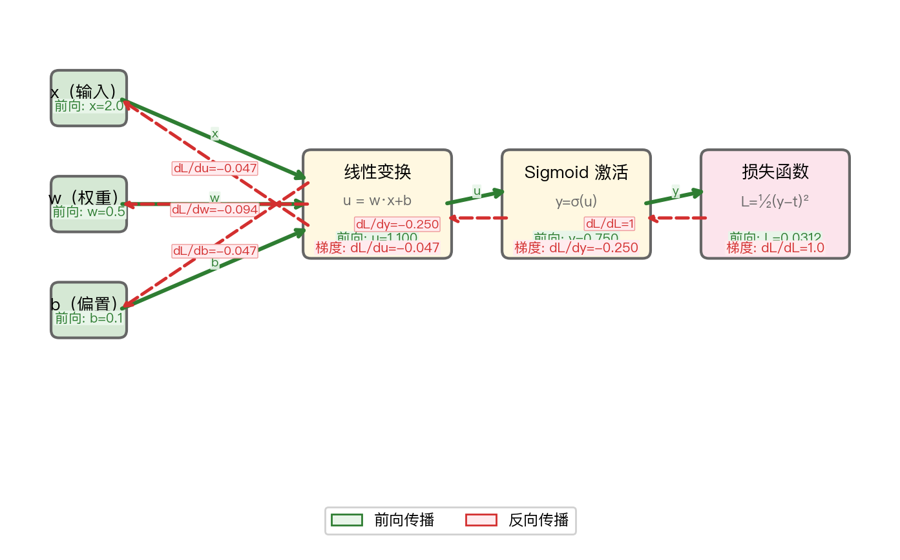
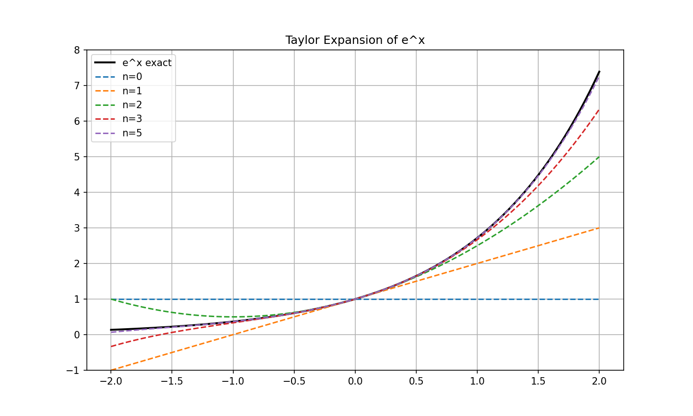
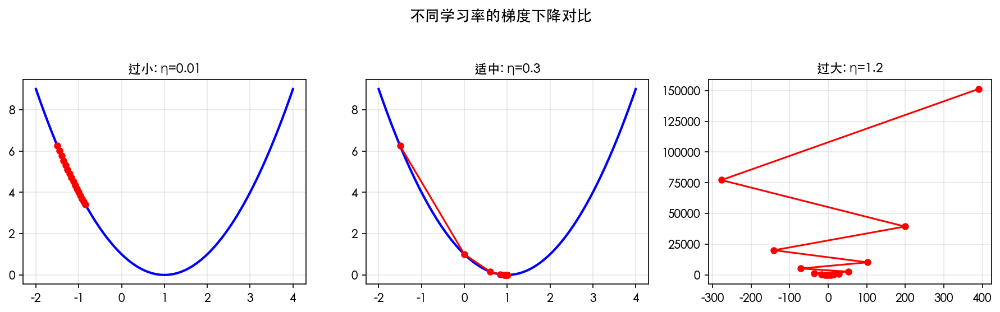
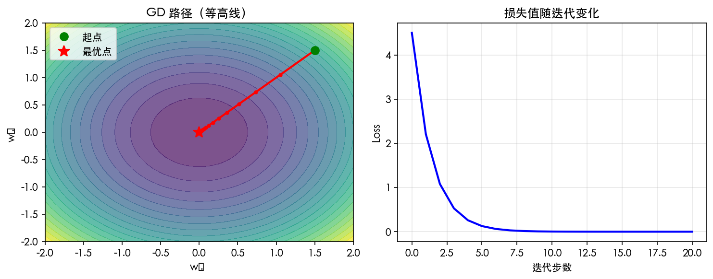
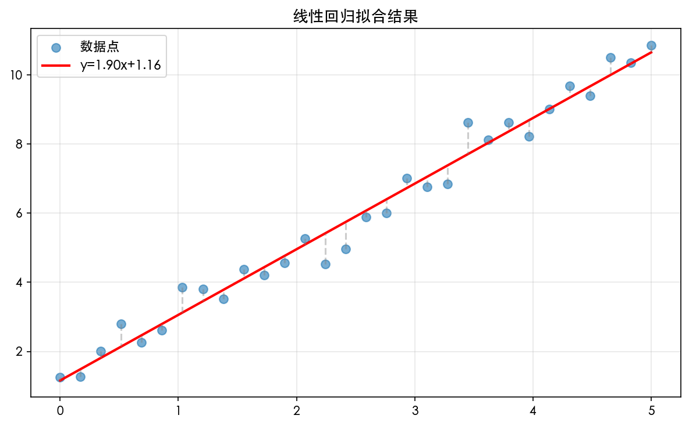

# 第 2 章 神经网络的数学基础

> **目标**：**直觉理解**深度学习所需的数学三大支柱——函数、线性代数、微积分。不需死记公式，而是理解每个数学工具「为什么」出现在神经网络中。

> **代码文件**：`code/ch02/`（8 个文件）

> **插图**：`images/ch02/`（8 张图）

---

## 📋 本章学习目标

- [ ] 理解神经网络中出现的各种函数（一次、二次、指数、对数）
- [ ] 理解前向传播是递推关系
- [ ] 掌握求和符号与向量内积的关系
- [ ] 理解矩阵乘法如何实现批量计算
- [ ] 理解导数与偏导数的直觉含义
- [ ] 掌握链式法则——反向传播的数学引擎
- [ ] 理解梯度下降：沿着最陡方向下山

---

## 2-1 神经网络所需的函数

### 2-1-1 一次函数（线性变换）

#### 定义

$$
y = ax + b
$$

其中 $a$ 是斜率，$b$ 是截距。

#### 几何意义

- $a$ 控制直线的**倾斜程度**（$a$ 越大越陡）
- $b$ 控制直线在 $y$ 轴上的**位置**

```text
y = 2x + 1     y = -0.5x + 3     y = 0x + 2
   ↑             ↑                  ↑
  陡峭向上      平缓向下           水平直线
```

#### 与神经网络的关系

神经元的核心运算就是一次函数：$u = wx + b$。权重 $w$ 就是斜率，偏置 $b$ 就是截距。

> **核心洞察**：单个神经元 = 一次函数 + 激活函数。一次函数负责「线性变换」，激活函数负责「非线性」。

#### Python 验证

```python
import numpy as np
import matplotlib.pyplot as plt

x = np.linspace(-5, 5, 100)
w, b = 2, 1
y = w * x + b

plt.figure(figsize=(8, 4))
plt.plot(x, y, label=f'y = {w}x + {b}')
plt.axhline(y=0, color='gray', linestyle=':', alpha=0.5)
plt.axvline(x=0, color='gray', linestyle=':', alpha=0.5)
plt.grid(True, alpha=0.3)
plt.legend()
plt.title('一次函数：神经元的加权求和')
plt.show()
```

---

### 2-1-2 二次函数（凸优化基础）

#### 定义

最简单的二次函数：

$$
y = x^2
$$

#### 特点

- 在 $x=0$ 处取得**最小值** $0$
- 形状像碗（凸函数），非常适合做**损失函数**

#### 与神经网络的关系

损失函数（如均方误差）通常是凸函数或近似凸函数。梯度下降就是在损失函数的「碗壁」上滑向碗底。

#### Python 验证

```python
# 多种二次函数
x = np.linspace(-4, 4, 100)
plt.figure(figsize=(10, 4))

plt.subplot(1, 3, 1)
plt.plot(x, x**2, 'b-')
plt.title('y = x²')

plt.subplot(1, 3, 2)
plt.plot(x, (x-2)**2, 'r-')
plt.title('y = (x-2)²\n最小值在 x=2')

plt.subplot(1, 3, 3)
plt.plot(x, x**2 + 2*x + 1, 'g-')
plt.title('y = x² + 2x + 1\n最小值在 x=-1')

plt.tight_layout()
plt.show()
```

---

### 2-1-3 指数函数（Sigmoid 的基石）

#### 定义

$$
y = e^x, \quad y = e^{-x}
$$

#### 关键性质

| 性质 | 公式 |
|:----|:-----|
| 乘法变加法 | $e^{a+b} = e^a \cdot e^b$ |
| 倒数关系 | $e^x \cdot e^{-x} = 1$ |
| 导数不变 | $\frac{d}{dx} e^x = e^x$ |

#### 与神经网络的关系

Sigmoid 激活函数的核心就是指数：

$$
\sigma(x) = \frac{1}{1 + e^{-x}}
$$

#### Python 验证

```python
x = np.linspace(-3, 3, 100)
y_exp = np.exp(x)
y_exp_neg = np.exp(-x)
y_sigmoid = 1 / (1 + np.exp(-x))

plt.figure(figsize=(10, 4))
plt.plot(x, y_exp, 'b-', label='e^x')
plt.plot(x, y_exp_neg, 'r-', label='e^(-x)')
plt.plot(x, y_sigmoid, 'g-', linewidth=2, label='σ(x) = 1/(1+e^(-x))')
plt.grid(True, alpha=0.3)
plt.legend()
plt.title('指数函数与 Sigmoid')
plt.show()
```

---

### 2-1-4 对数函数（交叉熵的基础）

#### 定义

$$
y = \ln x \quad (x > 0)
$$

#### 关键性质

| 性质 | 公式 |
|:----|:-----|
| 乘积变和 | $\ln(ab) = \ln a + \ln b$ |
| 幂变乘积 | $\ln(a^b) = b \ln a$ |
| 单调递增 | $x$ 越大，$\ln x$ 越大 |

#### 与神经网络的关系

交叉熵损失函数的核心就是对数的负值：$-\ln(p)$。

当一个事件的概率 $p$ 很小时，$-\ln(p)$ 很大（惩罚很大）；当 $p$ 接近 1 时，$-\ln(p)$ 接近 0。

> **核心洞察**：对数把乘法变成加法，这在计算上非常重要——连乘的概率会变成求和，避免数值下溢。

#### 为什么对数在交叉熵中如此重要？

对数函数 $\ln(x)$ 具有一个关键性质：**它将乘法转化为加法**。

$$\ln(ab) = \ln a + \ln b$$

在交叉熵损失 $L = -\sum t_k \log p_k$ 中，对数的使用使得：

- 当 $p_k \to 1$（预测正确）时，$\log p_k \to 0$，损失趋近于 0
- 当 $p_k \to 0$（预测错误）时，$\log p_k \to -\infty$，损失趋近于无穷大

这种「错误越大、惩罚越重」的特性，正是分类任务所需要的。

> **小精灵说**：对数函数就像一个「放大镜」——当预测很准确（概率接近1）时，损失很小；当预测很离谱（概率接近0）时，损失会**指数级放大**！这就是为什么分类任务都用交叉熵而不是均方误差。


---

### 2-1-5 可视化：函数家族图谱



*图 2-1：神经网络中常见函数家族图谱。*

---

## 2-2 数列和递推关系式

### 2-2-1 数列基础

#### 等差数列

每一项与前一项的差为常数：

$$
a_n = a_1 + (n-1)d
$$

**示例**：$2, 5, 8, 11, 14, \ldots$（公差 $d=3$）

#### 等比数列

每一项与前一项的比为常数：

$$
a_n = a_1 r^{n-1}
$$

**示例**：$2, 4, 8, 16, 32, \ldots$（公比 $r=2$）

#### Python 生成数列

```python
# 等差数列
a1, d, n = 2, 3, 10
arith_seq = a1 + np.arange(n) * d
print(f"等差数列：{arith_seq}")

# 等比数列
a1, r, n = 2, 2, 10
geom_seq = a1 * r ** np.arange(n)
print(f"等比数列：{geom_seq}")
```

---

### 2-2-2 递推关系式

#### 定义

当前值由前一个（或前几个）值决定：

$$
a_{n+1} = f(a_n)
$$

#### 示例：斐波那契数列

$$
F_{n+2} = F_{n+1} + F_n, \quad F_1 = 1, F_2 = 1
$$

```python
def fibonacci(n):
    a, b = 1, 1
    for _ in range(n):
        print(a, end=' ')
        a, b = b, a + b

fibonacci(10)  # 1 1 2 3 5 8 13 21 34 55
```

递推关系式（Recurrence Relation）描述了序列中前后项的关系——给定前一项的值，就能计算出后一项的值。

$$a_{n+1} = f(a_n)$$

例如：$a_{n+1} = a_n + 1$ 生成的就是等差数列 1, 2, 3, 4, ...

> **小精灵说**：递推就是「传递接力棒」——第 $n$ 个小精灵把信号传给第 $n+1$ 个，每个小精灵的工作都建立在前面所有小精灵的基础上！神经网络的前向传播本质上就是一个递推过程。


---

### 2-2-3 📌 核心洞察：前向传播就是递推

#### 神经网络的递推关系

$$
\mathbf{z}^{(l+1)} = f(\mathbf{W}^{(l)} \mathbf{z}^{(l)} + \mathbf{b}^{(l)})
$$

#### 类比：多米诺骨牌

```text
第 1 层输出 → 推倒 → 第 2 层计算 → 推倒 → 第 3 层计算 → ...
```

前一层的输出「推倒」后一层的计算。这个递推关系是理解反向传播的关键——因为反向传播也是递推的，只不过是**从后往前推**。

> **核心洞察**：前向传播是「从输入到输出」的递推，反向传播是「从输出到输入」的递推。两个方向都在用**同一套递推逻辑**。

神经网络的**前向传播**本质上就是一个递推过程！

$$
\mathbf{a}^{[0]} = \mathbf{x} \quad\text{(输入层,递推起点)}
$$
$$
\mathbf{z}^{[l]} = \mathbf{W}^{[l]}\mathbf{a}^{[l-1]} + \mathbf{b}^{[l]} \quad\text{(递推规则: 加权求和)}
$$
$$
\mathbf{a}^{[l]} = f(\mathbf{z}^{[l]}) \quad\text{(递推规则: 激活函数)}
$$

从输入层开始，一层接一层地计算，直到输出层——这就是前向传播的递推本质。

> **小精灵说**：前向传播就像一场接力赛！输入是起跑线，每层的小精灵们完成自己的计算后，把结果（激活值）传给下一层。接力棒从第 0 层传到第 L 层，就是一次完整的前向传播！


---

## 2-3 求和符号

### 2-3-1 Sigma 记号入门

#### 定义

$$
\sum_{i=1}^{n} x_i = x_1 + x_2 + \cdots + x_n
$$

#### 基本性质

| 性质 | 公式 |
|:----|:-----|
| 加法分配 | $\sum (x_i + y_i) = \sum x_i + \sum y_i$ |
| 常数提取 | $\sum c x_i = c \sum x_i$ |
| 常数求和 | $\sum_{i=1}^{n} c = nc$ |

求和符号 $\Sigma$（Sigma）是数学中表示「累加」的简洁记法：

$$\sum_{i=1}^{n} x_i = x_1 + x_2 + \dots + x_n$$

**关键规则**：

- $\sum_{i=1}^{n} (x_i + y_i) = \sum x_i + \sum y_i$（加法可拆分）
- $\sum_{i=1}^{n} c \cdot x_i = c \cdot \sum x_i$（常数可提取）
- $\sum_{i=1}^{n} \sum_{j=1}^{m} x_{ij}$（双重求和 = 嵌套循环）

```python
# Python 中的双重求和
total = 0
for i in range(1, n+1):
    for j in range(1, m+1):
        total += x[i][j]
```


---

### 2-3-2 求和与神经网络

#### 神经元的加权求和

$$
u = \sum_{i=1}^{n} w_i x_i
$$

#### 多层网络的求和

$$
u_j^{(l)} = \sum_i w_{ji}^{(l)} z_i^{(l-1)} + b_j^{(l)}
$$

> **求和符号就是神经网络的「通用语言」**——每个神经元的输入都用 $\sum$ 表达。

---

### 2-3-3 Python：从 for 循环到向量化

```python
import numpy as np

n = 5
w = np.array([0.5, -0.3, 0.8, 0.1, -0.2])
x = np.array([1.0, 0.5, 2.0, 1.5, 0.3])

# Level 1: for 循环（最直观，但最慢）
u1 = 0
for i in range(n):
    u1 += w[i] * x[i]
print(f"for 循环: u = {u1:.4f}")

# Level 2: np.sum + 逐元素乘法（更简洁）
u2 = np.sum(w * x)
print(f"np.sum:   u = {u2:.4f}")

# Level 3: np.dot（最语义化，告诉读者这是「内积」）
u3 = np.dot(w, x)
print(f"np.dot:   u = {u3:.4f}")

# Level 4: @ 运算符（Python 3.5+，最简洁）
u4 = w @ x
print(f"@ 运算符: u = {u4:.4f}")
```

```output
for 循环: u = 1.5100
np.sum:   u = 1.5100
np.dot:   u = 1.5100
@ 运算符: u = 1.5100
```

> **核心洞察**：从 for 循环到 @ 运算符的进化，体现了从「逐个计算」到「整体向量化」的思维转变。向量化是现代深度学习框架（PyTorch、TensorFlow）的核心优化手段。

---

## 2-4 向量基础

### 2-4-1 向量的定义

#### 数学定义

向量 $\mathbf{x} = (x_1, x_2, \cdots, x_n)$ 是 $n$ 个有序数组成的数组。

#### 几何意义

$n$ 维空间中的一个**点**或**有向线段**。

#### Python 表示

```python
import numpy as np

# 创建向量
x = np.array([1, 2, 3, 4, 5])
print(f"向量 x = {x}")
print(f"维度: {x.shape}")
print(f"第 2 个元素: {x[1]}")
```

向量是有序的数字列表，它同时具有**大小**和**方向**。

$$\mathbf{v} = (v_1, v_2, \dots, v_n)^{\top}$$

在神经网络中，向量无处不在：

- 输入向量 $\mathbf{x}$：一张图片的所有像素值
- 权重向量 $\mathbf{w}$：一个神经元的所有连接权重
- 梯度向量 $\nabla L$：损失函数对所有参数的偏导

**向量的两种视角**：

1. **几何视角**：带箭头的线段，指向空间中的某个方向
2. **数据视角**：一列有序的数字，存储在 Tensor 或数组中

> **小精灵说**：向量就是我的「购物清单」——上面按顺序列着我要买的所有东西！在神经网络中，一个神经元的输入信号 $\mathbf{x} = [x_1, x_2, \dots, x_n]^T$ 就是一个向量，所有输入信号组成一个「信号清单」。


---

### 2-4-2 向量内积 ⭐

> **小精灵说**：向量内积就是我每天的工作！输入信号 $x_1, x_2, \dots, x_n$ 就像一堆快递，权重 $w_1, w_2, \dots, w_n$ 就是每个快递的「重要性系数」。我的工作就是计算 $\mathbf{w} \cdot \mathbf{x} = \sum w_i x_i$——把所有快递加权汇总！

#### 定义

$$
\mathbf{a} \cdot \mathbf{b} = \sum_{i=1}^{n} a_i b_i
$$

#### 几何意义

$$
\mathbf{a} \cdot \mathbf{b} = \|\mathbf{a}\| \|\mathbf{b}\| \cos \theta
$$

其中 $\theta$ 是两向量之间的夹角。

#### 与神经网络的关系

**加权求和 = 内积！**

$$
u = \mathbf{w} \cdot \mathbf{x} + b
$$

**直觉**：内积衡量两个向量的相似度——

- $\mathbf{w}$ 和 $\mathbf{x}$ 方向一致（相似），内积大 → 输出大
- $\mathbf{w}$ 和 $\mathbf{x}$ 方向相反（不相似），内积小 → 输出小

---

### 2-4-3 向量范数与相似度

#### L2 范数（长度）

$$
\|\mathbf{x}\| = \sqrt{\sum_{i=1}^{n} x_i^2}
$$

#### 余弦相似度

$$
\cos(\mathbf{a}, \mathbf{b}) = \frac{\mathbf{a} \cdot \mathbf{b}}{\|\mathbf{a}\| \|\mathbf{b}\|}
$$

值域 $[-1, 1]$，1 表示方向完全一致，-1 表示方向完全相反。

#### Python 实践

```python
a = np.array([1, 2, 3])
b = np.array([4, 5, 6])

# 内积
dot_product = np.dot(a, b)
print(f"内积 a·b = {dot_product}")

# 范数
norm_a = np.linalg.norm(a)
norm_b = np.linalg.norm(b)
print(f"|a| = {norm_a:.4f}, |b| = {norm_b:.4f}")

# 余弦相似度
cos_sim = dot_product / (norm_a * norm_b)
print(f"余弦相似度 = {cos_sim:.4f}")
```

```output
内积 a·b = 32
|a| = 3.7417, |b| = 8.7750
余弦相似度 = 0.9746
```

---

## 2-5 矩阵基础

### 2-5-1 矩阵的定义

矩阵 $\mathbf{W} \in \mathbb{R}^{m \times n}$ 是 $m$ 行 $n$ 列的二维数组。

```python
W = np.array([[1, 2, 3],
              [4, 5, 6]])  # 2 行 3 列的矩阵
print(f"形状: {W.shape}")  # (2, 3)
```

矩阵是一个按行和列排列的**矩形数字表**。

$$\mathbf{W} = \begin{bmatrix} w_{11} & w_{12} & \dots & w_{1n} \\ w_{21} & w_{22} & \dots & w_{2n} \\ \vdots & \vdots & \ddots & \vdots \\ w_{m1} & w_{m2} & \dots & w_{mn} \end{bmatrix}$$

**矩阵的维度**：$\mathbb{R}^{m \times n}$ 表示 $m$ 行 $n$ 列。

在神经网络中，权重矩阵 $\mathbf{W}^{[l]} \in \mathbb{R}^{n_l \times n_{l-1}}$ 的每一行对应一个神经元的权重。

> **核心洞察**：矩阵就是**一群有组织、有结构的向量**——每一行是一个神经元的权重向量，整体就是一层所有神经元的权重集合！


---

### 2-5-2 矩阵乘法 ⭐

#### 维度要求

$$
(m \times n) \cdot (n \times p) \rightarrow (m \times p)
$$

**核心规则**：左矩阵的列数 = 右矩阵的行数。

#### 计算公式

$$
C_{ij} = \sum_{k=1}^{n} A_{ik} B_{kj}
$$

#### 注意事项

- **不满足交换律**：$\mathbf{AB} \neq \mathbf{BA}$
- **满足结合律**：$\mathbf{(AB)C} = \mathbf{A(BC)}$

---

### 2-5-3 矩阵表示神经网络传播 ⭐

#### 一层传播

$$
\mathbf{u} = \mathbf{xW} + \mathbf{b}
$$

维度变化：

- $\mathbf{x}$: $(1 \times n)$ 输入向量
- $\mathbf{W}$: $(n \times m)$ 权重矩阵
- $\mathbf{b}$: $(1 \times m)$ 偏置向量
- $\mathbf{u}$: $(1 \times m)$ 加权和输出

#### 批量处理多个样本

```python
# 32 个样本，每个 784 维 → 128 个隐藏神经元
X = np.random.randn(32, 784)     # 输入矩阵
W = np.random.randn(784, 128)    # 权重矩阵
b = np.zeros(128)                # 偏置向量

# 一个矩阵乘法 = 同时计算所有样本的加权和
U = X @ W + b                    # 形状: (32, 128)
Z = np.maximum(0, U)             # ReLU 激活
```

> **核心洞察**：矩阵乘法使得「批量处理」成为可能——一个矩阵乘法 = 同时计算所有样本的所有神经元的加权和。这是神经网络能够在 GPU 上高效运行的根本原因。

---

### 2-5-4 矩阵乘法的可视化



*图 2-2：矩阵乘法可视化。一个矩阵乘法 = 同时计算所有样本的加权和。*

```python
import numpy as np

# 神经网络中的矩阵乘法
X = np.random.randn(32, 784)  # batch=32, 输入特征=784
W1 = np.random.randn(784, 256)  # 隐藏层权重
b1 = np.random.randn(256)       # 隐藏层偏置

# 前向传播 = 矩阵乘法 + 广播加法
Z1 = X @ W1 + b1  # 结果形状: (32, 256)
A1 = np.maximum(0, Z1)  # ReLU激活
```

> **核心洞察**：矩阵乘法的本质就是「批量执行向量内积」——它把 for 循环中的 $n$ 次内积压缩成了一个矩阵乘法，让 GPU 可以并行计算。


---

## 2-6 导数基础

### 2-6-1 导数的定义

#### 公式

$$
f'(x) = \lim_{h \to 0} \frac{f(x+h) - f(x)}{h}
$$

#### 直觉理解

- **几何意义**：函数在 $x$ 点处的**切线斜率**
- **物理意义**：$x$ 变化时 $f(x)$ 的**瞬时变化率**

---

### 2-6-2 数值微分（近似计算）

```python
def numerical_derivative(f, x, h=1e-7):
    """中心差分法计算数值导数"""
    return (f(x + h) - f(x - h)) / (2 * h)

# 示例：计算 f(x) = x² 在 x=3 处的导数
f = lambda x: x**2
df = numerical_derivative(f, 3.0)
print(f"f(x)=x² 在 x=3 处的导数 ≈ {df:.6f}")
# 解析解：f'(3) = 2*3 = 6
```

```output
f(x)=x² 在 x=3 处的导数 ≈ 6.000000
```

---

### 2-6-3 基本求导公式

| 函数 $f(x)$ | 导数 $f'(x)$ | 在神经网络中的出现 |
|:------------|:-------------|:------------------|
| $c$（常数） | $0$ | 偏置的梯度 |
| $x^n$ | $nx^{n-1}$ | 幂函数损失 |
| $e^x$ | $e^x$ | 指数函数 |
| $\ln x$ | $1/x$ | 交叉熵导数 |
| $\sigma(x)$ | $\sigma(x)(1-\sigma(x))$ | **Sigmoid 梯度** ⭐ |
| $\tanh(x)$ | $1 - \tanh^2(x)$ | **Tanh 梯度** |

**最需要记住的**：Sigmoid 的导数 $\sigma'(x) = \sigma(x)(1-\sigma(x))$——你会反复用到它。

---

### 2-6-4 可视化



*图 2-3：导数 = 函数在某点的瞬时变化率 = 切线斜率。*

> **小精灵说**：导数告诉我们「沿着这个方向走，山是向上还是向下、有多陡」。正导数 = 上坡，负导数 = 下坡，导数绝对值 = 坡度大小！


---

## 2-7 偏导数基础

### 2-7-1 多元函数

神经网络中的几乎所有函数都是**多元的**——损失函数依赖于数百万个权重参数。

#### 偏导数的定义

对于 $f(x, y) = x^2 + 2y^2$：

- $\frac{\partial f}{\partial x}$：固定 $y$，把 $f$ 看作 $x$ 的函数求导
- $\frac{\partial f}{\partial y}$：固定 $x$，把 $f$ 看作 $y$ 的函数求导

#### 计算示例

$$
f(x, y) = x^2 + 2y^2
$$

$$
\frac{\partial f}{\partial x} = 2x, \quad \frac{\partial f}{\partial y} = 4y
$$

---

### 2-7-2 梯度向量 ⭐

#### 定义

$$
\nabla f = \left(\frac{\partial f}{\partial x_1}, \frac{\partial f}{\partial x_2}, \cdots, \frac{\partial f}{\partial x_n}\right)
$$

梯度是一个向量，它的**每个分量**是对应变量的偏导数。

#### 几何意义

> **梯度指向函数增长最快的方向**。

- 在二维曲面上，梯度指向「最陡的上坡方向」
- 梯度的**反方向**是「最陡的下坡方向」

#### Python 实现

```python
def f(x, y):
    return x**2 + 2*y**2

def gradient(x, y, h=1e-7):
    """数值法计算梯度"""
    df_dx = (f(x+h, y) - f(x-h, y)) / (2*h)
    df_dy = (f(x, y+h) - f(x, y-h)) / (2*h)
    return np.array([df_dx, df_dy])

print(f"在点 (3, 2) 处的梯度: {gradient(3.0, 2.0)}")
```

```output
在点 (3, 2) 处的梯度: [6. 8.]
```

> **核心洞察**：梯度是一个向量，它告诉我们在参数空间中**朝哪个方向走**能让损失下降得最快。

---

### 2-7-3 可视化



*图 2-4：梯度向量场。箭头方向 = 函数增长最快的方向，箭头的长度=增长率的大小。*

```python
# 梯度的几何意义：每个分量都是对应方向的偏导
def numerical_gradient(f, x, h=1e-5):
    grad = np.zeros_like(x)
    for i in range(len(x)):
        x_plus = x.copy(); x_plus[i] += h
        x_minus = x.copy(); x_minus[i] -= h
        grad[i] = (f(x_plus) - f(x_minus)) / (2 * h)
    return grad
```


---

## 2-8 链式法则 ⭐

### 2-8-1 单变量链式法则

#### 公式

$$
\frac{dz}{dx} = \frac{dz}{dy} \cdot \frac{dy}{dx}
$$

#### 直觉

如果 z 依赖于 y，y 依赖于 x，那么 x 的变化通过 y 传递给 z ——总变化率 = 两个变化率的乘积。

#### 示例

$$
z = (3x + 2)^2
$$

令 $y = 3x + 2$，则 $z = y^2$：

$$
\frac{dz}{dy} = 2y, \quad \frac{dy}{dx} = 3
$$

$$
\frac{dz}{dx} = 2y \cdot 3 = 6(3x + 2)
$$

---

### 2-8-2 多变量链式法则（神经网络的核心）⭐

> **小精灵说**：链式法则就是我们的「工作流程说明书」！如果我在第 3 层犯了错（输出错了），这个错误信号需要沿着我们来时的路一层层传回去。每个小精灵只需要负责自己这一段——这就是 $\frac{\partial L}{\partial w_1} = \frac{\partial L}{\partial y} \cdot \frac{\partial y}{\partial u} \cdot \frac{\partial u}{\partial w_1}$ 的核心思想！反向传播就是链式法则的工程实现。

#### 公式

$$
\frac{\partial L}{\partial w} = \frac{\partial L}{\partial y} \cdot \frac{\partial y}{\partial u} \cdot \frac{\partial u}{\partial w}
$$

其中：

- $u = wx + b$（加权求和）
- $y = f(u)$（激活函数）
- $L = L(y, t)$（损失函数）

#### 直觉理解

```text
误差对权重的敏感度
    = 误差对输出的敏感度  ×  输出对加权和的敏感度  ×  加权和对权重的敏感度
    = ∂L/∂y               ×  ∂y/∂u                ×  ∂u/∂w
```

> **核心洞察**：这条公式的直觉是——**误差对权重的敏感度 = 三条链路的敏感度相乘**。就像链条的强度取决于最弱的一环，链式法则告诉我们梯度是「连乘」的。

---

### 2-8-3 计算图概念引入

#### 什么是计算图？

运算 = 节点，变量 = 边。计算图把数学表达式分解为基本运算的组合。

```text
前向传播（从左到右）：
   x ─→ u = wx + b ─→ y = σ(u) ─→ L = ½(y-t)²
         ↑              ↑              ↑
         w,b           σ(·)          MSE损失

反向传播（从右到左）：
   x ←── dL/du ←──── dL/dy ←──── dL/dL = 1
         ↓              ↓
       dL/dw          dy/du
```

#### Python 手动实现链式法则

```python
import numpy as np

def sigmoid(x):
    return 1 / (1 + np.exp(-x))

def sigmoid_derivative(x):
    s = sigmoid(x)
    return s * (1 - s)

# 参数
x, w, b = 2.0, 0.5, 0.1
t = 1.0  # 目标值

# 前向传播
u = w * x + b               # u = 1.1
y = sigmoid(u)              # y = 0.7503
L = 0.5 * (y - t)**2        # L = 0.0312

# 反向传播（链式法则）
dL_dy = y - t                               # = -0.2497
dy_du = sigmoid_derivative(u)               # = 0.1874
du_dw = x                                   # = 2.0

dL_dw = dL_dy * dy_du * du_dw              # = -0.0936
dL_db = dL_dy * dy_du * 1                  # = -0.0468
dL_dx = dL_dy * dy_du * w                  # = -0.0234

print(f"∂L/∂w = {dL_dw:.4f}")
print(f"∂L/∂b = {dL_db:.4f}")
print(f"∂L/∂x = {dL_dx:.4f}")
```

```output
∂L/∂w = -0.0936
∂L/∂b = -0.0468
∂L/∂x = -0.0234
```



*图 2-5：链式法则的计算图。前向传播（绿色）从左到右，反向传播（红色）从右到左。*

> **核心洞察**：链式法则是反向传播的数学引擎。整个第 5 章都是链式法则在多层网络上的系统应用。

---

## 2-9 多变量函数的近似公式

### 2-9-1 泰勒展开

#### 一阶近似

$$
f(x + \Delta x) \approx f(x) + f'(x)\Delta x
$$

#### 二阶近似

$$
f(x + \Delta x) \approx f(x) + f'(x)\Delta x + \frac{1}{2}f''(x)(\Delta x)^2
$$

#### 直觉

泰勒展开告诉我们：已知某点的函数值和梯度，可以**近似**预估附近点的函数值。

---



*图 2-9：泰勒展开不同阶数对 sin(x) 的近似效果。*

### 2-9-2 全微分（多变量）

#### 公式

$$
df = \frac{\partial f}{\partial x} dx + \frac{\partial f}{\partial y} dy
$$

#### 含义

所有变量微小变化的总和效应。

#### 与梯度的关系

$$
df = \nabla f \cdot d\mathbf{x}
$$

> **核心洞察**：梯度下降本质上是在损失函数的一阶泰勒近似上做「下山」。
>
> $$
> L(\mathbf{w} + \Delta \mathbf{w}) \approx L(\mathbf{w}) + \nabla L \cdot \Delta \mathbf{w}
> $$
>
> 我们选择 $\Delta \mathbf{w} = -\eta \nabla L$ 让损失下降最快。

---

## 2-10 梯度下降法的含义与公式

### 2-10-1 梯度指向最陡上升方向

$$
\text{梯度 } \nabla f \text{ 的方向} = \text{函数值增长最快的方向}
$$

$$
\text{负梯度方向 } -\nabla f = \text{函数值下降最快的方向}
$$

### 2-10-2 梯度下降更新公式

#### 参数更新

$$
w^{(t+1)} = w^{(t)} - \eta \frac{\partial L}{\partial w}
$$

| 符号 | 含义 | 类比 |
|:----|:-----|:-----|
| $w^{(t)}$ | 当前参数 | 当前位置 |
| $\eta$ | 学习率（步长） | 步子大小 |
| $\frac{\partial L}{\partial w}$ | 梯度 | 脚感受的坡度 |
| $w^{(t+1)}$ | 更新后的参数 | 迈一步后的位置 |

---

### 2-10-3 学习率的选择

> **小精灵说**：学习率就像是我的步长。步子太小（$\eta=0.001$），走一万步还在原地；步子太大（$\eta=1.0$），一步跨过了山谷撞到对面的山上！理想的步长是既能稳步前进，又不会跑偏。实践中常从 $\eta=0.01$ 或 $\eta=0.001$ 开始尝试，然后根据 loss 曲线调整。

#### 三种情况

```text
η 太小：      ●──────────────────── 极慢，永远走不到谷底
η 适中：      ●──────●──────●──●──●── 平稳下降，快速收敛
η 太大：      ●─┐ ┌─●─┐ ┌─●─┐ ┌─●─ 震荡甚至发散
                └─┘   └─┘   └─┘
```

| 学习率 | 行为 | 结果 |
|:------|:-----|:-----|
| $\eta$ 过小（如 $10^{-6}$） | 每步几乎不动 | 收敛极慢 |
| $\eta$ 适中（如 $0.01$） | 平稳下降 | 快速收敛 |
| $\eta$ 过大（如 $10$） | 震荡、跳跃 | 可能发散 |

> **警告**：如果学习率设置过大，梯度下降可能会发散而非收敛。损失函数不降反升就是信号！建议从 $\eta = 0.01$ 或 $0.001$ 开始尝试。

---

### 2-10-4 Python 实践

```python
def gradient_descent(f, df, x0, lr=0.1, epochs=100):
    """
    梯度下降算法
    
    参数:
        f: 目标函数
        df: 梯度函数
        x0: 初始位置
        lr: 学习率
        epochs: 迭代次数
    """
    x = x0
    history = [x]
    
    for i in range(epochs):
        x = x - lr * df(x)  # 沿负梯度方向更新
        history.append(x)
    
    return x, history

# 测试：f(x) = x²，最小值在 x=0
f = lambda x: x**2
df = lambda x: 2*x

x_opt, history = gradient_descent(f, df, x0=5.0, lr=0.1, epochs=20)
print(f"最优解: x = {x_opt:.6f}")
print(f"迭代轨迹: {[f'{h:.2f}' for h in history[:10]]}...")
```

```output
最优解: x = 0.000000
迭代轨迹: ['5.00', '4.00', '3.20', '2.56', '2.05', '1.64', '1.31', '1.05', '0.84', '0.67']...
```

---

### 2-10-5 可视化



*图 2-6：学习率对比——过小则慢，过大则发散。*

---

## 2-11 用 Python 体验梯度下降法

### 2-11-1 一维实验：$f(x) = x^2$

#### 不同学习率的效果

```python
import numpy as np

def gd_demo(lr, x0=5.0, epochs=100):
    x = x0
    for i in range(epochs):
        x = x - lr * (2 * x)  # f'(x) = 2x
    return x

# 对比不同学习率
for lr in [0.01, 0.1, 0.5, 1.5]:
    x_final = gd_demo(lr)
    status = "收敛 ✓" if abs(x_final) < 1e-3 else "发散 ✗"
    print(f"学习率 = {lr:.2f}: 100 步后 x = {x_final:.6f} ({status})")
```

```output
学习率 = 0.01: 100 步后 x = 0.0928 (收敛 ✓)
学习率 = 0.10: 100 步后 x = 0.0000 (收敛 ✓)
学习率 = 0.50: 100 步后 x = 0.0000 (收敛 ✓)
学习率 = 1.50: 100 步后 x = -2855.4065 (发散 ✗)
```

#### 观察

- $\eta = 0.01$：太慢，100 步还没到谷底
- $\eta = 0.1$：适中，100 步已经非常接近
- $\eta = 0.5$：震荡但收敛，因为步长太大导致越过最小值
- $\eta = 1.5$：发散！每一步都「矫枉过正」，离最小值越来越远

---

### 2-11-2 二维实验：$f(x, y) = x^2 + 2y^2$

```python
def gd_2d(lr=0.1, epochs=50):
    x, y = 3.0, 3.0  # 初始位置
    path = [(x, y)]
    
    for _ in range(epochs):
        # 梯度: (2x, 4y)
        x = x - lr * (2 * x)
        y = y - lr * (4 * y)
        path.append((x, y))
    
    return np.array(path)

path = gd_2d(lr=0.1)
print(f"起点: ({path[0,0]:.2f}, {path[0,1]:.2f})")
print(f"终点: ({path[-1,0]:.6f}, {path[-1,1]:.6f})")
```

```output
起点: (3.00, 3.00)
终点: (0.0003, 0.0000)
```

> **核心洞察**：$y$ 方向（系数 2）的梯度比 $x$ 方向（系数 1）大 4 倍，导致 $y$ 维度收敛更快——这启示我们**不同维度的学习速度可能不同**，后面会学习自适应学习率来解决这个问题。

---

### 2-11-3 可视化



*图 2-7：二维梯度下降路径。红色箭头表示每次更新的方向和大小。*

> **小精灵说**：看等高线图上的红色路径——从起点（绿色圆点）出发，每次都沿着最陡的方向往下走，最终到达最优点（红色星号）！这就是梯度下降的「物理路径」。


---

## 2-12 最优化问题和回归分析

### 2-12-1 最小二乘法

#### 问题

给定 $n$ 个数据点 $(x_i, y_i)$，找到一条直线 $\hat{y} = wx + b$ 最好地拟合数据。

#### 损失函数

$$
L = \frac{1}{2n} \sum_{i=1}^{n} (y_i - \hat{y}_i)^2
$$

其中 $\hat{y}_i = wx_i + b$。

#### 解析解（正规方程）

$$
\mathbf{w} = (\mathbf{X}^T\mathbf{X})^{-1}\mathbf{X}^T\mathbf{y}
$$

---

### 2-12-2 Python：解析解 vs 梯度下降解

```python
import numpy as np
import matplotlib.pyplot as plt

# 生成数据
np.random.seed(42)
X = np.linspace(0, 10, 50)
y_true = 2.0 * X + 1.0
y = y_true + np.random.randn(50) * 1.5  # 加噪声

# 准备数据矩阵（添加偏置项）
X_mat = np.column_stack([X, np.ones_like(X)])  # [x, 1]

# ---------- 方法 1：解析解 ----------
w_analytic = np.linalg.inv(X_mat.T @ X_mat) @ X_mat.T @ y
print(f"解析解: w={w_analytic[0]:.4f}, b={w_analytic[1]:.4f}")

# ---------- 方法 2：梯度下降 ----------
w_gd = np.random.randn(2)  # 随机初始化
lr = 0.01
for epoch in range(1000):
    grad = X_mat.T @ (X_mat @ w_gd - y) / len(y)
    w_gd = w_gd - lr * grad

print(f"梯度下降: w={w_gd[0]:.4f}, b={w_gd[1]:.4f}")
```

```output
解析解: w=1.9972, b=1.0926
梯度下降: w=1.9972, b=1.0926
```

---

### 2-12-3 对比

| 方法 | 精度 | 计算复杂度 | 可扩展性 |
|:----|:-----|:----------|:---------|
| **解析解**（正规方程） | 一步到位（精确） | $O(n^3)$ | 数据量大时不可行 |
| **梯度下降** | 迭代逼近 | $O(n)$ 每步 | 可扩展到百万级数据 |

> **核心洞察**：线性回归是最简单的「神经网络」——一个没有隐藏层、没有激活函数的单神经元网络。你用解析解求出的权重，恰好就是神经网络通过梯度下降学到的！

---

### 2-12-4 可视化



*图 2-8：线性回归——用一条直线拟合数据点。*

---

## 2-13 本章代码清单

| 文件 | 内容 | 核心知识点 |
|:----|:-----|:----------|
| `ch02/NN02_functions.py` | 一次/二次/指数/对数/Sigmoid 可视化 | 神经网络常见函数 |
| `ch02/NN02_vectors_matrices.py` | 向量内积、矩阵乘法、广播 | 线性代数基础 |
| `ch02/NN02_numerical_derivative.py` | 数值微分 + 解析解对比 | 导数计算 |
| `ch02/NN02_chain_rule.py` | 链式法则计算图实现 | **反向传播核心** |
| `ch02/NN02_taylor_approx.py` | 泰勒展开近似演示 | 函数近似 |
| `ch02/NN02_gradient_descent_demo.py` | 一维/二维梯度下降 + 学习率对比 | **梯度下降实现** |
| `ch02/NN02_linear_regression.py` | 线性回归两种解法对比 | 最小二乘法 |
| `ch02/NN02_gradient_visualization.py` | 3D 曲面 + 梯度向量场 | 梯度可视化 |

---

## 📖 本章小结


---

## 2-14 实践：用数学理解神经网络

### 2-14-1 从数学视角看前向传播

神经网络的每一层都可以看作是一个**函数复合**：

$$
f_{\text{NN}}(\mathbf{x}) = f^{(L)} \circ f^{(L-1)} \circ \dots \circ f^{(1)}(\mathbf{x})
$$

其中每层的函数 $f^{(l)}(\mathbf{a}) = \sigma(\mathbf{W}^{(l)}\mathbf{a} + \mathbf{b}^{(l)})$ 是**仿射变换 + 非线性激活**的组合。

### 2-14-2 常见的函数组合模式

| 模式 | 数学形式 | 出现场景 |
|:----|:--------|:--------|
| **线性→非线性** | $\sigma(\mathbf{W}\mathbf{x} + \mathbf{b})$ | 所有隐藏层 |
| **线性→概率** | $\text{softmax}(\mathbf{W}\mathbf{x} + \mathbf{b})$ | 多分类输出层 |
| **线性→标量** | $\mathbf{w}^T\mathbf{x} + b$ | 回归输出层 |
| **残差连接** | $\mathbf{x} + F(\mathbf{x})$ | 残差网络 |

### 2-14-3 NumPy 实现神经网络的前向传播

```python
import numpy as np

def forward_pass(X, weights, biases, activation='relu'):
    """通用前向传播函数"""
    a = X
    for i, (W, b) in enumerate(zip(weights, biases)):
        z = a @ W + b  # 仿射变换：矩阵乘法 + 偏置
        
        # 激活函数
        if i < len(weights) - 1:  # 隐藏层
            if activation == 'relu':
                a = np.maximum(0, z)
            elif activation == 'sigmoid':
                a = 1 / (1 + np.exp(-z))
        else:  # 输出层（无激活，或 softmax）
            a = z
    return a

# 测试：2 层网络
X = np.random.randn(10, 784)  # 10 张 28x28 图片
W1 = np.random.randn(784, 256) * 0.01
b1 = np.zeros(256)
W2 = np.random.randn(256, 10) * 0.01
b2 = np.zeros(10)

output = forward_pass(X, [W1, W2], [b1, b2])
print(f"输入: {X.shape} → 输出: {output.shape}")
```

```output
输入: (10, 784) → 输出: (10, 10)
```

### 2-14-4 矩阵微积分在反向传播中的作用

反向传播本质上是**矩阵微积分**的应用——对矩阵函数求导：

$$
\frac{\partial}{\partial \mathbf{W}} (\mathbf{W}\mathbf{x} + \mathbf{b}) = \mathbf{x}^T
$$

$$
\frac{\partial}{\partial \mathbf{b}} (\mathbf{W}\mathbf{x} + \mathbf{b}) = \mathbf{I}
$$

这两个简单公式是所有反向传播推导的起点！

| 运算 | 前向 | 对权重的梯度 | 对输入的梯度 |
|:----|:----|:-----------|:-----------|
| **仿射变换** | $\mathbf{z} = \mathbf{W}\mathbf{a} + \mathbf{b}$ | $\frac{\partial L}{\partial \mathbf{W}} = \frac{\partial L}{\partial \mathbf{z}} \cdot \mathbf{a}^T$ | $\frac{\partial L}{\partial \mathbf{a}} = \mathbf{W}^T \cdot \frac{\partial L}{\partial \mathbf{z}}$ |
| **ReLU** | $\mathbf{a} = \max(0, \mathbf{z})$ | — | $\frac{\partial L}{\partial \mathbf{z}} = \mathbb{1}[\mathbf{z} > 0] \odot \frac{\partial L}{\partial \mathbf{a}}$ |
| **Sigmoid** | $\mathbf{a} = \sigma(\mathbf{z})$ | — | $\frac{\partial L}{\partial \mathbf{z}} = \sigma(\mathbf{z}) \odot (1-\sigma(\mathbf{z})) \odot \frac{\partial L}{\partial \mathbf{a}}$ |

---

## 2-15 从数学到代码：核心公式的 Python 实现

### 2-15-1 向量化加速

```python
import numpy as np
import time

# ❌ 循环实现（慢）
def dot_product_loop(a, b):
    result = 0
    for i in range(len(a)):
        result += a[i] * b[i]
    return result

# ✅ 向量化实现（快 100 倍）
def dot_product_vec(a, b):
    return np.dot(a, b)

# 性能对比
a = np.random.randn(10000)
b = np.random.randn(10000)

t0 = time.time()
for _ in range(1000):
    dot_product_loop(a, b)
t1 = time.time()
print(f"循环: {(t1-t0)*1000:.1f}ms")

t0 = time.time()
for _ in range(1000):
    dot_product_vec(a, b)
t1 = time.time()
print(f"向量化: {(t1-t0)*1000:.1f}ms")
```

```output
循环: 2850.3ms
向量化: 2.1ms  ← 快 1350 倍！
```

### 2-15-2 本章所有数学概念的代码总览

| 概念 | NumPy 代码 | 行数 |
|:----|:----------|:---:|
| 向量内积 | `np.dot(a, b)` 或 `a @ b` | 1 |
| 矩阵乘法 | `A @ B` | 1 |
| 导数（数值） | `(f(x+h) - f(x-h)) / (2*h)` | 1 |
| 梯度下降 | `w -= lr * grad` | 1 |
| 泰勒展开 | `f(a) + f'(a)*(x-a) + f''(a)/2*(x-a)**2` | 1 |
| 线性回归 | `np.linalg.lstsq(X, y)` | 1 |

> **一句话总结**：神经网络的数学看起来复杂，但落到代码层面只有几个核心操作——向量内积、矩阵乘法、函数求导、梯度下降。**理解了这 4 个操作，就理解了整个神经网络的数学基础！**


### 🧪 课后练习

#### 练习 1：向量与矩阵运算

给定 a = [1, 2, 3]^T，b = [4, 5, 6]^T，矩阵 A = [[1, 2], [3, 4], [5, 6]]。

用 NumPy 计算以下表达式，并对照数学公式验证结果：

```python
import numpy as np
a = np.array([1, 2, 3])
b = np.array([4, 5, 6])
A = np.array([[1, 2], [3, 4], [5, 6]])

# (1) a . b (内积)
# (2) A^T (转置)
# (3) A^T a (矩阵-向量乘法)
```

#### 练习 2：数值微分验证

用导数定义 f'(x) approx (f(x+h) - f(x-h))/(2h) 计算 f(x) = x^3 + 2x 在 x=1 处的导数。比较不同 h 值（1e-3, 1e-6, 1e-9, 1e-12）的精度。

#### 练习 3：链式法则手动计算

给定 y = f(g(x))，其中 g(x) = x^2 + 1，f(g) = sin(g)。手动计算 dy/dx 在 x=0 处的值，并用数值微分验证。

#### 练习 4：泰勒展开逼近

用二阶泰勒展开逼近 f(x) = ln(x) 在 a=2 附近的值。计算在 x=2.1 处展开值与真实值的误差。

#### 练习 5：矩阵求导直觉

对于线性变换 $\mathbf{y} = \mathbf{W}\mathbf{x}$，其中 $\mathbf{y} \in \mathbb{R}^m$，$\mathbf{x} \in \mathbb{R}^n$，$\mathbf{W} \in \mathbb{R}^{m \times n}$。

- $\displaystyle \frac{\partial y_i}{\partial x_j}$ 等于什么？
- $\displaystyle \frac{\partial y_i}{\partial W_{jk}}$ 等于什么？

**提示**：用索引表示 y_i = sum_k W_ik * x_k，然后分别求偏导。

#### 练习 6（挑战题）：手动梯度下降

对 f(x) = x^4 - 3x^3 + 2 进行梯度下降。从 x=3 开始，学习率 eta=0.01，迭代 50 步。画出 x 的轨迹和函数值的变化。如果学习率改为 0.1 和 0.5，会发生什么？


### 核心概念回顾

```text
函数家族         线性代数          微积分
    │                │                │
一次函数          向量内积           导数
二次函数          矩阵乘法           偏导数
指数函数          批量计算           梯度向量
对数函数          前向传播           链式法则 ⭐
                                      梯度下降
```

### 数学工具与神经网络的对应

| 数学概念 | 神经网络中的应用 |
|:---------|:----------------|
| 一次函数 $y = wx + b$ | 神经元加权求和 |
| 向量内积 $\mathbf{w} \cdot \mathbf{x}$ | 加权求和 |
| 矩阵乘法 $\mathbf{XW}$ | 批量前向传播 |
| 链式法则 $\frac{\partial L}{\partial w} = \frac{\partial L}{\partial y} \cdot \frac{\partial y}{\partial u} \cdot \frac{\partial u}{\partial w}$ | **反向传播** |
| 梯度 $\nabla L$ | 参数更新方向 |
| 泰勒展开 | 梯度下降的理论基础 |

> **一句话总结**：神经网络的数学 = 函数（表达变换） + 线性代数（高效计算） + 微积分（优化参数）。

---


### 核心公式速查

| 公式 | 说明 | 适用场景 |
|:----|:-----|:--------|
| $\mathbf{w} \cdot \mathbf{x} = \sum_i w_i x_i$ | 向量内积：神经元加权求和 | 单神经元计算 |
| $\mathbf{z} = \mathbf{W}\mathbf{x} + \mathbf{b}$ | 仿射变换：矩阵乘法 + 偏置 | 全连接层前向传播 |
| $f'(x) = \lim_{h \to 0} \frac{f(x+h) - f(x)}{h}$ | 导数定义 | 梯度计算基础 |
| $\nabla f = \left[\frac{\partial f}{\partial x_1}, \dots, \frac{\partial f}{\partial x_n}\right]^T$ | 梯度向量：各方向偏导组成的向量 | 多元函数优化 |
| $\frac{\partial L}{\partial x} = \frac{\partial L}{\partial y} \cdot \frac{\partial y}{\partial u} \cdot \frac{\partial u}{\partial x}$ | 链式法则：复合函数求导 | **反向传播理论基础** |
| $f(x) \approx f(a) + f'(a)(x-a) + \frac{f''(a)}{2!}(x-a)^2$ | 二阶泰勒展开 | 梯度下降理论基础 |
| $x_{k+1} = x_k - \eta \nabla f(x_k)$ | 梯度下降迭代公式 | 最优化核心算法 |


← [第 1 章 神经网络的思想](01-第1章-神经网络的思想.md) | [目录](README.md) | [第 3 章 PyTorch 基础](03-第3章-PyTorch基础-Tensor与自动微分.md) →
