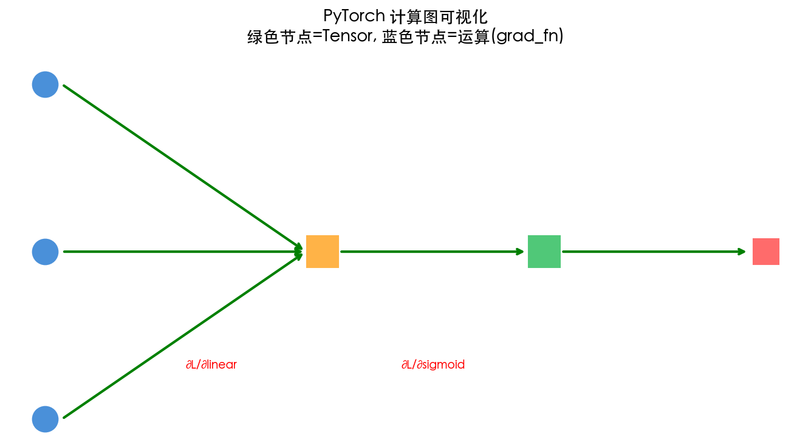
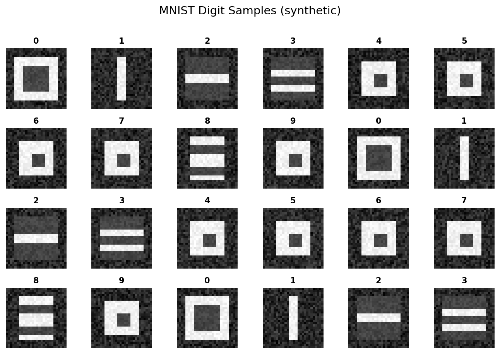

# 第 3 章 PyTorch 基础：Tensor 与自动微分

> **目标**：理解 PyTorch 两大核心——Tensor 和 Autograd——**背后的数学逻辑**，为后续用代码验证数学原理做好准备。

> **代码文件**：`code/ch03/`（7 个文件）

> **插图**：`images/ch03/`（2 张图）

---

## 📋 本章学习目标

- [ ] 理解 Tensor 与 NumPy ndarray 的关系与区别
- [ ] 掌握 Tensor 的创建、运算和维度操作
- [ ] 理解广播机制与矩阵乘法的维度规则
- [ ] 理解 Autograd 自动微分的原理
- [ ] 学会阅读和解读计算图
- [ ] 掌握 nn.Module 搭建网络的方法
- [ ] 了解 DataLoader 和数据集的使用

---

## 3-1 为什么需要 PyTorch？

### 3-1-1 从 Excel 到 NumPy 到 PyTorch

#### 计算工具的演进

| 工具 | 优点 | 不足 |
|:----|:-----|:-----|
| **Excel** | 直观，逐格可见 | 无法处理大规模数据、无法自动求梯度 |
| **NumPy** | 向量化运算，批量处理 | 需要手动实现梯度计算 |
| **PyTorch** | NumPy + GPU + **自动微分** | 需要学习新的语法 |

> **本书的核心过渡路径**：
>
> ```
> 第 1-2 章：数学直觉（NumPy 手动实现）
>     ↓
> 第 3 章：PyTorch 工具（Tensor + Autograd）
>     ↓
> 第 4-5 章：手动 NumPy → PyTorch autograd 渐进过渡
>     ↓
> 第 6-9 章：PyTorch 完整实战
> ```

---

### 3-1-2 深度学习框架对比

| 框架 | 特点 | 适用场景 |
|:----|:-----|:---------|
| **PyTorch** | Pythonic、动态图、易调试 | **研究首选**，本书选用 |
| **TensorFlow/Keras** | 生态成熟、部署方便 | 工业界部署 |
| **JAX** | 函数式、XLA 编译、高性能 | 前沿研究 |

**为什么本书选 PyTorch 而非其他？**

- **直觉第一**：动态图让你可以用 `print()` 随时查看任何中间值，调试体验和写普通 Python 一样
- **学术主流**：NeurIPS / ICML / ICLR 论文绝大多数使用 PyTorch
- **生态完善**：Hugging Face、TorchVision、TorchAudio 等生态组件齐全

> **提示**：本书所有 PyTorch 代码均可在 CPU 上运行，无需 GPU。但如果你有 NVIDIA GPU，安装 CUDA 版本会获得 10-50 倍加速。

### 3-1-3 PyTorch 的设计哲学

- **Pythonic**：与 Python 语法无缝融合——写起来就像写 NumPy
- **Define-by-Run**：计算图在运行时动态构建，而非预先定义
- **易调试**：可以用标准 Python debugger（pdb）单步调试

#### 安装验证

```bash
pip install torch torchvision matplotlib
python -c "import torch; print(torch.__version__)"  # 2.0+（当前最新 2.7.0）
```

```output
2.7.0
```

---

## 3-2 PyTorch Tensor 基础

### 3-2-1 什么是 Tensor？

Tensor = **多维数组**，对标 NumPy 的 ndarray，但额外支持：

1. **GPU 加速**：`.to('cuda')` 一键切换
2. **自动微分**：追踪运算历史，自动计算梯度
3. **深度学习算子**：卷积、池化、归一化等

#### Tensor 的维度

| 维度 | 名称 | 示例 |
|:----|:-----|:-----|
| 0 维 | **标量** | `torch.tensor(3.14)` — 一个数 |
| 1 维 | **向量** | `torch.tensor([1, 2, 3])` — 一列数 |
| 2 维 | **矩阵** | `torch.ones(3, 4)` — 表格 |
| 3 维 | **张量** | `torch.randn(3, 224, 224)` — 图像 (C, H, W) |
| 4 维 | **批次张量** | `torch.randn(32, 3, 224, 224)` — 图像批次 |

---

### 3-2-2 创建 Tensor

PyTorch 提供了多种方式创建 Tensor，从最基本的 Python 列表到随机初始化：

```python
import torch
import numpy as np

# 从 Python 列表创建
a = torch.tensor([[1, 2], [3, 4]])
print(f"从列表创建:\n{a}")

# 从 NumPy 数组创建（共享内存！）
np_arr = np.array([[1, 2], [3, 4]])
b = torch.from_numpy(np_arr)
print(f"从 NumPy 创建:\n{b}")
np_arr[0, 0] = 99  # ⚠️ 修改 NumPy 会同时修改 Tensor！
print(f"NumPy 修改后 Tensor 也变了:\n{b}")

# 特殊矩阵
zeros = torch.zeros(2, 3)     # 全 0
ones = torch.ones(2, 3)       # 全 1
eye = torch.eye(3)            # 单位矩阵
rand = torch.randn(2, 3)      # 标准正态分布随机

# 指定数据类型和设备
cuda_available = torch.cuda.is_available()
device = 'cuda' if cuda_available else 'cpu'
# 在 GPU 上创建 Tensor
x = torch.tensor([1, 2, 3], device=device, dtype=torch.float32)
print(f"设备: {x.device}, 类型: {x.dtype}")
```

| 创建方式 | 说明 | 适用场景 |
|:--------|:-----|:---------|
| `torch.tensor(data)` | 从数据创建 | 通用 |
| `torch.zeros/sizes()` | 全 0 张量 | 初始化偏置 |
| `torch.ones/sizes()` | 全 1 张量 | 初始化特定参数 |
| `torch.randn/sizes()` | 标准正态分布 | 初始化权重 |
| `torch.arange(start, end)` | 等差数列 | 生成索引 |
| `torch.linspace(start, end, steps)` | 等间隔数列 | 生成测试数据 |

> **注意**：`torch.tensor()` 会复制数据，`torch.from_numpy()` 与 NumPy **共享内存**——修改一个会影响另一个。

### 3-2-3 Tensor 属性

```python
t = torch.randn(3, 4)
print(f"形状: {t.shape}")        # torch.Size([3, 4])
print(f"数据类型: {t.dtype}")    # torch.float32
print(f"设备: {t.device}")       # cpu / cuda:0
print(f"是否需要梯度: {t.requires_grad}")  # False
```

> **提示**：Tensor 和 NumPy 共享内存！对 Tensor 的修改会反映在 NumPy 数组上（反之亦然）。这意味着零拷贝转换，但也需要小心副作用。

---

## 3-3 Tensor 运算与广播机制

### 3-3-1 基本运算

```python
a = torch.tensor([1, 2, 3])
b = torch.tensor([4, 5, 6])

# 逐元素运算
print(f"a + b = {a + b}")    # tensor([5, 7, 9])
print(f"a * b = {a * b}")    # tensor([4, 10, 18])

# 矩阵运算
A = torch.ones(2, 3)
B = torch.ones(3, 4)
C = A @ B                    # 矩阵乘法: (2, 3) @ (3, 4) → (2, 4)
print(f"A @ B 形状: {C.shape}")  # torch.Size([2, 4])
```

---

### 3-3-2 广播机制（Broadcasting）⭐

#### 什么是广播？

当两个 Tensor 形状不同但「兼容」时，PyTorch 会自动扩展较小的 Tensor 以匹配较大的 Tensor。

#### 广播规则

从**尾部维度**开始对齐，缺失的维度或长度为 1 的维度自动扩展。

```python
# ✅ 兼容：b 从 (4,) 广播为 (3, 4)
a = torch.ones(3, 4)      # (3, 4)
b = torch.ones(4)          # (4,) → 广播为 (3, 4)
print(f"(3,4) + (4,) = {(a + b).shape}")  # (3, 4)

# ❌ 不兼容：(3, 4) 和 (3,) 无法对齐
a = torch.ones(3, 4)
b = torch.ones(3)
# a + b  # ❌ RuntimeError: 形状不匹配
```

#### 广播在前向传播中的应用

```python
# 批量前向传播：广播让偏置自动扩展到每个样本
X = torch.randn(32, 784)     # 32 个样本
W = torch.randn(784, 128)    # 权重
b = torch.zeros(128)          # 偏置（形状 (128,)）

# b 自动广播：从 (128,) → (32, 128)
U = X @ W + b                 # 一句话完成批量计算！
print(f"U 的形状: {U.shape}")  # (32, 128)
```

> **核心洞察**：广播机制是「批量计算」的基石。它让你写代码的方式和写数学公式的方式完全一致——$\mathbf{U} = \mathbf{XW} + \mathbf{b}$。

---

### 3-3-3 维度操作

深度学习中经常需要调整 Tensor 的形状和维度：

```python
x = torch.randn(2, 3, 4)  # 3D Tensor

# reshape：改变形状（总元素数不变）
y = x.reshape(2, 12)      # (2,3,4) → (2,12)
y = x.reshape(-1)          # (2,3,4) → (24,)  # -1 表示自动推断

# transpose：交换两个维度
z = x.transpose(0, 1)     # (2,3,4) → (3,2,4)

# permute：任意重排所有维度
z = x.permute(2, 0, 1)    # (2,3,4) → (4,2,3)

# unsqueeze：增加维度（在指定位置插入长度为1的维度）
a = torch.randn(3, 4)      # (3,4)
a = a.unsqueeze(0)         # (1,3,4)  # 常用于添加 batch 维度
a = a.unsqueeze(-1)        # (1,3,4,1)

# squeeze：移除所有长度为 1 的维度
b = a.squeeze()            # (3,4)  # 恢复原状
```

> **提示**：`unsqueeze` 和 `squeeze` 在 CNN 中极其常用——图像通常是 4D Tensor `(batch, channels, height, width)`，而全连接层需要 2D `(batch, features)`。

### 3-4-1 什么是 Autograd？

**Autograd** = Automatic Differentiation（自动微分）。

#### 一句话理解

你只需要定义**前向传播**的逻辑，Autograd 自动完成**反向传播**的梯度计算。

#### 它做了什么？

```python
# 前向传播（你写）
u = w * x + b               # 你写：神经元的加权求和
y = torch.sigmoid(u)        # 你写：激活函数
L = 0.5 * (y - t)**2        # 你写：损失函数

# 反向传播（Autograd 自动做）
L.backward()                # Autograd：追踪运算历史 → 构建计算图
                            #          → 从 L 反向遍历
                            #          → 在每个节点应用链式法则
                            #          → 梯度存入 w.grad, x.grad, b.grad
```

#### 与手动求导的对比

| 方法 | 工作量 | 正确性 | 可扩展性 |
|:----|:------|:------|:---------|
| **手动求导** | 每个参数手写公式 | 易出错 | 网络每改一次就要重推 |
| **数值微分** | 改参数重新计算 | 有舍入误差 | $O(N)$ 次前向 |
| **Autograd** | 零工作量 | 精确到机器精度 | 任意网络结构都适用 |

> **核心洞察**：Autograd = 自动化的链式法则。你写前向，它自动反推梯度——这是 PyTorch 让你能专注于网络设计的根本原因。

### 3-4-2 requires_grad：告诉 PyTorch 需要计算谁的梯度

#### 基本用法

默认创建的 Tensor 不追踪梯度。需要设置 `requires_grad=True`：

```python
# 创建需要追踪梯度的 Tensor
x = torch.tensor([2.0], requires_grad=True)  # 输入：需要梯度
w = torch.tensor([0.5], requires_grad=True)  # 权重：需要梯度
b = torch.tensor([0.1], requires_grad=True)  # 偏置：需要梯度

# 对比：不需要梯度的 Tensor（如标签、固定输入）
t = torch.tensor([1.0])  # 标签：不需要梯度
print(f"t.requires_grad = {t.requires_grad}")  # False
```

#### 何时设置 requires_grad？

| 场景 | requires_grad | 原因 |
|:----|:-------------|:-----|
| 模型权重、偏置 | `True` | 需要计算梯度来更新参数 |
| 网络输入 | `True` | 如果需要输入梯度（如对抗样本） |
| 训练数据标签 | `False` | 不需要对标签求梯度 |
| 固定特征 | `False` | 不需要反向传播到输入特征 |
| 中间变量 | 自动继承 | 输入为 True 时自动变为 True |

#### 动态修改

```python
x = torch.tensor([2.0])  # 默认 requires_grad=False
x.requires_grad_(True)   # 原地修改为 True（注意下划线表示原地操作）
print(x.requires_grad)   # True

# 推理时关掉梯度追踪（省显存、提速）
with torch.no_grad():
    y = model(x)  # 这个前向传播不会构建计算图
```

> **提示**：只有 `requires_grad=True` 的 Tensor 才会被计算图追踪。在大型模型中，`with torch.no_grad():` 可以大幅节省显存——推理时不需要保存中间激活值。

---

### 3-4-3 前向传播：自动构建计算图

#### 什么是「自动构建计算图」？

当你执行 `requires_grad=True` 的 Tensor 运算时，PyTorch **自动**在背后构建了一个计算图——一个记录所有运算的有向无环图（DAG）。

```python
# 前向传播（自动构建计算图）
u = w * x + b              # u = 0.5*2.0 + 0.1 = 1.1
y = torch.sigmoid(u)       # y = sigmoid(1.1) = 0.7503
L = 0.5 * (y - 1.0)**2    # L = 0.5*(0.7503-1.0)^2 = 0.0312

print(f"u = {u.item():.4f}")
print(f"y = {y.item():.4f}")
print(f"L = {L.item():.4f}")
```

```output
u = 1.1000
y = 0.7503
L = 0.0312
```

#### 背后发生了什么？

每执行一步运算，PyTorch 就在计算图中添加一个**节点**：

```text
w → ┐
x → × → u → sigmoid → y → 平方误差 → L
b → ┘
```

图中的每个节点都知道：

- **输入来源**：它是由哪些 Tensor 计算得到的
- **运算类型**：是乘法、加法还是激活函数
- **局部梯度**：每个输入对应的导数（链式法则的原子操作）

> **核心洞察**：你写前向传播代码的同时，PyTorch 自动「记住了」所有运算路径。这就像你在黑板上写公式的同时，另一个人在透明纸上画出了公式的层次结构——**反向传播时只需要沿着这张纸反着走一遍**。

---

### 3-4-4 反向传播：一行代码计算所有梯度

#### 最神奇的一行代码

所有复杂的链式法则、梯度累积、矩阵转置——全都由这**一行代码**完成：

```python
# 反向传播——计算所有 requires_grad=True 的 Tensor 的梯度
L.backward()

# 查看梯度（每个 Tensor 的 .grad 属性自动填充）
print(f"∂L/∂w = {w.grad.item():.4f}")
print(f"∂L/∂b = {b.grad.item():.4f}")
print(f"∂L/∂x = {x.grad.item():.4f}")
```

```output
∂L/∂w = -0.0936
∂L/∂b = -0.0468
∂L/∂x = -0.0234
```

#### 对比第 2 章手动计算的结果

| 梯度 | 手动计算（第 2 章） | PyTorch Autograd | 一致？ |
|:----|:-------------------|:-----------------|:------:|
| $\partial L / \partial w$ | -0.0936 | -0.0936 | ✅ |
| $\partial L / \partial b$ | -0.0468 | -0.0468 | ✅ |
| $\partial L / \partial x$ | -0.0234 | -0.0234 | ✅ |

#### 背后发生了什么？

`L.backward()` 的内部流程：

```text
Step 1: 从 L 开始（输出节点）
Step 2: 找到 L 的 grad_fn（运算来源）
Step 3: 沿着计算图反向遍历
Step 4: 在每个运算节点应用链式法则
Step 5: 梯度累积到对应 Tensor 的 .grad 属性
```

相当于自动做了第 2 章 2-8 节中我们手动做的所有链式法则计算：

$$
\frac{\partial L}{\partial w} = \frac{\partial L}{\partial y} \cdot \frac{\partial y}{\partial u} \cdot \frac{\partial u}{\partial w} = (y-t) \cdot \sigma'(u) \cdot x
$$

> **核心洞察**：这是 PyTorch 最强大的功能——你只需要关心**前向传播**的逻辑，**反向传播的梯度计算完全自动化**。对比第 2 章手动求导的痛苦，Autograd 是真正的解放。

---

### 3-4-5 backward() 的工作原理

#### 标量 vs 非标量

`backward()` 的核心限制：它只能对标量（scalar）自动求导。如果损失不是标量，需要传入一个「梯度种子」：

```python
# ✅ 标量 loss：直接 backward
loss = (y_pred - y_true).pow(2).sum()  # 标量
loss.backward()

# ❌ 非标量：直接 backward 会报错
losses = (y_pred - y_true).pow(2)  # 形状 (batch_size,)
# losses.backward()  # RuntimeError! grad can be implicitly created only for scalar outputs

# ✅ 非标量：传入同形状的梯度种子
losses.backward(torch.ones_like(losses))  # 等价于 loss.sum().backward()
```

#### 内部流程

```text
调用 L.backward() 后：

Step 1: 从 L 对应的计算图节点开始
Step 2: 检查 L 的 grad_fn（记录运算来源）
Step 3: 沿着 grad_fn 链反向遍历计算图
Step 4: 在每个节点执行「局部链式法则」——将上游梯度 × 局部梯度
Step 5: 将计算出的梯度累积到叶子节点的 .grad 属性
Step 6: 释放计算图（默认）以节省内存
```

### 3-4-6 grad 的累积特性 ⚠️

#### 最大的新手陷阱

PyTorch 的梯度是**累积**的（累加到 `.grad` 上），而不是覆盖。每次调用 `.backward()`，梯度会加上去而不是替换：

```python
x = torch.tensor([2.0], requires_grad=True)
y = x ** 2
y.backward()
print(f"第一次 backward: x.grad = {x.grad}")   # tensor([4.])

# ❌ 第二次 backward 前没有清零！
y2 = x ** 2
y2.backward()
print(f"第二次 backward: x.grad = {x.grad}")   # tensor([8.]) ← 4+4，累积了！

# ✅ 正确做法：先清零再 backward
x.grad.zero_()          # 或者 optimizer.zero_grad()
y3 = x ** 2
y3.backward()
print(f"清零后: x.grad = {x.grad}")            # tensor([4.]) ← 正确
```

#### 为什么设计成累积？

梯度累积在某些场景下是有用的——比如 GPU 显存不足时，可以通过**梯度累积**（Gradient Accumulation）用多个小批次模拟大批次：

```python
# 梯度累积：模拟 batch_size=128（实际每批只有 32）
accumulation_steps = 4
optimizer.zero_grad()
for i, (inputs, labels) in enumerate(dataloader):  # batch_size=32
    loss = model(inputs, labels)
    loss = loss / accumulation_steps  # 缩放损失
    loss.backward()
    if (i + 1) % accumulation_steps == 0:
        optimizer.step()       # 累积了 4 个 batch 的梯度后更新
        optimizer.zero_grad()  # 清零
```

> **警告**：`optimizer.zero_grad()` 是 PyTorch 初学者**最容易忘记的一行代码**。忘记清零会导致梯度指数级增长，参数更新完全错误。

## 3-5 计算图深度解析 ⭐

### 3-5-1 grad_fn：追踪运算来源

每个 Tensor 都有一个 `grad_fn` 属性，记录它是通过什么运算得到的：

```python
x = torch.tensor([2.0], requires_grad=True)
w = torch.tensor([0.5], requires_grad=True)

u = w * x          # u 由乘法运算得到
y = u + 0.1        # y 由加法运算得到
L = y ** 2         # L 由乘方运算得到

print(f"u.grad_fn: {u.grad_fn}")  # <MulBackward0>
print(f"y.grad_fn: {y.grad_fn}")  # <AddBackward0>
print(f"L.grad_fn: {L.grad_fn}")  # <PowBackward0>
```

| Tensor | `grad_fn` | 含义 |
|:-------|:----------|:-----|
| `u = w * x` | `MulBackward0` | 乘法运算节点 |
| `y = u + 0.1` | `AddBackward0` | 加法运算节点 |
| `L = y ** 2` | `PowBackward0` | 乘方运算节点 |
| `x`（叶子节点） | `None` | 用户创建的，没有运算来源 |

---

### 3-5-2 静态图 vs 动态图

| 特性 | 静态图（TensorFlow 1.x） | 动态图（PyTorch） |
|:----|:-------------------------|:-----------------|
| 构建时机 | 先构建完整图，再执行 | 运行时动态构建 |
| 灵活性 | 低（控制流需要特殊处理） | 高（Python if/for 均可） |
| 调试 | 困难（无法在图中打断点） | 易（标准 Python debugger） |
| 性能优化 | 编译时优化 | JIT 编译（`torch.jit`） |

> **小精灵说**：动态图就像你边走路边铺路——每一步都知道下一步要去哪。静态图则是先把整条路修好再走——路线固定，但可以提前优化。

---

### 3-5-3 从计算图中分离

#### detach()：部分分离

```python
x = torch.tensor([1.0, 2.0], requires_grad=True)
y = x ** 2
z = y.detach()     # z 从计算图中分离，不再追踪梯度
w = z ** 2         # w 也不会追踪关于 x 的梯度

print(f"z.requires_grad: {z.requires_grad}")  # False
# w.backward()     # ❌ 不会计算关于 x 的梯度
```

#### with torch.no_grad()：推理模式

```python
# 推理时不需要构建计算图，节省大量内存
with torch.no_grad():
    y_pred = model(x_test)  # 不追踪梯度，不构建计算图
```

> **核心洞察**：训练和推理的核心区别之一就是**是否需要计算图**。训练需要（为了反向传播），推理不需要（只需前向）。

---

### 3-5-4 可视化计算图



*图 3-1：计算图可视化。从 x、w、b 出发，经过乘法、加法、Sigmoid、平方最终得到损失 L。*

---

## 3-6 nn.Module：搭建网络的基石

### 3-6-1 nn.Module 基类

`nn.Module` 是所有神经网络模块的基类——它自动管理所有子模块和参数。

```python
import torch.nn as nn

class MyNetwork(nn.Module):
    """自定义 2 层全连接网络"""

    def __init__(self):
        super().__init__()
        self.linear1 = nn.Linear(784, 128)  # 第 1 层
        self.linear2 = nn.Linear(128, 10)   # 第 2 层

    def forward(self, x):
        """前向传播（只需定义这个！）"""
        x = torch.sigmoid(self.linear1(x))
        x = self.linear2(x)
        return x

# 使用
model = MyNetwork()
print(model)
```

```output
MyNetwork(
  (linear1): Linear(in_features=784, out_features=128, bias=True)
  (linear2): Linear(in_features=128, out_features=10, bias=True)
)
```

---

### 3-6-2 nn.Sequential：快速堆叠

当网络结构是简单的「一层接一层」时，`nn.Sequential` 提供了更简洁的写法——不需要定义 `__init__` 和 `forward`：

```python
import torch.nn as nn

# 方法 A：用 nn.Module 子类
class MyNetwork(nn.Module):
    def __init__(self):
        super().__init__()
        self.linear1 = nn.Linear(784, 128)
        self.linear2 = nn.Linear(128, 10)
    def forward(self, x):
        x = torch.sigmoid(self.linear1(x))
        return self.linear2(x)

# 方法 B：用 nn.Sequential（简洁！）
model = nn.Sequential(
    nn.Linear(784, 128),   # 第 1 层
    nn.Sigmoid(),           # 激活函数
    nn.Linear(128, 10),    # 第 2 层
)

x = torch.randn(32, 784)
output = model(x)  # 数据自动依次流过各层
print(f"输出形状: {output.shape}")  # (32, 10)
```

> **何时用 Sequential？** 简单的直连网络（没有分支、没有跳跃连接）用 Sequential 最方便。需要复杂逻辑（如 ResNet 的残差连接）时，必须用 `nn.Module` 子类。

### 3-6-3 nn.Parameter：可训练参数

#### 什么是 nn.Parameter？

`nn.Parameter` 是 Tensor 的子类——它告诉 PyTorch：「这个 Tensor 是模型的可训练参数，需要追踪它的梯度」。

`nn.Linear` 内部自动创建了权重和偏置作为 `nn.Parameter`：

```python
linear = nn.Linear(784, 128)
print(f"权重形状: {linear.weight.shape}")  # [128, 784]
print(f"偏置形状: {linear.bias.shape}")    # [128]
print(f"weight 是 Parameter? {isinstance(linear.weight, nn.Parameter)}")  # True
```

#### 显式定义参数

如果你不想用 `nn.Linear`，可以手动创建参数：

```python
class MyCustomLayer(nn.Module):
    def __init__(self, in_features, out_features):
        super().__init__()
        # 显式创建可训练参数
        self.W = nn.Parameter(torch.randn(in_features, out_features) * 0.1)
        self.b = nn.Parameter(torch.zeros(out_features))

    def forward(self, x):
        return x @ self.W + self.b

layer = MyCustomLayer(784, 128)
print(f"手动参数: W={layer.W.shape}, b={layer.b.shape}")
```

> **核心**：把 Tensor 用 `nn.Parameter()` 包装后，它会自动被 `model.parameters()` 识别——优化器就能找到并更新它。

### 3-6-4 模型参数管理

`nn.Module` 自动管理所有子模块和参数——你可以通过 `named_parameters()` 查看所有可训练参数：

```python
model = MyNetwork()
for name, param in model.named_parameters():
    print(f"{name}: {param.shape}, requires_grad={param.requires_grad}")
```

```output
linear1.weight: torch.Size([128, 784]), requires_grad=True
linear1.bias: torch.Size([128]), requires_grad=True
linear2.weight: torch.Size([10, 128]), requires_grad=True
linear2.bias: torch.Size([10]), requires_grad=True
```

#### 常用参数管理方法

| 方法 | 功能 | 示例 |
|:----|:-----|:------|
| `model.parameters()` | 返回所有参数迭代器 | 传给 `optimizer` |
| `model.named_parameters()` | 返回 (名字, 参数) 对 | 调试查看 |
| `model.state_dict()` | 返回所有参数的字典 | 保存/加载模型 |
| `model.load_state_dict(d)` | 从字典加载参数 | 恢复训练 |
| `model.to(device)` | 将所有参数移到设备 | GPU 训练 |

## 3-7 数据集与数据加载

### 3-7-1 Dataset：自定义数据集

#### 三个必须实现的方法

`torch.utils.data.Dataset` 是一个抽象类，你需要实现三个方法：

```python
from torch.utils.data import Dataset

class MyDataset(Dataset):
    """自定义数据集：包装特征矩阵和标签"""
    def __init__(self, X, y):
        """初始化：将数据转为 Tensor"""
        self.X = torch.tensor(X, dtype=torch.float32)
        self.y = torch.tensor(y, dtype=torch.long)

    def __len__(self):
        """返回数据集大小"""
        return len(self.y)

    def __getitem__(self, idx):
        """返回第 idx 个样本 (特征, 标签)"""
        return self.X[idx], self.y[idx]

# 使用
import numpy as np
X = np.random.randn(1000, 784)  # 1000 张 28×28 的图
y = np.random.randint(0, 10, 1000)  # 0-9 的标签
dataset = MyDataset(X, y)
print(f"数据集大小: {len(dataset)}")
print(f"第 0 个样本: X={dataset[0][0].shape}, y={dataset[0][1]}")
```

| 方法 | 必须实现 | 作用 |
|:----|:--------|:-----|
| `__init__` | ✅ | 加载数据，预处理 |
| `__len__` | ✅ | 告诉 DataLoader 有多少样本 |
| `__getitem__` | ✅ | 按索引返回 (特征, 标签) 对 |

### 3-7-2 DataLoader：批量加载

```python
from torch.utils.data import DataLoader

dataset = MyDataset(X, y)
loader = DataLoader(dataset, batch_size=32, shuffle=True)

# 遍历批次
for batch_x, batch_y in loader:
    # batch_x: (32, num_features)
    # batch_y: (32,)
    print(f"批次形状: {batch_x.shape}")
    break
```

### 3-7-3 使用标准数据集（MNIST）

```python
from torchvision import datasets, transforms

# MNIST 手写数字数据集
transform = transforms.Compose([
    transforms.ToTensor(),  # PIL 图像 → Tensor
    transforms.Normalize((0.1307,), (0.3081,))  # 标准化
])

mnist_train = datasets.MNIST(
    root='./data', train=True,
    transform=transform, download=True
)

train_loader = DataLoader(mnist_train, batch_size=64, shuffle=True)
print(f"训练集大小: {len(mnist_train)} 张图片")
```

```output
训练集大小: 60000 张图片
```



*图 3-2：MNIST 数据集样本——深度学习界的「Hello World」。*

---

## 3-8 损失函数与优化器速览

### 3-8-1 常见损失函数

PyTorch 在 `torch.nn` 中提供了丰富的损失函数：

```python
import torch.nn as nn

# 回归任务
mse_loss = nn.MSELoss()               # 均方误差（最常用）
l1_loss = nn.L1Loss()                 # 平均绝对误差（对异常值更鲁棒）

# 分类任务
ce_loss = nn.CrossEntropyLoss()       # 交叉熵（分类默认！内部含 Softmax）
bce_loss = nn.BCELoss()              # 二分类交叉熵（需配合 Sigmoid）
bce_logits = nn.BCEWithLogitsLoss()  # 更稳定的二分类（内部含 Sigmoid）

# 使用示例
y_pred = torch.randn(32, 10)  # 模型输出 (batch, 10)
y_true = torch.randint(0, 10, (32,))  # 真实标签
loss = ce_loss(y_pred, y_true)  # 注意：CrossEntropyLoss 不需要手动 Softmax！
print(f"损失值: {loss.item():.4f}")
```

| 损失函数 | 任务 | 配合激活 | 梯度形式 |
|:--------|:----|:--------|:--------|
| `MSELoss` | 回归 | 无 | $y - t$ |
| `CrossEntropyLoss` | 多分类 | 内置 Softmax | $p - t$（简洁！） |
| `BCEWithLogitsLoss` | 二分类 | 内置 Sigmoid | $\sigma(z) - t$ |

### 3-8-2 常见优化器

```python
import torch.optim as optim

model = nn.Linear(784, 10)

# SGD：随机梯度下降
optimizer = optim.SGD(model.parameters(), lr=0.01)

# Adam：自适应学习率（最常用）
optimizer = optim.Adam(model.parameters(), lr=0.001)
```

### 3-8-3 训练循环模板

```python
model = nn.Linear(784, 10)
criterion = nn.CrossEntropyLoss()
optimizer = optim.SGD(model.parameters(), lr=0.01)

for epoch in range(10):
    for batch_x, batch_y in train_loader:
        # 前向传播
        outputs = model(batch_x.view(batch_x.size(0), -1))
        loss = criterion(outputs, batch_y)

        # 反向传播
        optimizer.zero_grad()  # 清零梯度 ⭐
        loss.backward()        # 自动计算梯度
        optimizer.step()       # 更新参数

    print(f"Epoch {epoch}: loss = {loss.item():.4f}")
```

> **注意**：`optimizer.zero_grad()` 是初学者最容易忘记的一行代码！
>
> 如果忘记清零，梯度会累积，导致参数更新方向和大小都完全错误。


---

## ⚠️ PyTorch 常见陷阱与调试指南

### 陷阱一：忘记 optimizer.zero_grad()

```python
# ❌ 错误写法
for x, y in dataloader:
    pred = model(x)
    loss = loss_fn(pred, y)
    loss.backward()
    optimizer.step()  # ❌ 忘记 zero_grad()！梯度会累积！
    
# ✅ 正确写法
for x, y in dataloader:
    optimizer.zero_grad()  # ✅ 每次迭代前清零梯度
    pred = model(x)
    loss = loss_fn(pred, y)
    loss.backward()
    optimizer.step()
```

### 陷阱二：Tensor 设备不一致

```python
# ❌ 错误写法
x = torch.randn(3, 3)        # 在 CPU 上
model = MyModel().to('cuda')  # 模型在 GPU 上
y = model(x)                  # ❌ 报错！设备不匹配

# ✅ 正确写法
x = torch.randn(3, 3).to('cuda')  # 数据也要移到 GPU
y = model(x)                      # ✅ 设备一致
```

### 陷阱三：原地操作破坏计算图

```python
x = torch.tensor([1.0], requires_grad=True)
y = x ** 2
y += 1           # ❌ 原地操作（in-place），破坏计算图！
# y = y + 1     # ✅ 非原地操作，保留计算图
loss = y.mean()
loss.backward()  # ❌ 可能报错
```

> **小精灵说**：PyTorch 的计算图就像小精灵的「工作流程图」——每个运算都被记录下来。但如果你做了**原地操作**（比如 `y += 1`），就像把小精灵的工作笔记涂改了，后面的小精灵就不知道你之前做了什么了！所以一定要用 `y = y + 1` 这种非原地操作！


---

## 📦 本章代码清单

| 文件 | 内容 | 核心知识点 |
|:----|:-----|:----------|
| `ch03/NN03_tensor_basics.py` | Tensor 的创建、属性与基本运算 | Tensor 核心概念 |
| `ch03/NN03_broadcasting.py` | Broadcasting 广播机制演示 | 广播规则 |
| `ch03/NN03_autograd_demo.py` | Autograd 自动微分演示 | 自动求导 |
| `ch03/NN03_computational_graph.py` | 计算图构建与可视化 | 计算图机制 |
| `ch03/NN03_nn_module.py` | 用 nn.Module 构建神经网络 | 模块化编程 |
| `ch03/NN03_dataset_dataloader.py` | Dataset 与 DataLoader 数据管道 | 数据加载 |
| `ch03/NN03_training_loop.py` | 完整训练循环实现 | 训练四步曲 |

---

## 📖 本章小结


---

## 3-11 AUTograd 深度解析

### 3-11-1 计算图的构建时机

PyTorch 使用**动态计算图**（Dynamic Graph）——每次前向传播都重新构建计算图。

```python
import torch

x = torch.tensor(2.0, requires_grad=True)

# 每次 forward 都重建计算图
for i in range(3):
    y = x ** 2 + 2 * x + 1  # 每次这里都构建新的计算图
    y.backward()
    print(f"第{i+1}次: x.grad = {x.grad}")
    x.grad.zero_()  # 必须清零！否则梯度会累积
```

```output
第1次: x.grad = 6.0  (f'(x) = 2x+2 = 6)
第2次: x.grad = 6.0
第3次: x.grad = 6.0
```

> **核心洞察**：动态图意味着你可以在每次前向传播时**改变网络结构**——比如根据输入长度动态添加层、使用条件分支等。这是 PyTorch 相比于 TensorFlow 1.x（静态图）最大的优势。

### 3-11-2 梯度累积与清零

```python
# 演示梯度累积现象
x = torch.tensor([1.0, 2.0, 3.0], requires_grad=True)

# 多次 backward 而不清零
for i in range(3):
    y = (x ** 2).sum()
    y.backward()
    print(f"第{i+1}次后: x.grad = {x.grad}")
    
# 注意观察到梯度正在累加！
```

```output
第1次后: x.grad = tensor([2., 4., 6.])    
第2次后: x.grad = tensor([4., 8., 12.])   ← 翻倍了！
第3次后: x.grad = tensor([6., 12., 18.])  ← 三倍了！
```

**梯度累积的用途**：在显存不足时，可以用梯度累积来模拟更大的 batch size。

```python
# 梯度累积技巧：模拟大 batch
optimizer.zero_grad()
for micro_batch in range(4):  # 4 个 micro-batch
    loss = compute_loss(micro_batch_data)
    loss.backward()  # 梯度累积：每次 backward 都累加
# 此时梯度 = 4 个 micro-batch 的梯度之和
optimizer.step()  # 等效于 batch_size × 4 的效果
```

### 3-11-3 detach()：从计算图中分离

有时候我们需要从计算图中「摘下」一个 Tensor，让它不参与梯度计算：

```python
x = torch.tensor([1.0, 2.0], requires_grad=True)
y = x ** 2

# detach() 创建一个新的 Tensor，与计算图断开
y_detached = y.detach()
print(f"y.requires_grad = {y.requires_grad}")          # True
print(f"y_detached.requires_grad = {y_detached.requires_grad}")  # False

# 应用场景：特征提取 + GAN 训练
features = backbone(x)
features = features.detach()  # 冻结 backbone 的梯度
output = classifier(features)  # 只训练 classifier
```

### 3-11-4 no_grad() vs inference_mode()

PyTorch 提供了两种上下文管理器来禁用梯度追踪：

| 方法 | 作用 | 性能 |
|:----|:----|:----|
| `torch.no_grad()` | 不追踪梯度，但仍构建计算图 | 快 |
| `torch.inference_mode()` | **不追踪梯度，不构建计算图** | **更快（推荐）** |

```python
# 推理时推荐使用 inference_mode
@torch.inference_mode()
def predict(model, x):
    return model(x)

# ✅ inference_mode 比 no_grad 快 10-20%
```

---

## 3-12 PyTorch 调试实战

### 3-12-1 常见错误及解决方案

```python
# 错误 1：形状不匹配
x = torch.randn(32, 784)
linear = nn.Linear(784, 256)
try:
    out = linear(x.t())  # ❌ 输入形状是 (784, 32)，但期望 (32, 784)
except Exception as e:
    print(f"形状错误: {e}")
    # ✅ 修复：检查 x 的形状，确保是 (batch, features)
```

| 常见错误 | 错误信息 | 解决方案 |
|:--------|:--------|:--------|
| **形状不匹配** | `mat1 and mat2 shapes cannot be multiplied` | 检查每层的输入输出维度 |
| **设备不一致** | `Expected all tensors to be on the same device` | 确保数据和模型在同一设备 |
| **梯度为 None** | `can't access gradient of non-leaf Tensor` | 只对叶节点（参数）访问 `.grad` |
| **原地操作** | `one of the variables needed for gradient computation has been modified` | 使用 `a = a + 1` 而非 `a += 1` |

### 3-12-2 用 hook 调试中间层

PyTorch 的 hook 机制让你可以「偷看」中间层的输出和梯度：

```python
def debug_hook(module, input, output):
    """注册到任意层，打印输入输出信息"""
    print(f"层: {module.__class__.__name__}")
    print(f"  输入形状: {input[0].shape}")
    print(f"  输出形状: {output.shape}")
    print(f"  输出范围: [{output.min():.3f}, {output.max():.3f}]")

# 在模型某层注册 hook
model = nn.Sequential(
    nn.Linear(784, 256),
    nn.ReLU(),
    nn.Linear(256, 10)
)
model[1].register_forward_hook(debug_hook)  # 偷看 ReLU 的输出

x = torch.randn(1, 784)
out = model(x)
```

### 3-12-3 TensorBoard 可视化

```python
from torch.utils.tensorboard import SummaryWriter

writer = SummaryWriter('runs/experiment_1')

# 记录训练 curve
for epoch in range(100):
    loss = train_one_epoch()
    writer.add_scalar('Loss/train', loss, epoch)
    # 记录学习率
    writer.add_scalar('LR', optimizer.param_groups[0]['lr'], epoch)

# 记录计算图
dummy_input = torch.randn(1, 784)
writer.add_graph(model, dummy_input)

# 记录权重直方图
for name, param in model.named_parameters():
    writer.add_histogram(name, param, epoch)

writer.close()
# 运行 tensorboard --logdir=runs 查看
```

> **小精灵说**：TensorBoard 就像是给小精灵们装的「监控摄像头」！你可以实时看到训练过程中的 loss 曲线、参数变化、梯度大小——就像看股票走势图一样！发现问题，及时调整，不用等 100 个 epoch 跑完才发现不对劲！


### 🧪 课后练习

#### 练习 1：Tensor 基础操作

```python
import torch

# (1) 创建一个 3x4 的随机 Tensor，查看其形状和数据类型
# (2) 创建一个 4x3 的全 1 Tensor，进行矩阵乘法
# (3) 将结果移动到 CPU/GPU，体会 .to() 的使用
```

#### 练习 2：自动微分与计算图

```python
import torch
x = torch.tensor(3.0, requires_grad=True)
y = torch.tensor(1.0, requires_grad=True)

# 定义一个标量函数：z = (x + y) * (x - y)
# (1) 前向计算 z
# (2) 调用 backward()
# (3) 打印 x.grad 和 y.grad
# (4) 手动验算：dz/dx 和 dz/dy 的理论值是多少？
```

#### 练习 3：手动 vs Autograd

用 PyTorch 的自动微分验证第 2 章中手动推导的梯度。选择一个简单函数（如 y = x^2 + 2x + 1），分别在手工计算梯度值和调用 backward() 获取梯度值，比较结果。

#### 练习 4：构建简单线性模型

用 nn.Module 构建 y = Wx + b 模型（1 个输入-1 个输出），用 MSE 损失和 SGD 优化器训练 100 步。数据：x = [1,2,3,4,5]，y = [3,5,7,9,11]（即 y=2x+1）。

#### 练习 5：调试训练循环

故意在训练循环中忘记 optimizer.zero_grad()，观察梯度累积的后果。写出你观察到的现象并解释原因。

#### 练习 6（挑战题）：自定义 autograd 函数

继承 torch.autograd.Function 实现一个自定义激活函数 f(x) = x^2（前向和反向），并用它替换网络中的 ReLU。


### 核心概念回顾

| 概念 | 一句话理解 |
|:----|:-----------|
| **Tensor** | PyTorch 版的 NumPy 数组 + GPU 支持 + 梯度追踪 |
| **Autograd** | 自动化的链式法则——你写前向，它自动反向求梯度 |
| **计算图** | 记录所有运算的有向无环图，反向传播的「地图」 |
| **nn.Module** | 所有神经网络模块的基类——自动管理参数 |
| **DataLoader** | 批量加载 + 打乱 + 多进程的数据管道 |

> **一句话总结**：PyTorch = Tensor（数据容器）+ Autograd（自动求导）+ nn.Module（网络模板）+ DataLoader（数据管道）。训练循环四步曲：zero_grad → 前向 → backward → step。

> **PyTorch 的核心思维**：定义网络（`nn.Module`）→ 定义损失（`nn.Loss`）→ 定义优化器（`optim.Optimizer`）→ 循环：`zero_grad()` → `backward()` → `step()`。

---

### 核心公式速查

| 公式 / 代码 | 说明 | 适用场景 |
|:-----------|:-----|:--------|
| `torch.tensor([1,2,3], requires_grad=True)` | 创建可追踪梯度的 Tensor | 参数初始化 |
| `loss.backward()` | 反向传播计算梯度 | 自动求导 |
| `optimizer.zero_grad()` + `optimizer.step()` | 梯度清零 + 参数更新 | 训练循环核心 |
| `z = x @ y` 或 `torch.mm(x, y)` | 矩阵乘法 | 全连接层计算 |
| `y = x.view(-1, 784)` | Tensor 形状变换 | 展平操作 |
| `nn.Sequential(Linear(784,256), ReLU())` | 顺序容器构建网络 | 快速搭建模型 |


← [第 2 章 神经网络的数学基础](02-第2章-神经网络的数学基础.md) | [目录](README.md) | [第 4 章 神经网络的最优化](04-第4章-神经网络的最优化.md) →
