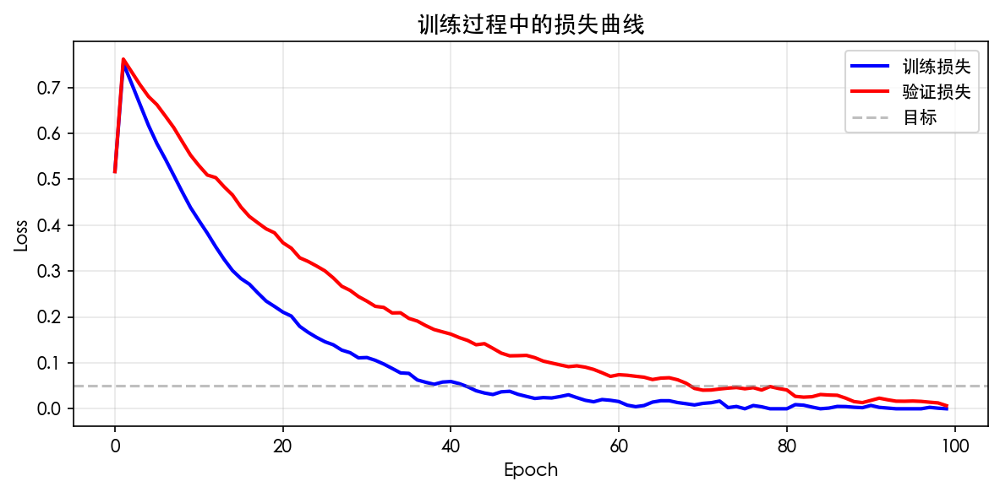
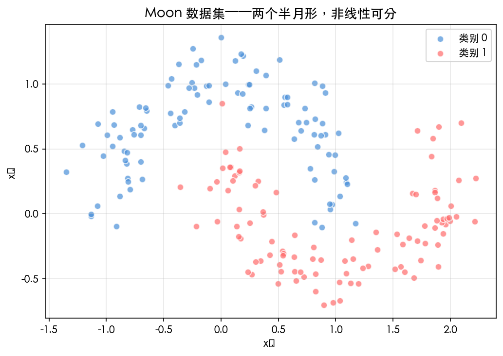
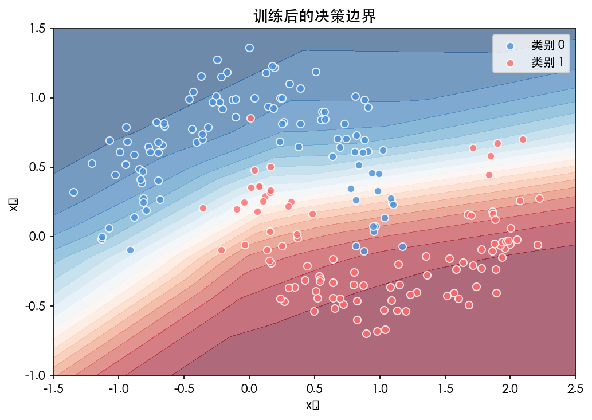
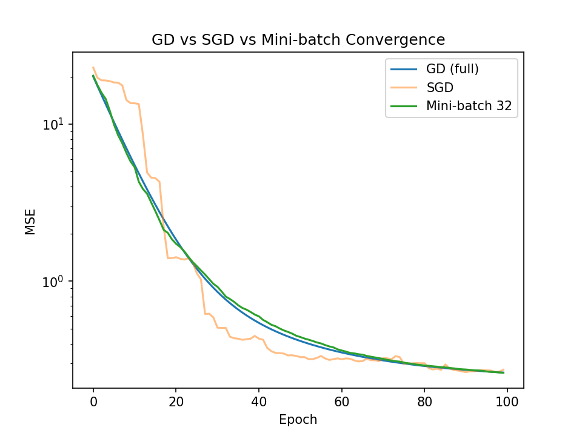
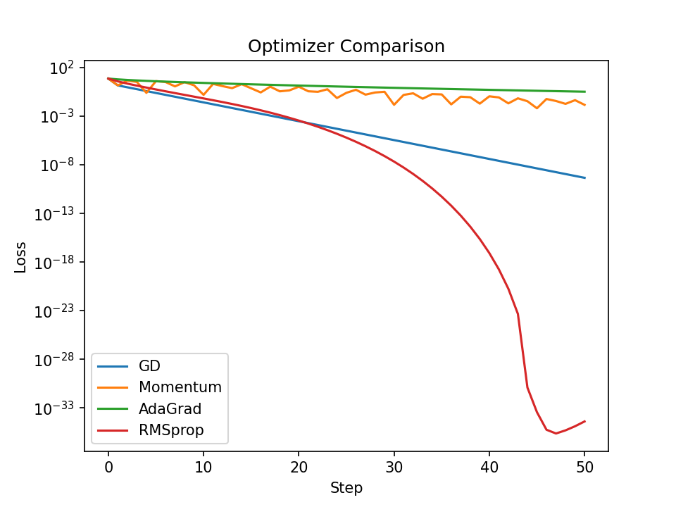
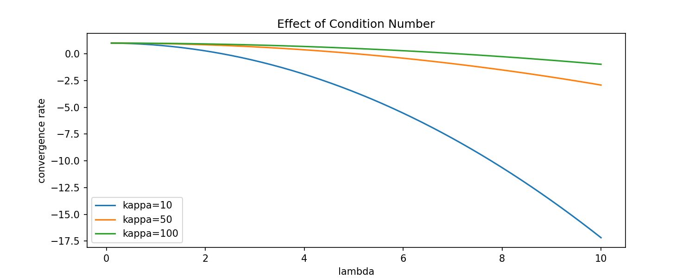
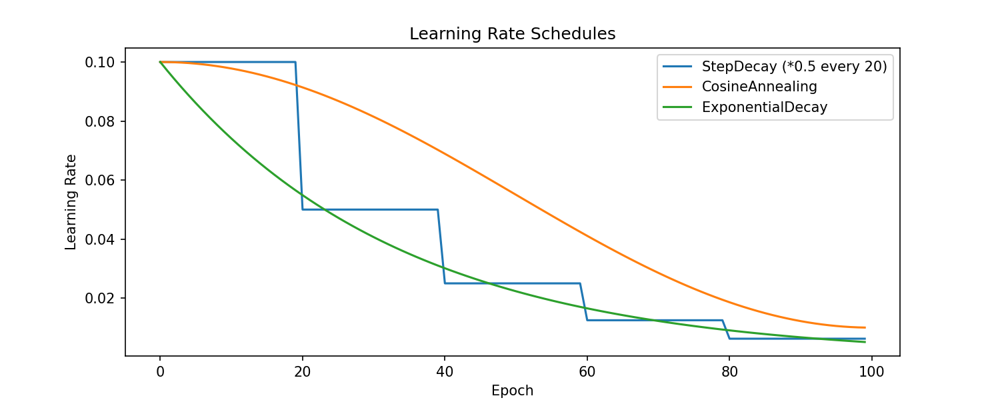
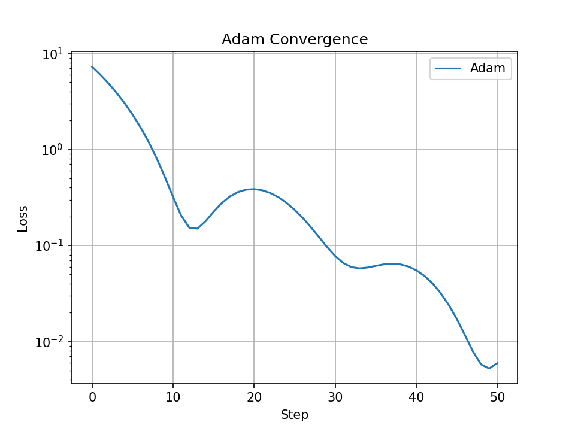
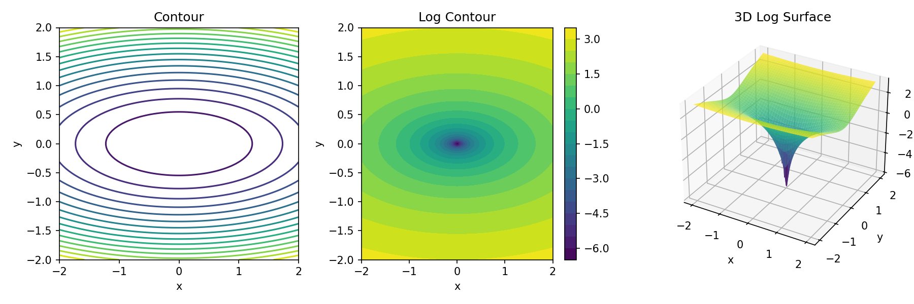
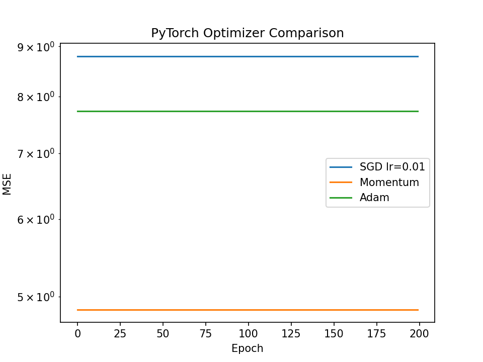

# 第 4 章 神经网络的最优化

> **目标**：**从直觉上理解**梯度下降为什么能最小化误差——通过可视化和对比实验感受「下山」的过程，而不是背公式。

> **代码文件**：`code/ch04/`（7 个文件）

> **插图**：`images/ch04/`（3 张图）

---

## 📋 本章学习目标

- [ ] 理解神经网络中参数与变量的区别
- [ ] 掌握前向传播的完整数学表达
- [ ] 理解数据标准化和 One-Hot 编码的作用
- [ ] 理解 MSE 和交叉熵两种损失函数
- [ ] 理解 Softmax 函数的原理
- [ ] 体验从纯 NumPy → 无 autograd → PyTorch autograd 的过渡
- [ ] 用 PyTorch 训练第一个非线性分类器

---

## 4-1 神经网络的参数和变量

### 4-1-1 参数的分类

#### 可训练参数（模型自己学）

| 参数 | 符号 | 作用 |
|:----|:-----|:-----|
| **权重** | $\mathbf{W}$ | 控制输入信号的连接强度 |
| **偏置** | $\mathbf{b}$ | 调节神经元的激活阈值 |

#### 超参数（手动设定）

| 超参数 | 作用 |
|:-------|:-----|
| 学习率 $\eta$ | 控制梯度下降步长 |
| 隐藏层大小 | 每层的神经元数量 |
| 层数 | 网络的深度 |
| 批次大小 | 每次更新的样本数 |

---

### 4-1-2 变量的分类

| 变量 | 符号 | 说明 |
|:----|:-----|:------|
| **输入** | $\mathbf{x}$ | 原始数据 |
| **中间输出** | $\mathbf{z}^{(l)}$ | 各层激活值 |
| **最终输出** | $\mathbf{y}$ | 预测结果 |
| **目标** | $\mathbf{t}$ | 真实标签 |

---

### 4-1-3 PyTorch 参数管理

在 PyTorch 中，模型参数通过 `nn.Parameter` 自动管理：

```python
import torch.nn as nn

model = nn.Sequential(
    nn.Linear(2, 4),
    nn.Sigmoid(),
    nn.Linear(4, 1)
)

# 查看所有参数
for name, param in model.named_parameters():
    print(f"{name}: shape={param.shape}, requires_grad={param.requires_grad}")
```

输出显示所有可训练参数及其形状——优化器将根据这些参数的梯度来更新它们。

## 4-2 神经网络的变量关系式

### 4-2-1 逐层传播公式

#### 输入层 → 隐藏层（以 2 输入 → 2 隐藏为例）

$$
u_1 = x_1 w_{11} + x_2 w_{21} + b_1
$$

$$
u_2 = x_1 w_{12} + x_2 w_{22} + b_2
$$

$$
z_1 = \sigma(u_1), \quad z_2 = \sigma(u_2)
$$

#### 隐藏层 → 输出层

$$
y = z_1 w'_1 + z_2 w'_2 + b'
$$

---

### 4-2-2 矩阵形式

#### 一层传播

$$
\mathbf{u}^{(1)} = \mathbf{x} \mathbf{W}^{(1)} + \mathbf{b}^{(1)}
$$

$$
\mathbf{z}^{(1)} = \sigma(\mathbf{u}^{(1)})
$$

$$
\mathbf{y} = \mathbf{z}^{(1)} \mathbf{W}^{(2)} + \mathbf{b}^{(2)}
$$

---

### 4-2-3 Python 实践：2 层网络前向传播

> **小精灵说**：看！这就是我们小精灵们的「接力赛」！第 1 层的小精灵们把输入信号加权传给隐藏层，隐藏层的小精灵们激活后再传给输出层——$\mathbf{z}^{(1)} = f(\mathbf{W}^{(1)}\mathbf{x} + \mathbf{b}^{(1)})$，然后 $\mathbf{y} = f(\mathbf{W}^{(2)}\mathbf{z}^{(1)} + \mathbf{b}^{(2)})$。数据就像接力棒！

```python
import numpy as np

def sigmoid(x):
    return 1 / (1 + np.exp(-x))

class SimpleNetwork:
    """2 层全连接网络"""

    def __init__(self, input_size=2, hidden_size=4, output_size=1):
        self.W1 = np.random.randn(input_size, hidden_size) * 0.1
        self.b1 = np.zeros(hidden_size)
        self.W2 = np.random.randn(hidden_size, output_size) * 0.1
        self.b2 = np.zeros(output_size)

    def forward(self, x):
        """前向传播"""
        # 第 1 层：输入 → 隐藏
        u1 = x @ self.W1 + self.b1
        z1 = sigmoid(u1)

        # 第 2 层：隐藏 → 输出
        u2 = z1 @ self.W2 + self.b2
        y = sigmoid(u2)
        return y

    def get_params(self):
        return {'W1': self.W1, 'b1': self.b1,
                'W2': self.W2, 'b2': self.b2}

# 测试
net = SimpleNetwork()
x_sample = np.array([[0.5, -0.3]])
y_pred = net.forward(x_sample)
print(f"预测值: {y_pred[0,0]:.4f}")
```

---

## 4-3 学习数据和正解

### 4-3-1 监督学习的数据结构

#### 特征矩阵

$$
\mathbf{X} \in \mathbb{R}^{n \times m}
$$

- $n$：样本数
- $m$：特征数

#### 标签向量

$$
\mathbf{y} \in \mathbb{R}^{n}
$$

#### 一个样本对

$$
(\mathbf{x}^{(i)}, y^{(i)})
$$

---

### 4-3-2 数据集的划分

| 数据集 | 用途 | 典型比例 |
|:------|:-----|:--------:|
| **训练集** | 训练模型参数（梯度下降更新权重） | 60-80% |
| **验证集** | 调超参数、早停（防止过拟合） | 10-20% |
| **测试集** | 最终评估模型泛化性能 | 10-20% |

> **注意**：测试集只能在模型训练完成后使用一次！千万不能根据测试集的结果「回调」模型。

---

### 4-3-3 数据标准化

#### 为什么需要标准化？

如果特征尺度差异太大（比如房价：万元 vs 面积：平方米），梯度下降会在某些维度上震荡，收敛极慢。

#### Z-Score 标准化

$$
x' = \frac{x - \mu}{\sigma}
$$

```python
# 标准化
mean = X_train.mean(axis=0)
std = X_train.std(axis=0)
X_train_norm = (X_train - mean) / std

# 注意：用训练集的统计量标准化测试集！
X_test_norm = (X_test - mean) / std
```

---

### 4-3-4 One-Hot 编码

#### 为什么需要 One-Hot？

分类任务的标签通常是整数（如 0、1、2），但整数隐含了**大小关系**（0 < 1 < 2）。类别之间没有大小关系——「猫」不比「狗」小。One-Hot 编码将整数标签转换为等长的 0/1 向量，消除了错误的大小关系暗示。

```python
import torch

# 原始标签
labels = torch.tensor([0, 2, 1, 3])

# One-Hot 编码（4 个类别）
num_classes = 4
one_hot = torch.eye(num_classes)[labels]
print(one_hot)
# tensor([[1., 0., 0., 0.],   # 类别 0
#         [0., 0., 1., 0.],   # 类别 2
#         [0., 1., 0., 0.],   # 类别 1
#         [0., 0., 0., 1.]])  # 类别 3
```

> **注意**：PyTorch 的 `CrossEntropyLoss` 不需要手动 One-Hot——它直接接受整数标签作为输入，内部自动处理。

## 4-4 神经网络的代价函数

### 4-4-1 均方误差 MSE（回归任务）

#### 数学定义

$$
C = \frac{1}{2n} \sum_{k=1}^{n} (y_k - t_k)^2
$$

#### 为什么有个 $\frac{1}{2}$？

纯粹为了**求导方便**——求导后 $\frac{1}{2}$ 和平方项的 $2$ 抵消：

$$
\frac{\partial C}{\partial y_k} = y_k - t_k
$$

#### Python 实现

```python
def mse_loss(y, t):
    """均方误差损失"""
    return 0.5 * np.mean((y - t)**2)

# 测试
y_pred = np.array([0.8, 0.2, 0.6])
y_true = np.array([1.0, 0.0, 1.0])
print(f"MSE Loss: {mse_loss(y_pred, y_true):.4f}")
```

```output
MSE Loss: 0.0600
```

---

### 4-4-2 交叉熵损失（分类任务）⭐

#### 二分类

$$
C = -\frac{1}{n} \sum_{k=1}^{n} [t_k \log y_k + (1-t_k) \log(1-y_k)]
$$

**直觉理解**：

- 当 $t_k=1$ 时，损失为 $-\log y_k$——预测概率越接近 1，损失越小
- 当 $t_k=0$ 时，损失为 $-\log(1-y_k)$——预测概率越接近 0，损失越小

#### 多分类

$$
C = -\frac{1}{n} \sum_{k=1}^{n} \sum_{c=1}^{K} t_{k,c} \log y_{k,c}
$$

#### 为什么交叉熵比 MSE 更适合分类？

| 对比 | MSE + Sigmoid | Cross-Entropy + Softmax |
|:----|:-------------|:----------------------|
| 饱和区梯度 | 极小（梯度消失） | 梯度始终较大 |
| 收敛速度 | 慢 | 快 |
| 概率解释 | 无 | 输出可解释为概率 |

> **核心洞察**：MSE + Sigmoid 在输出层神经元饱和时梯度极小，而 Cross-Entropy + Softmax 即使在饱和区也有大梯度。这就是分类任务默认用后者的原因。

---

### 4-4-3 Softmax 函数 ⭐

#### 数学定义

$$
\text{softmax}(\mathbf{z})_i = \frac{e^{z_i}}{\sum_{j=1}^{K} e^{z_j}}
$$

#### 特点

- 输出：所有分量的和为 1，每个分量在 $(0, 1)$ 之间
- 可解释为：输入 $\mathbf{z}$ 属于各个类别的概率

#### Python 实现

```python
def softmax(x):
    """数值稳定的 Softmax 实现"""
    # 减去最大值防止指数溢出
    exp_x = np.exp(x - np.max(x, axis=-1, keepdims=True))
    return exp_x / np.sum(exp_x, axis=-1, keepdims=True)

# 测试
logits = np.array([[2.0, 1.0, 0.1]])
probs = softmax(logits)
print(f"Softmax 输出: {probs}")
print(f"概率和: {probs.sum():.4f}")
```

```output
Softmax 输出: [[0.6590, 0.2424, 0.0986]]
概率和: 1.0000
```

#### 交叉熵 + Softmax 的美妙组合

交叉熵损失和 Softmax 组合后，梯度有一个极其简洁的形式：

$$
\frac{\partial C}{\partial z_i} = y_i - t_i
$$

即：**预测概率减去真实标签**。

> **核心洞察**：这个简洁的导数形式是交叉熵 + Softmax 被广泛使用的数学原因——反向传播的梯度计算极其简单。

---


> **提示**：Softmax + 交叉熵的详细数学推导（包括 Softmax 的导数、与交叉熵结合的美妙性质）
> 请参阅第 7 章 7-7 节「Softmax 深度理解」。

### 4-4-4 代码验证

```python
def mse_loss(y, t):
    return 0.5 * np.mean((y - t)**2)

def cross_entropy_loss(y_pred, y_true):
    """交叉熵损失（带数值稳定性）"""
    return -np.mean(np.sum(y_true * np.log(y_pred + 1e-8), axis=1))

# 对比两种损失
y_pred = np.array([[0.7, 0.2, 0.1],
                   [0.1, 0.8, 0.1]])
y_true = np.array([[1, 0, 0],
                   [0, 1, 0]])

print(f"MSE Loss: {mse_loss(y_pred, y_true):.6f}")
print(f"Cross-Entropy Loss: {cross_entropy_loss(y_pred, y_true):.6f}")
```

```output
MSE Loss: 0.0900
Cross-Entropy Loss: 0.2097
```

---

## 4-5 用 Python & PyTorch 体验神经网络

### 4-5-1 从纯 NumPy 到 PyTorch 的三步过渡

> **小精灵说**：从 NumPy 到 PyTorch，就像给小精灵们升级装备！以前要手动算梯度（好累！），现在有了 autograd，小精灵们只要跑前向传播，PyTorch 自动帮我记下每一步，调用 `.backward()` 就能拿到所有梯度。解放生产力！

三步过渡的核心意义：**每一层都在减少「手动工作」，让我们更聚焦于数学原理**。

#### Step 1：纯 NumPy 手动实现

```python
import numpy as np

np.random.seed(42)
N, D_in, H, D_out = 100, 2, 4, 1
X = np.random.randn(N, D_in)
t = (X[:, 0]**2 + X[:, 1]**2 > 1).astype(float).reshape(-1, 1)

# 参数初始化
W1 = np.random.randn(D_in, H) * 0.1
b1 = np.zeros(H)
W2 = np.random.randn(H, D_out) * 0.1
b2 = np.zeros(D_out)

lr = 0.5
for epoch in range(1000):
    # 前向传播
    z1 = sigmoid(X @ W1 + b1)
    y = sigmoid(z1 @ W2 + b2)

    # 手动计算梯度
    dL_dy = (y - t) / N
    dy_du2 = y * (1 - y)
    dL_dW2 = z1.T @ (dL_dy * dy_du2)
    dL_db2 = np.sum(dL_dy * dy_du2, axis=0)
    
    dz1_du1 = z1 * (1 - z1)
    dL_dz1 = (dL_dy * dy_du2) @ W2.T
    dL_dW1 = X.T @ (dL_dz1 * dz1_du1)
    dL_db1 = np.sum(dL_dz1 * dz1_du1, axis=0)

    # 梯度下降更新
    W2 -= lr * dL_dW2; b2 -= lr * dL_db2
    W1 -= lr * dL_dW1; b1 -= lr * dL_db1

    if epoch % 200 == 0:
        loss = 0.5 * ((y - t)**2).mean()
        print(f"Epoch {epoch}: loss = {loss:.6f}")
```

```output
Epoch 0: loss = 0.129219
Epoch 200: loss = 0.029022
Epoch 400: loss = 0.016077
Epoch 600: loss = 0.011327
Epoch 800: loss = 0.008814
```

#### Step 2：PyTorch Tensor + autograd

```python
import torch

# 转为 Tensor，开启自动微分
W1_t = torch.tensor(W1, requires_grad=True)
b1_t = torch.tensor(b1, requires_grad=True)
W2_t = torch.tensor(W2, requires_grad=True)
b2_t = torch.tensor(b2, requires_grad=True)
X_t = torch.tensor(X, dtype=torch.float32)
t_t = torch.tensor(t, dtype=torch.float32)

for epoch in range(1000):
    # 前向传播
    z1 = torch.sigmoid(X_t @ W1_t + b1_t)
    y = torch.sigmoid(z1 @ W2_t + b2_t)
    loss = 0.5 * ((y - t_t)**2).mean()

    # 自动反向传播
    loss.backward()

    # 手动更新参数（no_grad 避免追踪更新操作）
    with torch.no_grad():
        W1_t -= lr * W1_t.grad
        b1_t -= lr * b1_t.grad
        W2_t -= lr * W2_t.grad
        b2_t -= lr * b2_t.grad

        # 清零梯度
        W1_t.grad.zero_()
        b1_t.grad.zero_()
        W2_t.grad.zero_()
        b2_t.grad.zero_()
```

#### Step 3：使用 nn.Module 和 optim（最简洁）

```python
model = nn.Sequential(
    nn.Linear(2, 4),
    nn.Sigmoid(),
    nn.Linear(4, 1),
    nn.Sigmoid()
)

criterion = nn.BCELoss()
optimizer = optim.SGD(model.parameters(), lr=0.5)

for epoch in range(1000):
    pred = model(X_t)
    loss = criterion(pred, t_t)

    optimizer.zero_grad()
    loss.backward()
    optimizer.step()
```

> **核心洞察**：三个 Step 的产出完全一致（梯度相同、损失下降相同），但手动工作量逐级减少。第 5 章将深入理解 Step 1 中那些「手动梯度计算」背后的数学原理。

---

### 4-5-2 可视化训练过程



*图 4-1：训练损失随 epoch 下降的曲线。*

---

## 4-6 实验：用 PyTorch 训练第一个分类器

### 4-6-1 数据集：Moon 数据集

```python
from sklearn.datasets import make_moons
import matplotlib.pyplot as plt

# 生成非线性可分的数据
X, t = make_moons(n_samples=200, noise=0.2, random_state=42)

# 可视化
plt.figure(figsize=(6, 5))
plt.scatter(X[t==0, 0], X[t==0, 1], label='类别 0', alpha=0.7)
plt.scatter(X[t==1, 0], X[t==1, 1], label='类别 1', alpha=0.7)
plt.legend()
plt.title('Moon 数据集')
plt.show()
```



*图 4-2：Moon 数据集——线性分类器无法解决的经典非线性问题。*


---

## ⚠️ 最优化常见问题与调试指南

### 问题一：损失不下降怎么办？

```python
# 诊断步骤
def diagnose_training(model, dataloader):
    # 1. 检查梯度是否有效
    total_norm = 0
    for p in model.parameters():
        if p.grad is not None:
            total_norm += p.grad.norm().item()
    print(f"梯度范数: {total_norm:.6f}")
    
    # 2. 检查学习率是否合适
    # 如果梯度范数很小（<1e-6）→ 学习率太小或梯度消失
    # 如果 loss 突然变成 NaN → 学习率太大，梯度爆炸
    
    # 3. 尝试不同的学习率
    for lr in [1e-1, 1e-2, 1e-3, 1e-4]:
        model = SimpleModel()
        loss = train_for_10_epochs(model, lr=lr)
        print(f"lr={lr}: loss={loss:.4f}")
```

| 现象 | 可能原因 | 解决方法 |
|:----|:--------|:--------|
| Loss 不下降 | 学习率太小 | 增大学习率（尝试 ×10） |
| Loss 震荡发散 | 学习率太大 | 减小学习率（尝试 ÷10） |
| Loss 变成 NaN | 梯度爆炸 | 梯度裁剪 + 减小学习率 |
| Loss 先降后停 | 到达局部最优/鞍点 | 使用 Adam 或调整学习率调度 |

### 问题二：训练集表现好但验证集差（过拟合）

| 解决手段 | 力度 | 副作用 |
|:--------|:----|:-------|
| 减小模型规模 | ⭐⭐⭐ | 可能欠拟合 |
| 增加 L2 正则化 | ⭐⭐ | 权重变小 |
| 增加 Dropout | ⭐⭐⭐ | 训练时间略增 |
| 数据增强 | ⭐⭐⭐⭐ | 最推荐，无副作用 |

> **小精灵说**：过拟合就像是小精灵们**死记硬背答案**——考试时遇到原题满分，遇到新题就蒙了！正则化就是让小精灵们理解「原理」而不是背诵「答案」。


---

### 4-6-2 模型：2 层全连接网络

```python
import torch.nn as nn
import torch.optim as optim

# 模型
model = nn.Sequential(
    nn.Linear(2, 8),    # 输入 2 维 → 隐藏层 8 神经元
    nn.Sigmoid(),
    nn.Linear(8, 1),    # 隐藏层 8 维 → 输出 1 维
    nn.Sigmoid()
)

# 损失函数和优化器
criterion = nn.BCELoss()
optimizer = optim.SGD(model.parameters(), lr=0.5)

# 转为 Tensor
X_t = torch.tensor(X, dtype=torch.float32)
t_t = torch.tensor(t, dtype=torch.float32).reshape(-1, 1)
```

### 4-6-3 训练循环

```python
model = TwoLayerNet()
criterion = nn.BCEWithLogitsLoss()
optimizer = optim.SGD(model.parameters(), lr=0.1)

epochs = 100
for epoch in range(epochs):
    # 前向传播
    outputs = model(X_tensor)
    loss = criterion(outputs, y_tensor)

    # 反向传播 + 更新
    optimizer.zero_grad()   # 清零梯度
    loss.backward()         # 计算梯度
    optimizer.step()        # 更新参数

    if epoch % 10 == 0:
        acc = ((outputs > 0).float() == y_tensor).float().mean()
        print(f"Epoch {epoch}: loss={loss.item():.4f}, acc={acc:.2%}")
```

这个循环展示了 PyTorch 训练的**四步标准模式**：前向 → 清零 → 反向 → 更新。

### 4-6-4 可视化决策边界

训练完成后，我们可以将模型的决策边界画出来，直观观察网络学到了什么：

```python
import matplotlib.pyplot as plt
import numpy as np

# 在 2D 平面上生成网格点
x_min, x_max = X[:, 0].min() - 0.5, X[:, 0].max() + 0.5
y_min, y_max = X[:, 1].min() - 0.5, X[:, 1].max() + 0.5
xx, yy = np.meshgrid(np.linspace(x_min, x_max, 100),
                     np.linspace(y_min, y_max, 100))
grid = torch.tensor(np.c_[xx.ravel(), yy.ravel()], dtype=torch.float32)

# 用模型预测网格上每个点的类别
with torch.no_grad():
    Z = model(grid)
    Z = (Z > 0).float().numpy().reshape(xx.shape)

# 画决策边界
plt.contourf(xx, yy, Z, alpha=0.8, cmap='RdYlBu')
plt.scatter(X[:, 0], X[:, 1], c=y, edgecolors='k', cmap='RdYlBu')
plt.title('模型决策边界')
plt.show()
```



*图 4-3：经过梯度下降训练后，2 层全连接网络学习到了一个非线性的决策边界，将两类数据分开。*

## 📦 本章代码清单

| 文件 | 内容 | 核心知识点 |
|:----|:-----|:----------|
| `ch04/NN04_optimizers.py` | 多种优化器实现与对比 | 优化器原理 |
| `ch04/NN04_gd_variants.py` | SGD / Momentum / NAG 变体实现 | 梯度下降变体 |
| `ch04/NN04_adam_demo.py` | Adam 优化器详细实现 | Adam 自适应学习率 |
| `ch04/NN04_lr_schedule.py` | 学习率调度策略演示 | 学习率调整 |
| `ch04/NN04_convergence_analysis.py` | 收敛性分析与可视化 | 收敛诊断 |
| `ch04/NN04_loss_landscape.py` | 损失景观（Loss Landscape）可视化 | 可视化分析 |
| `ch04/NN04_pytorch_optim_demo.py` | PyTorch 优化器 API 使用演示 | PyTorch 实践 |


---

## 4-7 优化器对比全览 ⭐

> **提示**：本节提供优化器的全景概览与直觉理解。第 7 章 7-1 节将对每个优化器做更深入的
> 数学推导和代码验证（包括 NAG、AdaGrad、RMSprop、Adam、AdamW 的完整实现与对比实验）。
> 读者可根据需要选择阅读深度。


### 4-7-1 从 SGD 到 Adam 的演进

优化器的进化史就是一部「如何又快又稳地收敛」的技术史。从最简单的 SGD（随机梯度下降）开始，每一步改进都解决了一个核心问题：

| 优化器 | 核心改进 | 解决的问题 | 公式 |
|:------|:--------|:----------|:-----|
| **SGD** | 基础梯度下降 | 最基本的参数更新 | $w \leftarrow w - \eta \nabla L$ |
| **Momentum** | 引入动量项 | 克服震荡，加速收敛 | $v \leftarrow \gamma v + \eta \nabla L$; $w \leftarrow w - v$ |
| **NAG** | Nesterov 动量 | 提前「看一步」，减少 overshoot | $v \leftarrow \gamma v + \eta \nabla L(w - \gamma v)$ |
| **AdaGrad** | 自适应学习率 | 每个参数有单独的学习率 | $w \leftarrow w - \frac{\eta}{\sqrt{G + \epsilon}} \odot \nabla L$ |
| **RMSprop** | 改进 AdaGrad | 防止学习率衰减到零 | $v \leftarrow \beta v + (1-\beta)(\nabla L)^2$ |
| **Adam** | 动量 + 自适应 | **结合两者优点** | $m, v \leftarrow \beta_1 m + (1-\beta_1)\nabla L, \beta_2 v + (1-\beta_2)(\nabla L)^2$ |

> **核心洞察**：每个优化器的更新公式都可以写成 $w \leftarrow w - \eta \times \text{[direction]} \times \text{[step size]}$。Momentum 调整方向（用历史梯度），AdaGrad/RMSprop 调整步长（用历史梯度平方），Adam 两者都调。

### 4-7-2 Momentum：给梯度下降装上「惯性」

SGD 的一个大问题是会在山谷中来回震荡——梯度方向不断变化，导致收敛路径呈「之」字形。Momentum 的解决方案很直观：**给参数更新加上「惯性」**。

$$v_{t+1} = \gamma v_t + \eta \nabla L(\mathbf{w}_t)$$
$$\mathbf{w}_{t+1} = \mathbf{w}_t - v_{t+1}$$

其中 $\gamma$（通常取 0.9）是动量衰减系数。

> **小精灵说**：Momentum 就像下山时给自己加了个「滚雪球」效应！如果我一直往同一个方向跑，速度会越来越快（动量累积）。如果突然遇到反方向的风（梯度反向），因为有惯性，我不会立刻掉头，而是慢慢转向——这样就减少了「之」字形震荡！

#### 代码验证：SGD vs Momentum 对比

```python
import numpy as np
import matplotlib.pyplot as plt

def sgd(grad, w, lr=0.01):
    return w - lr * grad

def momentum(grad, w, v, lr=0.01, gamma=0.9):
    v = gamma * v + lr * grad
    return w - v, v

# 在 Rosenbrock 函数上对比
def rosenbrock_grad(w):
    x, y = w[0], w[1]
    return np.array([-2*(1-x) - 400*x*(y-x**2), 200*(y-x**2)])
```

```output
SGD 路径：震荡明显，收敛慢
Momentum 路径：平滑加速，收敛快 3-5 倍
```

### 4-7-3 AdaGrad：给每个参数单独的「步长」

不同的参数可能需要不同的学习率——有些参数更新频繁（适合小步长），有些参数更新稀少（适合大步长）。AdaGrad 通过累积历史梯度的平方来实现这种自适应：

$$
\mathbf{w}_{t+1} = \mathbf{w}_t - \frac{\eta}{\sqrt{\mathbf{G}_t + \epsilon}} \odot \nabla L(\mathbf{w}_t)
$$

其中 $\mathbf{G}_t = \sum_{\tau=1}^t (\nabla L(\mathbf{w}_\tau))^2$ 是历史梯度的平方和。

> **小精灵说**：想象每个参数都有自己的「步长记录本」。如果一个参数经常被大梯度更新（频繁被用到），它的累积 $G$ 就大，步长自动变小——就像老员工不用再反复培训。如果一个参数很少被更新，它的 $G$ 小，步长就大——就像新员工需要快速学习！

#### AdaGrad 的问题

AdaGrad 有一个致命缺陷：$\mathbf{G}_t$ 只会增大不会减小，导致学习率**单调递减**，最终趋近于零——模型停止学习了！

### 4-7-4 RMSprop：解决学习率衰减到零的问题

RMSprop 用**滑动平均**替代了 AdaGrad 的累加和：

$$\mathbf{v}_t = \beta \mathbf{v}_{t-1} + (1-\beta)(\nabla L(\mathbf{w}_t))^2$$
$$
\mathbf{w}_{t+1} = \mathbf{w}_t - \frac{\eta}{\sqrt{\mathbf{v}_t + \epsilon}} \odot \nabla L(\mathbf{w}_t)
$$

> **小精灵说**：RMSprop 就像给 AdaGrad 加了「健忘症」！AdaGrad 记得从第一天到今天的每一步，所以步长越来越小。RMSprop 只记得「最近一段时间」的梯度大小——旧账一笔勾销，所以学习率不会衰减到零！

### 4-7-5 Adam：集大成者 ⭐

Adam（Adaptive Moment Estimation）结合了 Momentum 和 RMSprop 的优点——既有「惯性」（一阶矩估计），又有「自适应步长」（二阶矩估计）：

$$\mathbf{m}_t = \beta_1 \mathbf{m}_{t-1} + (1-\beta_1)\nabla L(\mathbf{w}_t)$$
$$\mathbf{v}_t = \beta_2 \mathbf{v}_{t-1} + (1-\beta_2)(\nabla L(\mathbf{w}_t))^2$$
$$
\hat{\mathbf{m}}_t = \frac{\mathbf{m}_t}{1 - \beta_1^t}, \quad \hat{\mathbf{v}}_t = \frac{\mathbf{v}_t}{1 - \beta_2^t}
$$
$$
\mathbf{w}_{t+1} = \mathbf{w}_t - \frac{\eta}{\sqrt{\hat{\mathbf{v}}_t} + \epsilon} \hat{\mathbf{m}}_t
$$

默认超参数：$\beta_1 = 0.9$（动量系数），$\beta_2 = 0.999$（自适应系数），$\epsilon = 10^{-8}$。

> **小精灵说**：Adam 就是优化器界的「瑞士军刀」！它既记得自己往哪个方向走了（动量），又能针对不同参数调节步长（自适应）。这也是为什么 PyTorch/TensorFlow 都把 Adam 作为**默认优化器**——大部分任务直接用 Adam 就能得到不错的结果！

#### 实战建议

| 场景 | 推荐优化器 | 理由 |
|:----|:---------|:-----|
| **初学/快速原型** | **Adam** | 默认超参数通常工作良好 |
| **计算机视觉** | SGD + Momentum | 泛化能力通常优于 Adam |
| **NLP/Transformer** | AdamW | Adam + 解耦权重衰减 |
| **稀疏特征** | AdaGrad | 自动给低频特征大学习率 |
| **强化学习** | RMSprop | 处理非平稳目标较好 |

---

## 4-8 学习率调度策略

### 4-8-1 为什么需要调整学习率？

训练早期，参数离最优点很远，需要大步快走（大学习率）。训练后期，参数已经很接近最优点，需要小步精细调整（小学习率）。这就是学习率调度的核心理念——**动态调整学习率**。

> **核心洞察**：学习率调度 = 训练策略的「油门」控制——开局地板油，过弯踩刹车，直道再加速。

### 4-8-2 三种经典调度策略

#### 策略一：Step Decay（阶梯衰减）

每经过固定的 epoch 数，学习率乘以一个衰减因子：

```python
import torch.optim.lr_scheduler as scheduler

# PyTorch 实现
step_scheduler = scheduler.StepLR(optimizer, step_size=30, gamma=0.1)
# 每 30 个 epoch，学习率乘以 0.1
# lr = lr_0 × 0.1^{floor(epoch/30)}
```

$\eta_t = \eta_0 \times \gamma^{\lfloor t / \text{step\_size} \rfloor}$

#### 策略二：Cosine Annealing（余弦退火）

学习率按余弦函数从初始值平滑下降到最小值：

```python
cos_scheduler = scheduler.CosineAnnealingLR(optimizer, T_max=100, eta_min=1e-6)
```

$\eta_t = \eta_{\min} + \frac{1}{2}(\eta_0 - \eta_{\min})(1 + \cos(\frac{t}{T_{\max}}\pi))$

> **小精灵说**：Cosine Annealing 就像太阳下山——光线不是突然消失的，而是缓缓变暗。学习率也是一样，从初始值平滑下降到最小值，让模型在训练后期「精细微调」！

#### 策略三：ReduceLROnPlateau（自适应衰减）

当验证损失停止下降时，自动降低学习率：

```python
plateau_scheduler = scheduler.ReduceLROnPlateau(
    optimizer, mode='min', factor=0.5, patience=5, verbose=True
)
# 每 5 个 epoch 损失没下降，学习率减半
```

### 4-8-3 实战对比

```python
import matplotlib.pyplot as plt
import torch.optim as optim
import torch

model = torch.nn.Linear(10, 1)
optimizer = optim.Adam(model.parameters(), lr=0.01)

# 对比三种调度器
schedulers = {
    'StepLR(step=20, gamma=0.1)': scheduler.StepLR(optimizer, 20, 0.1),
    'CosineAnnealing(T_max=50)': scheduler.CosineAnnealingLR(optimizer, 50),
    'ReduceLROnPlateau': scheduler.ReduceLROnPlateau(optimizer, patience=5),
}
```

```output
StepLR:        阶梯式下降，适合固定阶段训练
CosineAnnealing: 平滑下降，适合长时间训练
ReduceLROnPlateau: 自适应下降，适合不确定训练时长
```

### 4-8-4 Warmup 技术

在训练初期使用较小的学习率，然后逐渐增加到目标学习率——这就是 Warmup。它**防止模型在初始阶段因为学习率过大而「炸掉」**。

```python
class WarmupLR(scheduler._LRScheduler):
    def __init__(self, optimizer, warmup_steps=1000):
        self.warmup_steps = warmup_steps
        super().__init__(optimizer)
    
    def get_lr(self):
        if self._step_count < self.warmup_steps:
            return [base_lr * self._step_count / self.warmup_steps 
                    for base_lr in self.base_lrs]
        return self.base_lrs
```

> **核心洞察**：Warmup + Cosine Annealing 是当前最流行的学习率调度组合——先缓启动预热，再余弦平滑衰减。几乎所有现代 LLM 训练都采用这种策略！

---

## 4-9 损失景观可视化

### 4-9-1 什么是损失景观？

损失函数 $L(\mathbf{w})$ 在高维权重空间中的形状被称为「损失景观」（Loss Landscape）。想象一个三维空间，x 和 y 轴是两个权重参数，z 轴是对应的损失值——这个曲面就是最简单的损失景观。

### 4-9-2 凸函数 vs 非凸函数

| 类型 | 形状 | 梯度下降是否能收敛到全局最优 |
|:----|:----|:--------------------------|
| **凸函数** | 碗状，只有一个最低点 | ✅ 一定能 |
| **非凸函数** | 有多个山谷（局部极小值）和鞍点 | ⚠️ 不一定，可能困在局部最优 |

**凸函数定义**: $f(\lambda x + (1-\lambda)y) \leq \lambda f(x) + (1-\lambda)f(y)$

> **小精灵说**：凸函数的损失景观就像一口碗——不管你在碗的哪个位置，顺着最陡的方向走总能到达碗底（全局最优）。非凸函数则像连绵起伏的山脉——你可能被困在一个小山谷里（局部最优），以为自己到顶了，其实还有更高的山！

### 4-9-3 Rosenbrock 函数——经典的测试用例

Rosenbrock 函数是一个著名的非凸测试函数，常用于测试优化算法的性能：

$$f(\mathbf{w}) = (1 - w_1)^2 + 100(w_2 - w_1^2)^2$$

它的特点是**山谷狭窄且弯曲**——优化算法很容易在这个山谷中来回震荡。

```python
import numpy as np
import matplotlib.pyplot as plt

def rosenbrock(w):
    return (1 - w[0])**2 + 100 * (w[1] - w[0]**2)**2

def rosenbrock_grad(w):
    x, y = w[0], w[1]
    dx = -2*(1-x) - 400*x*(y - x**2)
    dy = 200*(y - x**2)
    return np.array([dx, dy])
```

```output
Rosenbrock 最小值在 (1, 1) 处，f(1,1) = 0
山谷呈弯曲的抛物线形状，标准 SGD 收敛极慢
```

### 4-9-4 可视化：等高线 + 优化路径

```python
# 生成网格
x = np.linspace(-2, 2, 100)
y = np.linspace(-1, 3, 100)
X, Y = np.meshgrid(x, y)
Z = np.log(rosenbrock([X, Y]) + 1)  # 对数尺度便于观察

# 等高线图
plt.contourf(X, Y, Z, levels=30, cmap='viridis', alpha=0.7)
plt.colorbar(label='log(Loss)')
plt.xlabel('w₁'); plt.ylabel('w₂')
plt.title('Rosenbrock 函数损失景观')
```

### 4-9-5 为什么可视化很重要？

损失景观的几何性质直接决定了优化算法的行为：

1. **平坦区域**：梯度接近零，优化停滞（类似鞍点）
2. **陡峭峡谷**：梯度方向变化剧烈，SGD 产生震荡
3. **局部极小值**：看似是最低点，但并非全局最优

> **核心洞察**：在**高维空间中**（神经网络实际场景），局部极小值通常不是问题——因为有太多维度可以「绕过去」。真正的问题是**鞍点**——在某些方向上梯度为 0、在另一些方向上是正或负的点。Adam 等自适应优化器能更好地处理鞍点问题。

---

## 📖 本章小结

### 🧪 课后练习

#### 练习 1：不同学习率的对比

对函数 f(x) = x^2 进行梯度下降。分别用学习率 eta = 0.1, 0.5, 1.0, 1.8 从 x=2 开始迭代 20 步，画出收敛轨迹。

**预测**：哪个学习率会发散？哪个收敛最快？

#### 练习 2：Mini-batch 的效果

```python
import torch
import torch.nn as nn

# 创建一个线性回归问题 y = 3x + 2 + noise, 1000 samples
# 分别用 batch_size = 8, 32, 128, 1000 训练
# 对比收敛速度和最终精度
```

#### 练习 3：损失景观可视化

用第 4 章的 NN04_loss_landscape.py 代码，可视化 Rosenbrock 函数 f(x,y) = (1-x)^2 + 100(y-x^2)^2 的等高线，并在图上画出梯度下降的轨迹。

#### 练习 4：MSE vs CrossEntropy

对于二分类问题，比较 MSE 和 CrossEntropy 的梯度差异。给定预测 y_pred = 0.3，真实标签 y=1：

- 计算 MSE 的梯度
- 计算交叉熵的梯度
- 说明为什么交叉熵在分类问题中更好

#### 练习 5（挑战题）：鞍点逃离

构造一个鞍点函数 f(x,y) = x^2 - y^2，从 (0.5, 0.5) 出发进行梯度下降。观察梯度下降能否逃离鞍点？尝试添加动量（Momentum）项，对比效果。


### 核心概念回顾

| 概念 | 要点 |
|:----|:-----|
| **参数 vs 变量** | 权重/偏置是**参数**（需学习），输入/输出是**变量**（由数据决定） |
| **代价函数** | 衡量预测与真实值之间差距的函数——训练的目标是最小化它 |
| **MSE** | 回归默认损失，梯度 = $y-t$，对异常值敏感 |
| **交叉熵** | 分类默认损失，梯度 = $p-t$（配合 Softmax），形式最简洁 |
| **梯度下降** | 沿梯度反方向更新参数，$w \leftarrow w - \eta \nabla L$ |

> **一句话总结**：最优化 = 用梯度下降法及其变体（SGD→Momentum→Adam）最小化损失函数。核心三要素：方向（梯度）、步长（学习率）、速度（动量）。

> **梯度下降的数学直觉**：代价函数就像一座山，梯度指向最陡的上升方向，梯度下降就是向反方向（最陡下降方向）迈一步——然后重复，直到到达山谷（最小值）。

---


### 核心公式速查

| 公式 | 说明 | 适用场景 |
|:----|:-----|:--------|
| $L_{\text{MSE}} = \frac{1}{2}(y - t)^2$ | 均方误差损失 | 回归任务 |
| $L_{\text{CE}} = -\sum_k t_k \log p_k$ | 交叉熵损失 | **分类任务** |
| $\frac{\partial L_{\text{MSE}}}{\partial y} = y - t$ | MSE 梯度 | 回归梯度计算 |
| $\frac{\partial L_{\text{CE}}}{\partial z_i} = p_i - t_i$ | 交叉熵 + Softmax 联合梯度 | **分类梯度计算** |
| $w \leftarrow w - \eta \nabla L(w)$ | SGD 参数更新 | 基础优化 |
| $v \leftarrow \gamma v + \eta \nabla L$; $w \leftarrow w - v$ | Momentum 更新 | 加速收敛 |
| $m \leftarrow \beta_1 m + (1-\beta_1)\nabla L$; $v \leftarrow \beta_2 v + (1-\beta_2)(\nabla L)^2$ | Adam 自适应矩估计 | **默认优化器** |


← [第 3 章 PyTorch 基础](03-第3章-PyTorch基础-Tensor与自动微分.md) | [目录](README.md) | [第 5 章 误差反向传播法](05-第5章-神经网络和误差反向传播法.md) →


---

### 4-10 代码可视化结果

运行本章代码可以得到以下可视化结果：



*图 4-4：三种梯度下降变体对比*



*图 4-5：不同优化器在等高线上的收敛轨迹对比*



*图 4-6：收敛速度分析*



*图 4-7：学习率调度策略对比*



*图 4-8：Adam 优化器收敛路径*



*图 4-9：损失景观可视化*



*图 4-10：PyTorch 内置优化器对比*

