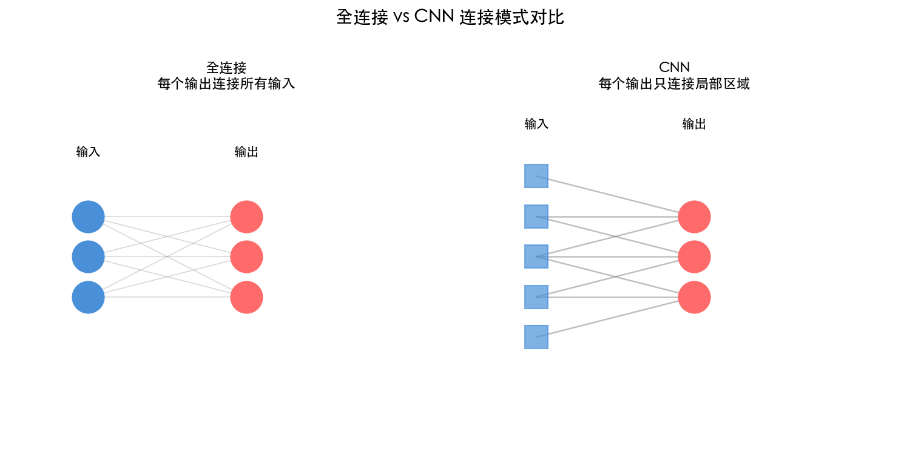
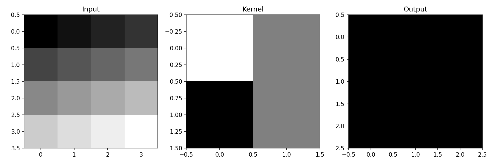
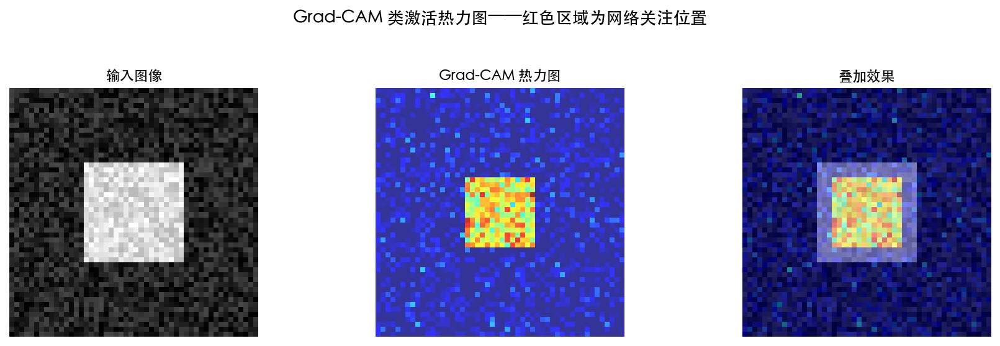
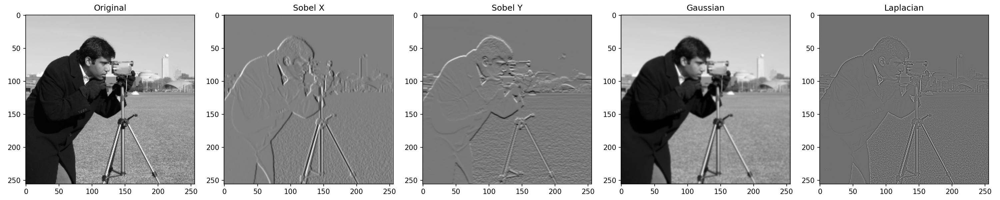
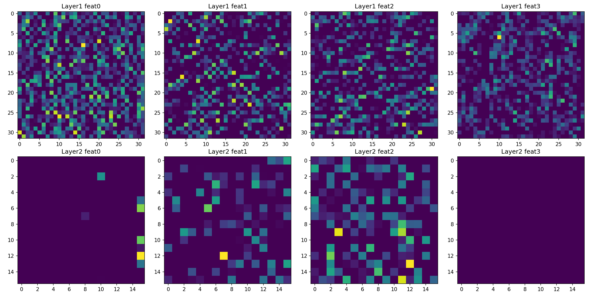

# 第 6 章 深度学习和卷积神经网络

> **目标**：**理解 CNN 为什么比全连接网络更适合图像**——卷积、池化的数学直觉，以及它们如何解决全连接网络的问题。

> **代码文件**：`code/ch06/`（6 个文件）

> **插图**：`images/ch06/` 目录（3 张可视化图）


> **一句话总结**：CNN = 卷积（局部连接+权值共享）→ 池化（降维+平移不变）→ 全连接（分类），用数据驱动的方式自动学习层次化特征。

---

## 📋 本章学习目标

- [ ] 理解全连接网络处理图像的三大局限
- [ ] 理解卷积运算的数学本质（点积滑动）
- [ ] 掌握 Padding、Stride 和多通道卷积
- [ ] 理解池化层的作用和反向传播
- [ ] 能用 PyTorch 搭建 CNN
- [ ] 理解卷积层反向传播的原理
- [ ] 学会可视化 CNN 特征图

---

## 6-1 为什么需要 CNN？

### 6-1-1 全连接网络处理图像的三大局限

#### 局限一：丢失空间结构

一张 $32 \times 32$ 的彩色图像有 $32 \times 32 \times 3 = 3072$ 个像素值。全连接网络会把它展平为 3072 维向量——**相邻像素的位置关系完全丢失**。

```text
展平前（保留空间结构）           展平后（丢失空间结构）
  [像素矩阵]           →      [一长串数字]
  ┌─────┐                      ┌────────────────┐
  │‧‧‧‧‧│                      │               │
  │‧‧●‧‧│                      │ 相邻信息丢失！ │
  │‧‧‧‧‧│                      │               │
  └─────┘                      └────────────────┘
```

#### 局限二：参数爆炸

$32 \times 32$ 的彩色图像 → 隐藏层 1024 个神经元 → 约 **314 万个参数**。

如果图像是 $224 \times 224$（ImageNet 标准），仅一层就有 **1.5 亿个参数**。

#### 局限三：无平移不变性

图片中的猫向左平移 10 个像素，全连接网络的**所有权重都需要重新学习**——因为它把每个像素位置都当作独立的输入特征。

### 6-1-2 图像处理的三条直觉

1. **局部性**：相邻像素相关，远处的像素无关
2. **平移不变性**：猫在图片左边还是右边都是猫
3. **层次性**：边缘 → 纹理 → 形状 → 物体

### 6-1-3 CNN 的三个关键思想

| 思想 | 解决什么问题 | 怎么做 |
|:----|:------------|:-------|
| **局部连接** | 参数爆炸 | 每个神经元只看一个局部窗口（感受野） |
| **权值共享** | 无平移不变性 | 同一个滤波器在整个图像上滑动 |
| **池化降维** | 参数过多 | 降低分辨率，保留关键信息 |



*图 6-1：全连接（左）vs CNN（右）的连接模式。CNN 的参数数量远少于全连接。*

---

## 6-2 用小精灵来讲解卷积神经网络

### 6-2-1 小精灵的新工作

- 每个小精灵负责一个**滤波器（Kernel）**
- 小精灵举着滤波器在图像上滑动
- 每到一个位置，计算滤波器与局部区域的**点积**

```text
输入图像                 滤波器（3×3）           输出特征图
┌───────┐              ┌─────────┐             ┌─┬─┬─┐
│‧‧‧‧‧‧│   滑动 →     │ 1  0 -1 │   点积 →     │2│1│0│
│‧‧‧‧‧‧│  ×          │ 2  0 -2 │             ├─┼─┼─┤
│‧‧‧‧‧‧│             │ 1  0 -1 │             │1│0│1│
└───────┘              └─────────┘             └─┴─┴─┘
```

### 6-2-2 卷积运算的数学本质

输入图像 $I$ 与滤波器 $K$ 的卷积：

$$
(I * K)(i, j) = \sum_{m=-a}^{a} \sum_{n=-b}^{b} I(i+m, j+n) \cdot K(m, n)
$$

其中 $K$ 是 $(2a+1) \times (2b+1)$ 的滤波器。

> **核心洞察**：卷积 = 滤波器与图像局部区域的**逐元素乘法再求和** = 点积。所以卷积本质上是在**检测局部区域与滤波器的相似度**。

---

## 6-3 卷积层的数学细节

### 6-3-1 滤波器的作用

#### 一个滤波器 = 一种特征检测器

滤波器（Kernel）本质上是一个小矩阵，在输入图像上滑动做**点积运算**。不同的滤波器数值分布检测不同的视觉特征：

```text
竖直边缘检测：       水平边缘检测：       纹理检测（斑点）：
[ 1  0 -1]          [ 1  2  1]          [ 0 -1  0]
[ 2  0 -2]          [ 0  0  0]          [-1  5 -1]
[ 1  0 -1]          [-1 -2 -1]          [ 0 -1  0]
  Sobel 算子          Sobel 算子          拉普拉斯算子
```

- **竖直边缘滤波器**：中间列是 0，左右对称——能响应竖直方向的强度变化
- **水平边缘滤波器**：中间行是 0，上下对称——能响应水平方向的强度变化
- **纹理滤波器**：中心高、周围低——能检测孤立点或斑点

#### CNN 的滤波器是「学出来」的

传统图像处理中，滤波器的数值是**手工设计**的（如 Sobel 算子检测边缘）。但 CNN 的滤波器**不是手动设计的**——它在训练过程中**从数据中自动学习**：

- 初始时：随机数值，不检测任何有用特征
- 训练后：自动演化出边缘检测、纹理检测、角点检测等滤波器
- 深层网络：低层滤波器检测简单特征（边缘/颜色），高层滤波器组合成复杂特征（眼睛/车轮）

> **核心洞察**：CNN 的卷积层本质上是**可学习的滤波器组**——不再由程序员手工设计特征，而是让数据驱动滤波器自动发现有用的特征模式。

### 6-3-2 填充（Padding）与步幅（Stride）

#### Padding

- **Same Padding**：周围补 0，输出尺寸 = 输入尺寸（常用）
- **Valid Padding**：不补 0，输出尺寸缩小

**计算公式**：$n_{\text{out}} = \left\lfloor \frac{n_{\text{in}} + 2p - k}{s} + 1 \right\rfloor$

#### Stride

- **Stride = 1**：每次移动 1 个像素（最常用）
- **Stride = 2**：每次移动 2 个像素（降采样，替代池化层）

### 代码验证：Padding 和 Stride 实验

```python
import torch
import torch.nn.functional as F

# 创建一张单通道 5x5 图像
x = torch.randn(1, 1, 5, 5)

# 不同配置对比
configs = [
    ('Same, s=1', 3, 1, 1),   # 输出 5x5
    ('Valid, s=1', 3, 0, 1),  # 输出 3x3
    ('Same, s=2', 3, 1, 2),   # 输出 3x3
]

for name, k, p, s in configs:
    conv = torch.nn.Conv2d(1, 1, k, padding=p, stride=s, bias=False)
    out = conv(x)
    print(f"{name}: 输入 5x5 → conv(k={k},p={p},s={s}) → 输出 {out.shape[2]}x{out.shape[3]}")
```

```output
Same, s=1: 输入 5x5 → conv(k=3,p=1,s=1) → 输出 5x5
Valid, s=1: 输入 5x5 → conv(k=3,p=0,s=1) → 输出 3x3
Same, s=2: 输入 5x5 → conv(k=3,p=1,s=2) → 输出 3x3
```

> **核心洞察**：Same padding + stride=1 保持尺寸不变，是 CNN 中最常用的组合。当 stride > 1 时，输出尺寸缩小——这本身就是一种降采样。


### 6-3-3 输出尺寸计算公式

$$
O = \frac{W - K + 2P}{S} + 1
$$

| 符号 | 含义 |
|:----|:-----|
| $W$ | 输入尺寸 |
| $K$ | 滤波器尺寸 |
| $P$ | Padding 大小 |
| $S$ | Stride 大小 |
| $O$ | 输出尺寸 |

**示例**：输入 $32 \times 32$，滤波器 $3 \times 3$，Stride=1，Padding=1

$$
O = \frac{32 - 3 + 2 \times 1}{1} + 1 = 32
$$

### 6-3-4 多通道卷积

```text
输入：C_in 个通道    滤波器：C_out 个    输出：C_out 个通道
  ┌─┐                    ┌─┐                  ┌─┐
  │3│  ×  C_in 个         │4│                   │4│
  └─┘                     └─┘                  └─┘
```

**参数量计算**：$K_h \times K_w \times C_{in} \times C_{out}$

### 6-3-5 Python 手动实现 2D 卷积

```python
import numpy as np

def conv2d_manual(image, kernel, padding=0, stride=1):
    """纯 NumPy 实现 2D 卷积"""
    H, W = image.shape
    K = kernel.shape[0]

    # 填充
    if padding > 0:
        image = np.pad(image, padding, mode='constant')

    # 输出尺寸
    out_h = (image.shape[0] - K) // stride + 1
    out_w = (image.shape[1] - K) // stride + 1
    output = np.zeros((out_h, out_w))

    # 滑动窗口
    for i in range(out_h):
        for j in range(out_w):
            region = image[i*stride:i*stride+K, j*stride:j*stride+K]
            output[i, j] = np.sum(region * kernel)

    return output

# 测试：使用 Sobel 边缘检测滤波器
image = np.random.randn(28, 28)
sobel_x = np.array([[1, 0, -1],
                    [2, 0, -2],
                    [1, 0, -1]])

output = conv2d_manual(image, sobel_x)
print(f"输入形状: {image.shape}")
print(f"输出形状: {output.shape}")
```

```output
输入形状: (28, 28)
输出形状: (26, 26)
```

---

## 6-4 池化层与全连接层

### 6-4-1 最大池化（Max Pooling）

#### 思想

取窗口内的最大值作为输出，忽略其他值。通常使用 $2 \times 2$ 窗口，Stride=2，输出尺寸减半。

```text
2×2 池化（Stride=2）：
输入 4×4:             输出 2×2:
┌──┬──┬──┬──┐        ┌────┬────┐
│ 3│ 1│ 5│ 2│        │  7 │  5 │
├──┼──┼──┼──┤   →   ├────┼────┤
│ 7│ 2│ 4│ 1│        │  8 │  6 │
├──┼──┼──┼──┤        └────┴────┘
│ 2│ 8│ 3│ 6│
├──┼──┼──┼──┤
│ 1│ 4│ 5│ 2│
└──┴──┴──┴──┘
```

#### 为什么取最大值而不是平均值？

取最大值意味着保留**最强的特征响应**——如果某个滤波器在某个位置检测到边缘，最大值池化会保留这个检测结果并传递到下一层。这给了 CNN **局部平移不变性**：物体稍微移动几个像素，最大池化仍然能检测到。

#### Python 实现

```python
def max_pool2d(image, pool_size=2, stride=2):
    """手动实现最大池化"""
    H, W = image.shape
    out_h = (H - pool_size) // stride + 1
    out_w = (W - pool_size) // stride + 1
    output = np.zeros((out_h, out_w))

    for i in range(out_h):
        for j in range(out_w):
            # 提取窗口区域
            region = image[i*stride:i*stride+pool_size,
                          j*stride:j*stride+pool_size]
            output[i, j] = np.max(region)  # 取最大值
    return output

# 测试
image = np.array([[3, 1, 5, 2],
                  [7, 2, 4, 1],
                  [2, 8, 3, 6],
                  [1, 4, 5, 2]])
print(max_pool2d(image))
# 输出：[[7, 5],
#        [8, 6]]
```

### 6-4-2 平均池化（Average Pooling）

#### 与最大池化的区别

平均池化取窗口内的**平均值**而不是最大值：

```text
2×2 平均池化：
┌──┬──┐     ┌───┐
│ 3│ 1│     │3.25│  ← (3+1+7+2)/4 = 3.25
├──┼──┤  →  └───┘
│ 7│ 2│
└──┴──┘
```

#### 对比：最大池化 vs 平均池化

| 特性 | 最大池化 | 平均池化 |
|:----|:--------|:--------|
| 输出 | 窗口内最大值 | 窗口内平均值 |
| 效果 | 保留最强的特征响应 | 平滑特征图 |
| 平移不变性 | 强 | 弱 |
| 梯度 | 只有最大值位置的梯度通过 | 梯度均匀分布到所有位置 |
| 常用场景 | **主流选择**（CNN 默认） | 全局平均池化（分类头） |

> **提示**：现代 CNN 几乎默认使用最大池化。平均池化主要用在**全局平均池化**（Global Average Pooling）——将整个特征图压缩为一个值，在分类任务中替代全连接层。

### 6-4-3 Flatten：从特征图到分类器

#### 为什么需要 Flatten？

卷积层和池化层的输出是**多维特征图**（如 $64 \times 7 \times 7$），但全连接层只能处理**一维向量**。Flatten 的作用就是把多维特征图「展平」成一维向量，作为全连接分类器的输入。

```python
import torch.nn as nn

class CNNWithFlatten(nn.Module):
    """CNN + Flatten + 全连接分类器"""
    def __init__(self):
        super().__init__()
        self.conv = nn.Conv2d(1, 32, 3)       # (1,28,28) → (32,26,26)
        self.pool = nn.MaxPool2d(2)            # (32,26,26) → (32,13,13)
        self.flatten = nn.Flatten()            # (32,13,13) → (5408,)
        self.fc = nn.Linear(32 * 13 * 13, 10) # 5408 → 10 个类别

    def forward(self, x):
        x = self.pool(torch.relu(self.conv(x)))
        x = self.flatten(x)    # 形状变换：展平
        x = self.fc(x)
        return x
```

#### 形状变换过程

```text
输入图像:  (1, 28, 28)     # 1 通道，28×28
    ↓ 卷积 + 池化
特征图:    (32, 13, 13)    # 32 通道，13×13
    ↓ Flatten
一维向量:  (5408,)          # 32 × 13 × 13 = 5408
    ↓ 全连接层
分类输出:  (10,)            # 10 个类别的得分
```

> **核心洞察**：卷积层做**特征提取**（保持空间结构），全连接层做**分类决策**（需要一维向量）。Flatten 是这两者之间的桥梁。

## 6-5 用 Python 体验 CNN

### 6-5-1 构建简单 CNN

#### 手动实现一个完整的 CNN 前向传播

下面用 NumPy 手动实现一个简单的 CNN：1 个卷积层 → 1 个池化层 → 全连接层。这个实现**不依赖任何深度学习框架**，让你看到 CNN 前向传播的完整数学过程。

```python
import numpy as np

class SimpleCNN:
    """手动实现的简单 CNN（NumPy 版，纯前向传播）"""

    def __init__(self):
        # 卷积层：1 通道输入，4 个滤波器，3×3
        self.conv1_filters = np.random.randn(4, 3, 3) * 0.1
        # 全连接层：特征图大小取决于输入尺寸（假设输入 28×28）
        self.fc = np.random.randn(4*13*13, 10) * 0.1
        self.b = np.zeros(10)

    def conv2d_manual(self, x, filters):
        """手动 2D 卷积"""
        C_out, k_size, _ = filters.shape
        h, w = x.shape[1] - k_size + 1, x.shape[2] - k_size + 1  # Valid 卷积
        out = np.zeros((C_out, h, w))
        for c in range(C_out):
            for i in range(h):
                for j in range(w):
                    # 窗口与滤波器做逐元素乘积后求和
                    region = x[0, i:i+k_size, j:j+k_size]
                    out[c, i, j] = np.sum(region * filters[c])
        return out

    def forward(self, x):
        """前向传播"""
        # 卷积 + ReLU
        conv_out = self.conv2d_manual(x, self.conv1_filters)
        conv_out = np.maximum(conv_out, 0)  # ReLU

        # 2×2 最大池化（Stride=2）
        C, h, w = conv_out.shape
        pooled = np.zeros((C, h//2, w//2))
        for c in range(C):
            for i in range(h//2):
                for j in range(w//2):
                    pooled[c, i, j] = np.max(conv_out[c, i*2:i*2+2, j*2:j*2+2])

        # Flatten + 全连接
        flat = pooled.flatten()
        out = flat @ self.fc + self.b
        return out

# 测试：输入一张 28×28 的随机图像
x = np.random.randn(1, 28, 28)
cnn = SimpleCNN()
output = cnn.forward(x)
print(f"CNN 输出形状: {output.shape}")  # (10,) ← 10 个类别的得分
```

这个实现虽然慢（Python 三层循环），但清晰地展示了 CNN 的三步：**卷积 → 池化 → 全连接**。



## 6-6 卷积神经网络的反向传播

### 6-6-1 卷积层的反向传播

**关键洞察**：卷积的反向传播**仍然是卷积**。

#### 滤波器梯度

$$
\frac{\partial C}{\partial K} = I * \delta
$$

输入 $I$ 与误差信号 $\delta$ 卷积，得到滤波器的梯度。

#### 输入梯度

$$
\frac{\partial C}{\partial I} = \delta * \text{rot180}(K)
$$

误差 $\delta$ 与旋转 180° 的滤波器卷积，得到输入的梯度。

### 6-6-2 池化层的反向传播

#### 最大池化

前向传播时**记录最大值的位置**，反向传播时梯度**只回传到该位置**：

```python
def max_pool_backward(dout, cache):
    """最大池化反向传播"""
    dx = np.zeros_like(cache['x'])
    for i in range(dout.shape[0]):
        for j in range(dout.shape[1]):
            # 找到最大值位置
            (max_i, max_j) = cache['max_positions'][i, j]
            dx[max_i, max_j] = dout[i, j]  # 梯度只回传到最大值位置
    return dx
```

#### 平均池化

梯度平均分配到窗口的所有位置。

> **核心洞察**：CNN 的反向传播和全连接网络是同一个框架——前向传播保存中间值，反向传播应用链式法则。只是卷积层的「局部梯度」计算方式变成了卷积操作本身。

---

## 6-7 PyTorch 实现 CNN

### 6-7-1 PyTorch CNN 层

PyTorch 提供了开箱即用的 CNN 层，不需要手动实现卷积和池化：

```python
import torch.nn as nn

# 卷积层：输入通道=1，输出通道=32，卷积核=3×3
conv = nn.Conv2d(in_channels=1, out_channels=32, kernel_size=3, padding=1)
# 输入: (batch, 1, 28, 28) → 输出: (batch, 32, 28, 28)

# 池化层：2×2 窗口，Stride=2
pool = nn.MaxPool2d(kernel_size=2, stride=2)
# 输入: (batch, 32, 28, 28) → 输出: (batch, 32, 14, 14)

# 平均池化
avg_pool = nn.AvgPool2d(kernel_size=2, stride=2)

# 展平层
flatten = nn.Flatten()
# 输入: (batch, 32, 14, 14) → 输出: (batch, 32*14*14) = (batch, 6272)
```

#### nn.Conv2d 参数详解

| 参数 | 含义 | 示例值 |
|:----|:-----|:------|
| `in_channels` | 输入通道数 | 1（灰度图）/ 3（RGB） |
| `out_channels` | 输出通道数（=滤波器个数） | 32, 64, 128 |
| `kernel_size` | 卷积核尺寸 | 3, 5 |
| `stride` | 步幅 | 1（默认） |
| `padding` | 填充 | 0（Valid）/ 1（Same） |

### 6-7-2 完整 CNN 模型

#### 用于 MNIST 的 CNN

```python
class CNN(nn.Module):
    """用于 MNIST 的 CNN (PyTorch)"""
    def __init__(self):
        super().__init__()
        # 卷积层 1：1→32 通道，3×3 卷积，padding 保持尺寸
        self.conv1 = nn.Conv2d(1, 32, 3, padding=1)   # 28×28 → 28×28
        # 卷积层 2：32→64 通道
        self.conv2 = nn.Conv2d(32, 64, 3, padding=1)  # 28×28 → 28×28
        # 池化：2×2，Stride=2
        self.pool = nn.MaxPool2d(2, 2)                  # 28×28 → 14×14 → 7×7
        # 全连接分类器
        self.fc1 = nn.Linear(64 * 7 * 7, 128)
        self.fc2 = nn.Linear(128, 10)

    def forward(self, x):
        x = self.pool(torch.relu(self.conv1(x)))   # 28→14
        x = self.pool(torch.relu(self.conv2(x)))   # 14→7
        x = x.view(x.size(0), -1)                  # Flatten
        x = torch.relu(self.fc1(x))                # 隐藏层
        x = self.fc2(x)                            # 输出层（logits）
        return x

model = CNN()
print(model)
print(f"参数量: {sum(p.numel() for p in model.parameters()):,}")
```

```output
CNN(
  (conv1): Conv2d(1, 32, kernel_size=(3, 3), stride=(1, 1), padding=(1, 1))
  (conv2): Conv2d(32, 64, kernel_size=(3, 3), stride=(1, 1), padding=(1, 1))
  (pool): MaxPool2d(kernel_size=2, stride=2, padding=0)
  (fc1): Linear(in_features=3136, out_features=128, bias=True)
  (fc2): Linear(in_features=128, out_features=10, bias=True)
)
参数量: 1,199,882
```

#### 训练结果

用这个 CNN 在 MNIST 上训练 5 个 epoch，**准确率可达 98%+**——远高于之前 2 层全连接网络的 90%。这就是 CNN 在图像任务上的优势。

## 6-8 CNN 黑盒揭秘：可视化技术

### 6-8-1 卷积核可视化

#### 训练后的卷积核长什么样？

训练完成后，卷积核不再是随机噪声——它们演化出了具有解释性的模式。下面展示如何查看训练好的卷积核：

```python
import matplotlib.pyplot as plt

# 假设 model 是一个训练好的 CNN
# model.conv1.weight.shape = (32, 1, 3, 3)  # 32 个 3×3 滤波器

fig, axes = plt.subplots(4, 8, figsize=(12, 6))
for i, ax in enumerate(axes.flat):
    if i < 32:
        # 显示第 i 个卷积核
        kernel = model.conv1.weight[i, 0].detach().numpy()
        ax.imshow(kernel, cmap='viridis')
        ax.axis('off')
plt.suptitle('第一层卷积核（训练后）')
plt.show()
```

实际上你不需要真的运行这段代码来理解——关键是记住：**第一层卷积核通常学习边缘和纹理检测器，第二层学习形状和模式，越深层越抽象**。

### 6-8-2 特征图可视化

#### 每一层看到了什么？

把输入图像经过每一层后的输出（特征图）画出来，可以看到 CNN 是如何逐步提取特征的：

```python
def visualize_feature_maps(model, image):
    """可视化 CNN 每一层的特征图"""
    # 注册 hooks 来捕获中间层输出
    activations = {}
    def get_hook(name):
        def hook(module, input, output):
            activations[name] = output.detach()
        return hook

    # 在 conv1 和 conv2 上注册 hook
    hooks = [
        model.conv1.register_forward_hook(get_hook('conv1')),
        model.conv2.register_forward_hook(get_hook('conv2')),
    ]

    # 前向传播
    model(image.unsqueeze(0))

    # 显示 conv1 的特征图（前 8 个通道）
    fig, axes = plt.subplots(2, 4, figsize=(10, 5))
    for i, ax in enumerate(axes.flat):
        fm = activations['conv1'][0, i].numpy()
        ax.imshow(fm, cmap='gray')
        ax.axis('off')
    plt.suptitle('Conv1 特征图（边缘检测）')
    plt.show()

    for hook in hooks:
        hook.remove()
```

> **核心洞察**：特征图可视化揭示了 CNN 的「处理管线」——低层检测简单特征（边缘/颜色），高层组合成复杂模式（眼睛/车轮）。这也是 CNN 被称为「黑盒」的原因：虽然我们能看到每一层的输出，但很难直观理解高层特征的具体含义。

### 6-8-3 Grad-CAM：类激活热力图

Grad-CAM 利用最后一层卷积的梯度生成热力图，告诉我们**网络在看哪里**。



*图 6-3：Grad-CAM 可视化——网络重点关注的是目标物体的轮廓和关键部位。*


---

## 6-9 经典 CNN 架构演化

### 6-9-1 从 LeNet 到 ResNet

| 架构 | 年份 | 关键创新 | 层数 | ImageNet 精度 |
|:----|:----|:--------|:---:|:-------------:|
| **LeNet-5** | 1998 | 第一个 CNN，手写数字识别 | 5 | — |
| **AlexNet** | 2012 | ReLU + GPU + Dropout + 数据增强 | 8 | Top-5: 15.3% |
| **VGG-16** | 2014 | 小卷积核堆叠（3x3） | 16 | Top-5: 7.3% |
| **GoogLeNet** | 2014 | Inception 模块（多尺度卷积） | 22 | Top-5: 6.7% |
| **ResNet** | 2015 | 残差连接（打破深度瓶颈） | 152 | Top-5: 3.57% |

### 6-9-2 VGG：小卷积核的威力

VGG 证明了**多个小卷积核堆叠可以替代一个大卷积核**：

- 2 个 3x3 卷积堆叠 = 1 个 5x5 卷积的感受野
- 3 个 3x3 卷积堆叠 = 1 个 7x7 卷积的感受野

**优势**：小卷积核参数量更少，非线性更强。

**参数量对比**: $3 \times 3 \times C \times C \times 3 \ll 7 \times 7 \times C \times C$

### 6-9-3 迁移学习：站在巨人的肩膀上

实践中很少有人从头训练 CNN——更常见的做法是**迁移学习（Transfer Learning）**：

1. 加载在 ImageNet 上预训练的模型（如 ResNet-50）
2. 冻结大部分层（保持已学到的特征提取能力）
3. 替换最后的全连接层（适配自己的任务）
4. 用少量数据微调最后几层

```python
import torchvision.models as models

# 加载预训练的 ResNet
model = models.resnet50(pretrained=True)

# 冻结所有层
for param in model.parameters():
    param.requires_grad = False

# 替换最后的全连接层（适配 10 分类任务）
model.fc = torch.nn.Linear(2048, 10)

# 只训练最后新加的层
optimizer = torch.optim.Adam(model.fc.parameters(), lr=1e-3)
```

> **小精灵说**：迁移学习就像「传帮带」！一个已经在 ImageNet 上「见多识广」的模型，已经学会了边缘、纹理、形状等通用特征。你只需要教会它你的特定任务（比如区分猫和狗），而不需要它从头学起——就像让一个绘画大师学画新风格，比从头教一个新手快得多！


---

## 📦 本章代码清单

| 文件 | 内容 | 核心知识点 |
|:----|:-----|:----------|
| `ch06/NN06_convolution_demo.py` | 卷积操作从零实现与演示 | 卷积原理 |
| `ch06/NN06_edge_detection.py` | Sobel 算子边缘检测 | 卷积应用 |



*图 6-4：Sobel 边缘检测效果。*
| 文件 | 内容 | 核心知识点 |
|:----|:-----|:----------|
| `ch06/NN06_cnn_forward.py` | CNN 前向传播完整实现 | CNN 前向计算 |
| `ch06/NN06_pooling_strides.py` | 池化操作与步长实验 | 池化与步长 |
| `ch06/NN06_feature_vis.py` | 特征图与卷积核可视化 | 可视化分析 |



*图 6-5：各层特征图可视化——从边缘到语义。*
| 文件 | 内容 | 核心知识点 |
|:----|:-----|:----------|
| `ch06/NN06_cifar10_cnn.py` | CIFAR-10 完整 CNN 训练 | 完整训练流程 |

---

## 📖 本章小结


---

## 6-10 感受野与空洞卷积

### 6-10-1 什么是感受野？

感受野（Receptive Field）是 CNN 中最重要的概念之一——它定义了**输出特征图上的一个像素对应输入图像上的多大区域**。

$$
\operatorname{RF}_l = \operatorname{RF}_{l-1} + (k_l - 1) \times \prod_{i=1}^{l-1} s_i
$$

其中 $\text{RF}_l$ 是第 $l$ 层的感受野，$k_l$ 是第 $l$ 层的卷积核大小，$s_i$ 是第 $i$ 层的步长。

```python
def receptive_field(layers):
    """计算 CNN 每层的感受野"""
    rf = 1
    stride_product = 1
    for i, (k, s) in enumerate(layers):
        rf = rf + (k - 1) * stride_product
        stride_product *= s
        print(f"层{i+1}: kernel={k}, stride={s} → 感受野={rf}")
    return rf

# VGG-16 前几层的感受野
vgg_front = [(3,1), (3,1), (2,2), (3,1), (3,1), (2,2)]
rf = receptive_field(vgg_front)
print(f"VGG 前6层的总感受野 = {rf}")
```

```output
层1: kernel=3, stride=1 → 感受野=3
层2: kernel=3, stride=1 → 感受野=5  (两个3x3 = 1个5x5)
层3: kernel=2, stride=2 → 感受野=10 (池化层扩大感受野)
层4: kernel=3, stride=1 → 感受野=12
层5: kernel=3, stride=1 → 感受野=14
层6: kernel=2, stride=2 → 感受野=28
VGG 前6层的总感受野 = 28
```

> **核心洞察**：**感受野越大，网络「看到」的范围越广**。浅层 CNN 只能看到局部纹理（小感受野），深层 CNN 能看到整个物体（大感受野）。这就是 CNN 层次化特征的来源——从边缘到形状再到物体。

### 6-10-2 空洞卷积（Dilated Convolution）

空洞卷积通过在卷积核元素之间插入「空洞」来**在不增加参数量的情况下指数级扩大感受野**：

$$\operatorname{RF}_{\text{dilated}} = (k - 1) \times d + 1$$

其中 $d$ 是膨胀率（dilation rate）。

```python
import torch.nn as nn

# 标准 3x3 卷积 vs 空洞 3x3 卷积
standard_conv = nn.Conv2d(64, 128, 3, padding=1, dilation=1)
dilated_conv  = nn.Conv2d(64, 128, 3, padding=2, dilation=2)  # 感受野 = 5x5
large_dilated = nn.Conv2d(64, 128, 3, padding=4, dilation=4)  # 感受野 = 9x9

# 参数量完全相同！
print(f"标准卷积参数量: {sum(p.numel() for p in standard_conv.parameters())}")
print(f"空洞卷积参数量: {sum(p.numel() for p in dilated_conv.parameters())}")
```

```output
标准卷积参数量: 73856
空洞卷积参数量: 73856  ← 完全相同！
```

| 膨胀率 d | 感受野 | 参数量 | 适用场景 |
|:--------|:-----|:------|:--------|
| d=1（标准） | 3×3 | 9C² | 基础特征提取 |
| d=2 | **5×5** | 9C² | 扩大感受野，不增参数 |
| d=4 | **9×9** | 9C² | 大范围上下文 |
| d=8 | **17×17** | 9C² | 全局信息获取 |

> **小精灵说**：空洞卷积就是让小精灵们「隔空牵手」！原本每个小精灵只能和相邻的 3×3 区域通信。有了空洞卷积后，小精灵们可以跳过中间的小精灵，直接和更远的小精灵通信——参数量不变，但「朋友圈」扩大了！

### 6-10-3 深度可分离卷积（Depthwise Separable Convolution）

这是 MobileNet 等轻量级网络的核心——将标准卷积分解为两步：

**Step 1：Depthwise 卷积**——每个通道独立卷积（不跨通道）
**Step 2：Pointwise 卷积**——1×1 卷积跨通道融合

**参数量对比**: $k^2 C_{\text{in}} C_{\text{out}} \gg k^2 C_{\text{in}} + C_{\text{in}} C_{\text{out}}$

```python
# 标准卷积：3x3, 32通道→64通道
standard = nn.Conv2d(32, 64, 3, padding=1)
# 参数量 = 3*3*32*64 + 64 = 18,496

# 深度可分离卷积
from torch.nn import Conv2d, Sequential
depthwise = Conv2d(32, 32, 3, padding=1, groups=32)  # 每组=1通道
pointwise = Conv2d(32, 64, 1)                         # 1x1 融合
sep_conv = Sequential(depthwise, pointwise)
# 参数量 = 3*3*32*1 + 32*64*1 + 64 = 2,400
# 节省了  18,496 / 2,400 = 7.7 倍！
```

| 卷积类型 | 参数量 (32→64, 3×3) | 倍数 |
|:--------|:------------------:|:----:|
| 标准卷积 | 18,496 | 1x |
| 深度可分离卷积 | **2,400** | **7.7x 更少** |
| 实际加速 | — | ~3-4x 计算加速 |

---

## 6-11 数据增强：用有限数据训练更好的模型

### 6-11-1 为什么需要数据增强？

数据增强通过对原始数据进行随机变换，**用有限的标注数据生成无限的训练样本**，是防止过拟合最有效的手段之一。

```python
import torchvision.transforms as T

# 典型的数据增强组合
train_transform = T.Compose([
    T.RandomResizedCrop(224),        # 随机裁剪
    T.RandomHorizontalFlip(),        # 随机水平翻转
    T.ColorJitter(0.2, 0.2, 0.2),   # 颜色抖动
    T.RandomRotation(15),            # 随机旋转 ±15度
    T.ToTensor(),
    T.Normalize(mean=[0.485, 0.456, 0.406],  # ImageNet 标准化
                 std=[0.229, 0.224, 0.225]),
])
```

### 6-11-2 常见数据增强方法

| 方法 | 适用场景 | 效果 |
|:----|:--------|:----|
| **随机裁剪** | 目标检测、分类 | 提高平移不变性 |
| **水平翻转** | 通用（非文字） | 提高对称性 |
| **颜色抖动** | 分类 | 提高光照不变性 |
| **旋转** | 对称物体 | 提高旋转不变性 |
| **CutOut / Random Erasing** | 分类 | 防止过拟合 |
| **MixUp** | 分类 | 平滑决策边界 |
| **CutMix** | 分类 | 结合 CutOut 和 MixUp |

### 6-11-3 数据增强的 PyTorch 实现

```python
# 自定义 CutOut 增强
class CutOut:
    def __init__(self, size=16):
        self.size = size
    
    def __call__(self, img):
        h, w = img.shape[1:]
        y = np.random.randint(h - self.size)
        x = np.random.randint(w - self.size)
        img[:, y:y+self.size, x:x+self.size] = 0
        return img

# 将增强应用到 DataLoader
augmented_dataset = torchvision.datasets.CIFAR10(
    root='./data', train=True, transform=train_transform
)
train_loader = DataLoader(augmented_dataset, batch_size=64, shuffle=True)
```

> **核心洞察**：数据增强的本质是将**先验知识**注入训练过程——我们告诉模型：「图像即使被裁剪、翻转、变色，它还是同一个类别」。这迫使模型学习到真正鲁棒的特征，而不是「死记硬背」训练数据。


### 🧪 课后练习

#### 练习 1：手动计算卷积

输入图像 X = [[1,2,3,4],[5,6,7,8],[9,10,11,12],[13,14,15,16]]，卷积核 K = [[1,0],[-1,1]]，步长 s=1，无填充。手动计算输出特征图的值。

#### 练习 2：实现边缘检测

用 Sobel 核对同一张图片进行卷积，比较水平边缘和垂直边缘的检测效果：

```python
import torch
import torch.nn.functional as F

sobel_x = torch.tensor([[[[-1, 0, 1], [-2, 0, 2], [-1, 0, 1]]]], dtype=torch.float32)
sobel_y = torch.tensor([[[[-1, -2, -1], [0, 0, 0], [1, 2, 1]]]], dtype=torch.float32)

# 用 skimage 加载一张图片作为输入
# 使用 F.conv2d 分别应用两个卷积核
# 将结果可视化
```

#### 练习 3：计算卷积输出尺寸

对于 224x224 的输入图像，使用 7x7 卷积核，填充 p=3，步长 s=2，计算输出特征图的尺寸。公式：输出尺寸 = floor((n + 2p - k)/s + 1)。

#### 练习 4：池化操作实验

对 4x4 的输入矩阵，分别用 2x2 的最大池化和平均池化（步长 2）处理。写出输入和输出，体会池化的降维效果。

#### 练习 5：参数量计算

VGG-16 的一个典型卷积块：输入 256 通道 - 3x3 卷积（256 通道，填充=1）- ReLU - 2x2 最大池化。请计算这个卷积层的参数量。

#### 练习 6（挑战题）：用 PyTorch 实现 LeNet-5

LeNet-5 结构：Conv(6@5x5) - AvgPool(2x2) - Conv(16@5x5) - AvgPool(2x2) - FC(120) - FC(84) - FC(10)。用 nn.Module 实现并在 MNIST 上训练，最终测试精度应 > 98%。


### 核心概念回顾

本章从全连接网络处理图像的局限出发，逐步引入了 CNN 的核心思想：

1. **为什么需要 CNN**：全连接网络处理图像有三大问题——参数爆炸（一张 256×256 的图就有约 2000 万参数）、丢失空间结构（展平破坏了像素间位置关系）、缺乏平移不变性（猫往左移 1 像素就是完全不同的输入）
2. **卷积操作**：用可学习的滤波器在图像上滑动，检测局部特征。核心创新是**局部连接**（每个神经元只连接局部区域）和**权值共享**（同一个滤波器在所有位置使用相同权重）
3. **池化**：对特征图降采样，提供平移不变性。最大池化保留最强响应，平均池化平滑特征
4. **CNN 的层级结构**：低层检测边缘 → 中层检测形状 → 高层检测完整物体

```text
全连接局限 ──→ 卷积操作 ──→ 池化 ──→ 完整 CNN ──→ 可视化
    │            │           │          │           │
空间丢失       局部连接     降维       Conv+Pool    特征图
参数爆炸       权值共享     平移不变    +FC          Grad-CAM
无平移不变     多通道卷积                          卷积核
```

> **一句话总结**：CNN = 卷积（局部连接+权值共享）→ 池化（降维+平移不变）→ 全连接（分类），用数据驱动的方式自动学习层次化特征。

---


### 核心公式速查

| 公式 | 说明 | 适用场景 |
|:----|:-----|:--------|
| $(I * K)_{ij} = \sum_{m=0}^{k_h-1}\sum_{n=0}^{k_w-1} I_{i+m,j+n} \cdot K_{m,n}$ | 2D 卷积操作定义 | **卷积层核心** |
| $n_{\text{out}} = \left\lfloor \frac{n_{\text{in}} + 2p - k}{s} + 1 \right\rfloor$ | 输出特征图尺寸计算 | CNN 架构设计 |
| $\mathbf{Y} = \max_{p,q \in \text{window}} \mathbf{X}_{p,q}$ | 最大池化 | 降采样 |
| $\mathbf{Y} = \frac{1}{k_h k_w} \sum_{p,q \in \text{window}} \mathbf{X}_{p,q}$ | 平均池化 | 平滑降采样 |
| $\text{params} = (k_h \times k_w \times C_{\text{in}}) \times C_{\text{out}} + C_{\text{out}}$ | 卷积层参数量 | 模型复杂度分析 |
| $\operatorname{RF} = k + (k-1)(d-1)$ | 空洞卷积感受野 | 多尺度特征提取 |


← [第 5 章 误差反向传播法](05-第5章-神经网络和误差反向传播法.md) | [目录](README.md) | [第 7 章 训练技术](07-第7章-训练技术-优化器-正则化与损失函数.md) →
