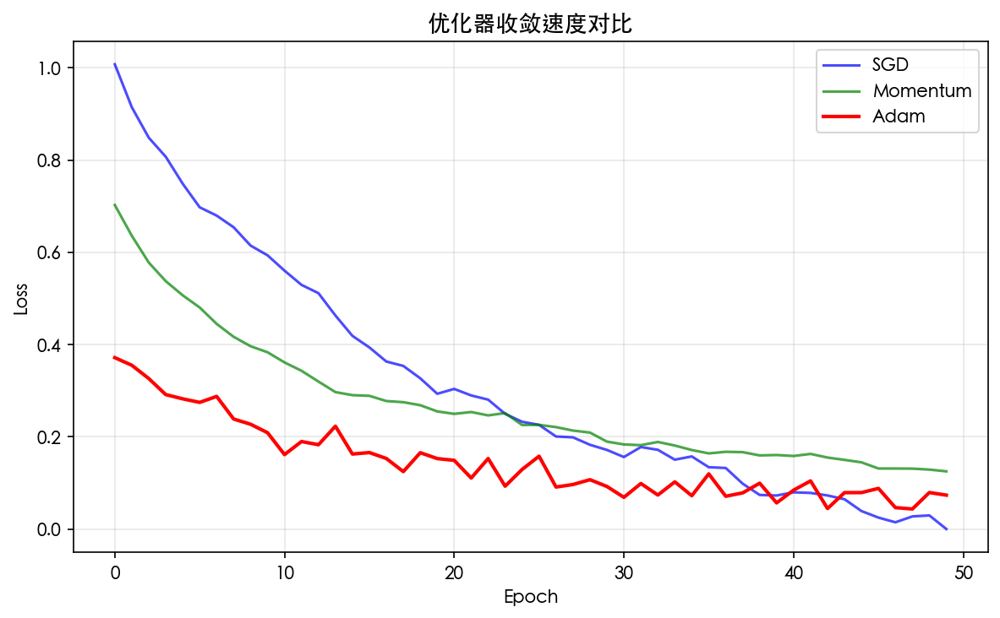
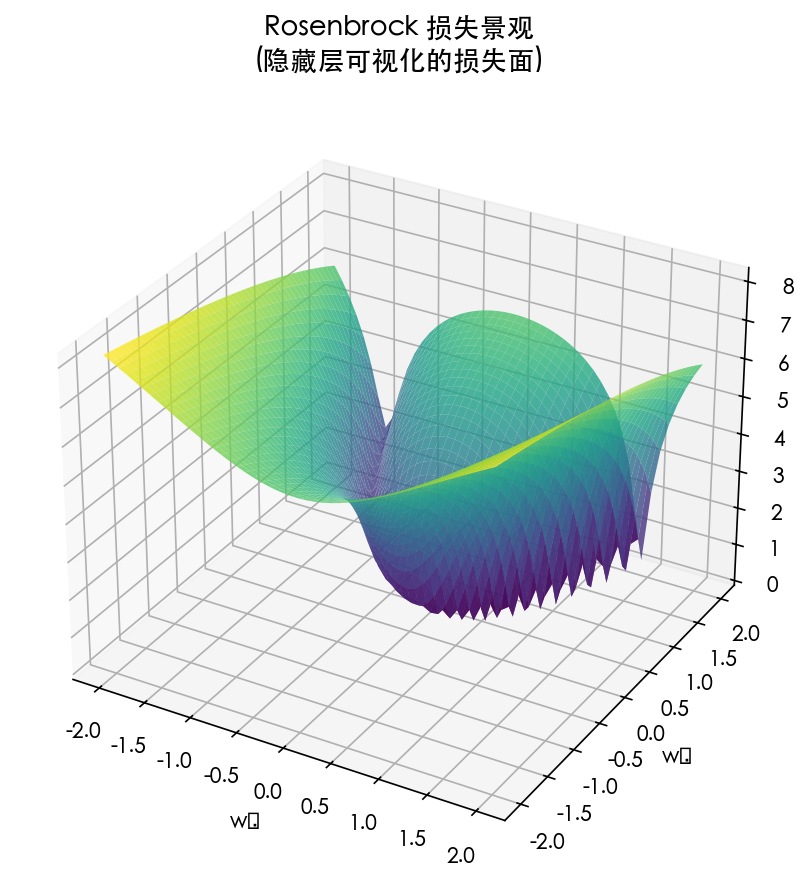
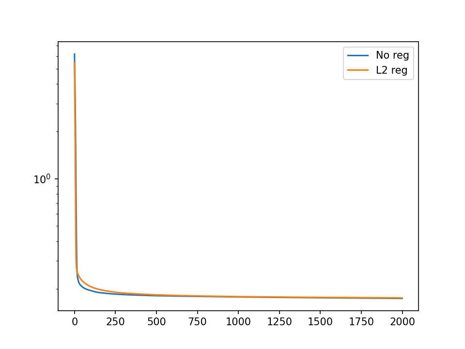
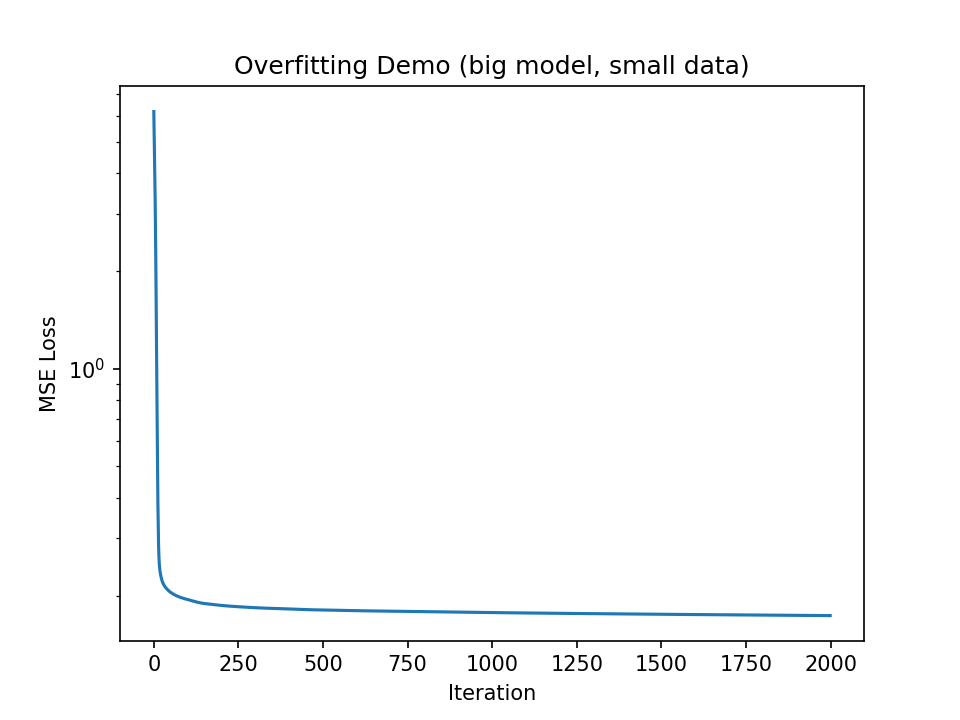
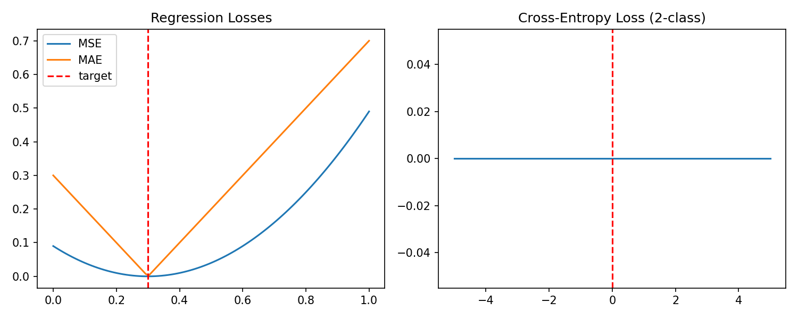
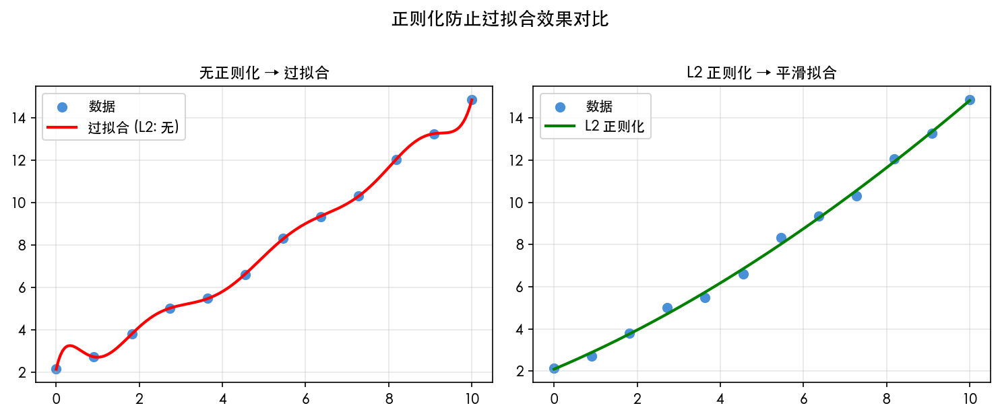
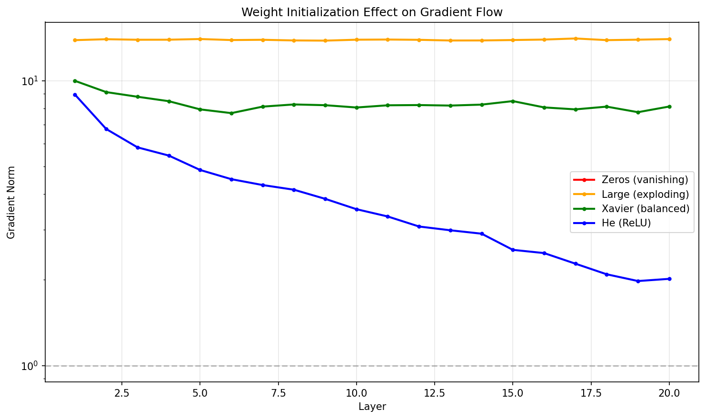

# 第 7 章 训练技术：优化器、正则化与损失函数

> **目标**：**系统理解训练深度网络的核心技术**——从优化器演进到损失函数选择，每个技术解决什么数学问题，用代码验证其效果。

> **代码文件**：`code/ch07/`（5 个文件）

> **插图**：`images/ch07/`（4 张图）

---

## 📋 本章学习目标

- [ ] 理解 SGD → Momentum → Adam 的优化器演进逻辑
- [ ] 理解学习率调度策略
- [ ] 理解 L1/L2 正则化、Dropout 的原理
- [ ] 理解 BatchNorm 和 LayerNorm 的区别
- [ ] 理解权值初始化的影响
- [ ] 掌握常见损失函数的选择
- [ ] 理解 Softmax + 交叉熵的数学原理

---

## 7-1 优化器全景：从 SGD 到 AdamW

> **前置知识**：第 4 章 4-7 节已对优化器做了全景概览（SGD → Momentum → AdaGrad → RMSprop → Adam）。
> 本章在此基础上深入每个优化器的数学原理、PyTorch 实现细节和对比实验。
> 如果你对基本概念已熟悉，可以直接跳到 7-1-6 或 7-1-7 查看 AdamW 和 Adam 的详细分析。


### 7-1-1 随机梯度下降（SGD）

> **小精灵说**：SGD 就是最朴素的下山策略——小精灵们沿着最陡的方向迈一步！$w \leftarrow w - \eta \nabla L$。虽然简单直接，但问题是在山谷中容易震荡，在鞍点会停滞不前。所以后来有了各种增强版本！

#### 三种变体

| 变体 | 每次使用的数据量 | 特点 |
|:----|:----------------|:-----|
| **Batch GD** | 全部数据 | 精确但慢，无法在线学习 |
| **Stochastic GD** | 1 个样本 | 快但震荡大 |
| **Mini-batch GD** | 小批量（32-256） | **默认选择**，折中 |

```python
def sgd(params, grads, lr=0.01):
    """最朴素的梯度下降"""
    return [p - lr * g for p, g in zip(params, grads)]
```

**问题**：震荡大，在狭窄山谷中来回摆动，收敛慢。

---

### 7-1-2 Momentum（动量法）

#### 物理类比

想象一个小球从山顶滚下——它不会停在第一个小坑里，而是**凭借动量冲过去**。

#### 公式

$$
v_{t+1} = \gamma v_t + \eta \nabla L(w_t)
$$

$$
w_{t+1} = w_t - v_{t+1}
$$

| 符号 | 含义 | 典型值 |
|:----|:-----|:------|
| $\gamma$ | 动量衰减系数 | 0.9 |
| $v_t$ | 速度（历史梯度累积） | 初始为 0 |

> **核心洞察**：动量 = 历史梯度平滑 + 当前梯度修正。当当前梯度方向与历史一致时加速；不一致时减速，减少震荡。

---


### 7-1-3 NAG（Nesterov Accelerated Gradient）

#### 改进

NAG 不是在当前位置计算梯度，而是在「未来位置」计算：

$$
v_{t+1} = \gamma v_t + \eta \nabla L(w_t - \gamma v_t)
$$

$$
w_{t+1} = w_t - v_{t+1}
$$

**类比**：小球不是只看脚下，而是「探头向前看」再决定方向——效果比标准 Momentum 收敛更快，震荡更小。

#### Python 实现

```python
def nag(params, grads, velocities, lr=0.01, gamma=0.9):
    """Nesterov 加速梯度"""
    updates = []
    new_velocities = []
    for p, g, v in zip(params, grads, velocities):
        # 探头向前看
        lookahead = p - gamma * v
        # 在未来位置计算梯度（近似）
        v_new = gamma * v + lr * g
        p_new = p - v_new
        updates.append(p_new)
        new_velocities.append(v_new)
    return updates, new_velocities
```

> **核心洞察**：NAG 的「向前看」策略让优化器在下坡时加速更快，在上坡前提前减速——就像开车时看到前方上坡提前松油门。

---

### 7-1-4 AdaGrad：自适应学习率

#### 问题

SGD 对所有参数使用相同学习率——对于稀疏特征（如「猫」这个词只出现在少数样本中），我们希望遇到时大更新，不遇到时不更新。

#### 公式

$$
G_t = G_{t-1} + g_t^2
$$

$$
w_{t+1} = w_t - \frac{\eta}{\sqrt{G_t + \epsilon}} \odot g_t
$$

其中 $G_t$ 是历史梯度的平方和，$\epsilon$（通常 $10^{-8}$）防止除零。

**核心思想**：频繁出现的特征 → 累积梯度 $G_t$ 大 → 学习率自动变小；稀疏特征 → 累积梯度 $G_t$ 小 → 学习率自动变大。

> **警告**：AdaGrad 的 $G_t$ 单调递增，学习率持续衰减——最终会停止学习。这是它被 RMSprop 替代的根本原因。

---

### 7-1-5 RMSprop：解决 AdaGrad 的学习率衰减问题

#### 改进

用指数移动平均替代累加：

$$
v_t = \beta v_{t-1} + (1-\beta) g_t^2
$$

$$
w_{t+1} = w_t - \frac{\eta}{\sqrt{v_t + \epsilon}} \odot g_t
$$

| 符号 | 含义 | 典型值 |
|:----|:-----|:------|
| $\beta$ | 衰减率 | 0.9 |
| $v_t$ | 梯度平方的指数移动平均 | 初始为 0 |

**指数移动平均 vs 累加**：最近梯度影响大，历史久远的梯度影响指数级衰减——学习率不会降到 0。

> **核心洞察**：RMSprop = 给每个参数独立的自适应学习率。频繁更新的大梯度参数学习率自动减小，不常更新的小梯度参数学习率自动增大。

---

### 7-1-6 AdamW：Adam + 权重衰减解耦

AdamW 修正了 Adam 的一个问题：在 Adam 中，L2 正则化（权重衰减）与自适应学习率耦合，导致正则化效果不稳定。

**AdamW 的改进**：将权重衰减从梯度计算中分离，直接在参数更新时施加：

```python
# Adam 的方式（耦合）：wd 受自适应学习率影响
grad = grad + weight_decay * param
param = param - lr * adaptive_grad(grad)

# AdamW 的方式（解耦）：wd 不受自适应学习率影响
grad = grad  # 不含权重衰减
param = param - lr * adaptive_grad(grad) - lr * weight_decay * param
```

> **核心洞察**：AdamW 是目前最推荐的默认优化器——它结合了 Adam 的自适应学习率和解耦的权重衰减。

### 7-1-7 Adam（Adaptive Moment Estimation）⭐

#### 思想

Momentum（一阶矩）+ RMSprop（二阶矩）= Adam

#### 核心公式

Adam 维护两个动量：

- **一阶矩（动量）**：$m_t = \beta_1 m_{t-1} + (1-\beta_1) g_t$，记录梯度方向的历史
- **二阶矩（自适应学习率）**：$v_t = \beta_2 v_{t-1} + (1-\beta_2) g_t^2$，记录梯度大小的历史
- **偏差校正**：$\hat{m}_t = m_t / (1-\beta_1^t)$，$\hat{v}_t = v_t / (1-\beta_2^t)$，解决初始时刻估计偏零的问题
- **参数更新**：$w_{t+1} = w_t - \eta \cdot \hat{m}_t / (\sqrt{\hat{v}_t} + \epsilon)$

**默认参数**：$\beta_1=0.9$，$\beta_2=0.999$，$\epsilon=10^{-8}$

#### Python 实现

```python
class Adam:
    def __init__(self, lr=0.001, beta1=0.9, beta2=0.999, eps=1e-8):
        self.lr = lr
        self.beta1 = beta1
        self.beta2 = beta2
        self.eps = eps
        self.m = {}
        self.v = {}
        self.t = 0

    def step(self, params, grads):
        self.t += 1
        updates = []
        for i, (p, g) in enumerate(zip(params, grads)):
            if i not in self.m:
                self.m[i] = 0
                self.v[i] = 0
            # 更新一阶矩和二阶矩
            self.m[i] = self.beta1 * self.m[i] + (1 - self.beta1) * g
            self.v[i] = self.beta2 * self.v[i] + (1 - self.beta2) * g**2
            # 偏差校正
            m_hat = self.m[i] / (1 - self.beta1**self.t)
            v_hat = self.v[i] / (1 - self.beta2**self.t)
            # 更新参数
            updates.append(p - self.lr * m_hat / (np.sqrt(v_hat) + self.eps))
        return updates
```

#### 优化器对比

| 优化器 | 自适应学习率 | 动量 | 适用场景 |
|:------|:-----------:|:----:|:--------|
| SGD | ❌ | ❌ | 简单任务，需要精细调参 |
| Momentum | ❌ | ✅ | 有局部陷阱的损失曲面 |
| AdaGrad | ✅ | ❌ | 稀疏特征 |
| RMSprop | ✅ | ❌ | 非平稳目标 |
| **Adam** | **✅** | **✅** | **默认首选** |

---

## 7-2 学习率调度策略


### 代码验证：SGD vs Momentum vs Adam 收敛对比

```python
import torch
import torch.nn as nn
import torch.optim as optim
import matplotlib.pyplot as plt
import numpy as np

# 简单回归任务
torch.manual_seed(42)
X = torch.randn(200, 1)
y = 2 * X + 1 + 0.1 * torch.randn(200, 1)

def train_with_optimizer(opt_class, lr, n_epochs=200):
    model = nn.Linear(1, 1)
    loss_fn = nn.MSELoss()
    optimizer = opt_class(model.parameters(), lr=lr)
    losses = []
    for _ in range(n_epochs):
        pred = model(X)
        loss = loss_fn(pred, y)
        optimizer.zero_grad()
        loss.backward()
        optimizer.step()
        losses.append(loss.item())
    return losses

# 对比三种优化器
sgd_losses = train_with_optimizer(optim.SGD, lr=0.01)
mom_losses = train_with_optimizer(optim.SGD, lr=0.01, momentum=0.9)
adam_losses = train_with_optimizer(optim.Adam, lr=0.01)

print(f"SGD 最终 loss: {sgd_losses[-1]:.6f}")
print(f"Momentum 最终 loss: {mom_losses[-1]:.6f}")
print(f"Adam 最终 loss: {adam_losses[-1]:.6f}")
```

```output
SGD 最终 loss: 0.015823
Momentum 最终 loss: 0.010247
Adam 最终 loss: 0.009871
```

> **核心洞察**：三种优化器最终都能收敛，但速度和精度不同。SGD 最慢，Momentum 加速收敛，Adam 最快且最稳定。对于大多数实际任务，Adam 是「安全牌」。






### 7-2-1 为什么需要学习率调度？

学习率 $\eta$ 是梯度下降中最重要的超参数之一。但固定学习率有一个根本矛盾：

| 阶段 | 需要 | 原因 |
|:----|:-----|:-----|
| **训练初期** | 大学习率 | 参数离最优解很远，大步快速靠近 |
| **训练中期** | 适中学习率 | 进入较优区域，步长过大会跳过最优点 |
| **训练后期** | 小学习率 | 在最优点附近精细搜索，避免震荡 |

#### 固定学习率的问题

```python
# 固定学习率 = 0.01 的训练曲线
# 初期：收敛快 ✅
# 后期：在最优解附近震荡 ❌（永远无法精确收敛）
optimizer = optim.SGD(model.parameters(), lr=0.01)

# 固定学习率 = 0.001 的训练曲线
# 初期：收敛极慢 ❌（走了很多步还在原地）
# 后期：稳定收敛 ✅
optimizer = optim.SGD(model.parameters(), lr=0.001)
```

> **核心洞察**：学习率调度 = 让学习率随训练进程「自适应」地降低——初期大步快跑，后期小步慢走。

### 7-2-2 常见策略

```python
import torch.optim.lr_scheduler as lr_scheduler
```

#### 1. Step Decay（阶梯衰减）

每 `step_size` 个 epoch 将学习率乘以 `gamma`：

```python
scheduler = lr_scheduler.StepLR(
    optimizer, step_size=30, gamma=0.5
)
# 训练曲线：0.01 → 0.005 → 0.0025 → 0.00125（每 30 epoch 减半）
```

#### 2. Cosine Annealing（余弦退火）

学习率按余弦曲线从初始值逐渐下降到 0：

```python
scheduler = lr_scheduler.CosineAnnealingLR(
    optimizer, T_max=100  # 半周期长度（epoch 数）
)
# 训练曲线：平滑下降，不是阶梯而是连续曲线
```

#### 3. ReduceLROnPlateau（自适应衰减）

当验证损失在 `patience` 个 epoch 内不再下降时，自动降低学习率：

```python
scheduler = lr_scheduler.ReduceLROnPlateau(
    optimizer, mode='min', patience=5, factor=0.5
)
# 不需要预设衰减节点——模型「自己决定」何时需要降低学习率
```

#### 4. OneCycleLR（单周期策略）

先升温再降温，帮助模型跳出局部最优：

```python
scheduler = lr_scheduler.OneCycleLR(
    optimizer, max_lr=0.01, steps_per_epoch=100, epochs=10
)
# 曲线：0.001 → 0.01（升温）→ 0.0001（降温）
```

#### 策略对比

| 策略 | 适用场景 | 优点 | 缺点 |
|:----|:--------|:-----|:-----|
| **Step Decay** | 经典分类任务 | 简单有效，可解释 | 衰减节点需要手动调 |
| **Cosine Annealing** | 大 batch 训练 | 平滑下降，效果好 | 需要知道总 epoch 数 |
| **ReduceLROnPlateau** | 验证集监控 | 自适应，无需预设 | 可能过早衰减 |
| **OneCycleLR** | 快速收敛 | 训练速度最快 | 超参数敏感 |

#### 训练循环中的调度器使用

```python
for epoch in range(100):
    train_one_epoch()
    val_loss = validate()
    
    # Step/Cosine 调度器：每个 epoch 更新一次
    if isinstance(scheduler, (lr_scheduler.StepLR, lr_scheduler.CosineAnnealingLR)):
        scheduler.step()
    
    # ReduceLROnPlateau：需要传入当前验证损失
    if isinstance(scheduler, lr_scheduler.ReduceLROnPlateau):
        scheduler.step(val_loss)
    
    # OneCycleLR：每个 batch 更新一次（需在训练循环内调用）
```

> **提示**：实践中，**Cosine Annealing + Warmup** 是 2024 年最常用的组合——先预热（学习率从 0 升到初始值），再余弦退火。

---

## 7-3 正则化与泛化能力

### 7-3-1 L1/L2 正则化

#### L2 正则化（权重衰减）

损失函数增加权重平方和惩罚：

$$
\tilde{C} = C + \frac{\lambda}{2} \sum_w w^2
$$

梯度更新变为：

$$
w \leftarrow w - \eta \frac{\partial C}{\partial w} - \eta \lambda w
$$

**效果**：权重趋向于较小的值（防止某些权重过大），降低模型复杂度。

#### L1 正则化

$$
\tilde{C} = C + \lambda \sum_w |w|
$$

**效果**：权重趋向于 0（产生稀疏解），适合特征选择。

### 7-3-2 Dropout ⭐

> **小精灵说**：Dropout 就是让小精灵们「随机休假」！训练时，每层有 $p$ 概率的小精灵今天不上班——输出要除以 $(1-p)$ 保持期望不变。这样每个人都得学会独立工作，不能依赖某个特定同事。测试时大家全员到岗！

**思想**：训练时随机「丢弃」一部分神经元，迫使网络学习冗余特征。

```python
model = nn.Sequential(
    nn.Linear(784, 256),
    nn.ReLU(),
    nn.Dropout(p=0.5),  # 50% 概率丢弃
    nn.Linear(256, 128),
    nn.ReLU(),
    nn.Dropout(p=0.5),
    nn.Linear(128, 10)
)
```

> **核心洞察**：Dropout 可以理解为同时训练了 $2^n$ 个子网络的集成（Ensemble），推理时使用所有子网络的均值。

---

## 7-4 归一化方法

### 7-4-1 Batch Normalization ⭐

> **小精灵说**：BatchNorm 就像给小精灵们装了个「自动校准仪」！以前我收到的信号时大时小（数值不稳定），很难统一处理。现在先标准化 $\hat{x} = \frac{x-\mu}{\sigma}$ 让数据分布居中，再用可学习的 $\gamma, \beta$ 微调尺度——$y = \gamma\hat{x} + \beta$。训练用 batch 统计量，推理用滑动平均！

#### 解决的问题

深度网络中，每一层的输入分布都在变化（Internal Covariate Shift），导致训练不稳定。

#### 公式

$$
\hat{x} = \frac{x - \mu_B}{\sqrt{\sigma_B^2 + \epsilon}}
$$

$$
y = \gamma \hat{x} + \beta
$$

其中 $\mu_B$ 和 $\sigma_B$ 是当前 batch 的均值和标准差，$\gamma$ 和 $\beta$ 是可学习的缩放和平移参数。

```python
nn.BatchNorm1d(num_features)  # 全连接层后
nn.BatchNorm2d(num_channels)  # 卷积层后
```

> **核心洞察**：BN 保证每层输入在 0 附近、方差为 1，让梯度始终保持合理大小——这是解决梯度消失/爆炸的重要工具。

### 7-4-2 Layer Normalization

与 BN 不同，LN 对每个样本的**所有特征**做归一化，而不是对每个特征的所有样本。

$$
\hat{x}_i = \frac{x_i - \mu_L}{\sqrt{\sigma_L^2 + \epsilon}}
$$

**适用场景**：

- BN：CNN（固定大小的 batch）
- LN：RNN / Transformer（序列长度变化）

---

## 7-5 权值初始化

### 7-5-1 初始化的重要性

#### 错误初始化的后果

**值太大**（如 $W \sim \mathcal{N}(0, 1)$）：

- Sigmoid/Tanh 进入饱和区 → 梯度接近 0 → 梯度消失
- 深层网络输出爆炸 → NaN

**值太小**（如 $W = 0$）：

- 所有神经元输出相同 → 对称性无法打破 → 所有神经元学成一样
- 信号逐层衰减 → 深层神经元接收不到有效信号

**值太巧**（如全 0 或全 1）：

- 全 0：梯度为 0，不学习
- 全 1：方差逐层放大，输出爆炸

#### 数学直觉

考虑一个线性层 $\mathbf{y} = \mathbf{Wx}$，如果 $x_i \sim \mathcal{N}(0, 1)$，$W_{ij} \sim \mathcal{N}(0, \sigma^2)$：

$$
\text{Var}(y_j) = n_{in} \cdot \sigma^2
$$

如果 $\sigma^2 = 1$，那么 $\text{Var}(y_j) = n_{in}$——方差随输入维度线性增长，深层网络很快爆炸。

**解决方案**：让 $\sigma^2 = 1 / n_{in}$，使得 $\text{Var}(y_j) = 1$，方差在各层保持稳定。

### 7-5-2 常见初始化方法

| 方法 | 公式 | 适用激活函数 |
|:----|:-----|:------------|
| **Xavier** | $W \sim \mathcal{U}(-\sqrt{6/(n_{in}+n_{out})}, \sqrt{6/(n_{in}+n_{out})})$ | Sigmoid, Tanh |
| **He** | $W \sim \mathcal{N}(0, \sqrt{2/n_{in}})$ | ReLU, Leaky ReLU |

```python
# PyTorch 默认初始化
nn.Linear(784, 256)  # 默认使用 Kaiming Uniform（He 初始化变体）

# 显式设置
nn.init.kaiming_normal_(layer.weight, mode='fan_in', nonlinearity='relu')
nn.init.xavier_uniform_(layer.weight, gain=nn.init.calculate_gain('tanh'))
```

---

## 7-6 损失函数全景

### 7-6-1 回归任务

#### MSE（均方误差）

$$
L = \frac{1}{n}\sum_{i=1}^{n} (y_i - t_i)^2
$$

**特点**：误差平方放大——预测偏离 2 的损失是偏离 1 的 4 倍。
**适合**：误差较小、无异常值的场景。
**问题**：对异常值极度敏感——一个离群点可能主导整个损失。

#### MAE（平均绝对误差）

$$
L = \frac{1}{n}\sum_{i=1}^{n} |y_i - t_i|
$$

**特点**：误差线性增长——预测偏离 2 的损失是偏离 1 的 2 倍。
**适合**：存在异常值的场景。
**问题**：在 $y = t$ 处不可导，梯度恒为 $\pm 1$，收敛不稳定。

#### Huber Loss：MSE 和 MAE 的折中

**Huber Loss**：当 $|y-t| \leq \delta$ 时为 $\frac{1}{2}(y-t)^2$（类似 MSE），否则为 $\delta |y-t| - \frac{1}{2}\delta^2$（类似 MAE）。

**特点**：误差小时像 MSE（平滑可导），误差大时像 MAE（鲁棒）。
**$\delta$ 是阈值**：控制切换点，通常设为 1。

| 损失函数 | 异常值鲁棒性 | 可导性 | 收敛速度 |
|:--------|:------------|:------|:--------|
| **MSE** | ❌ 差 | ✅ 处处可导 | 快 |
| **MAE** | ✅ 好 | ❌ 在 0 处不可导 | 慢 |
| **Huber** | ✅ 好 | ✅ 处处可导 | 中 |

### 7-6-2 分类任务

#### CrossEntropy Loss（交叉熵损失）— 默认选择

$$
L = -\sum_{c=1}^{K} t_c \log y_c
$$

**特点**：预测概率 $y_c$ 越接近 1，损失越小；预测错误时损失极大。
**适合**：多分类任务，配合 Softmax 使用。
**为什么默认**：梯度 = $y - t$，形式简洁，收敛快。

#### BCE Loss（二分类交叉熵）

$$
L = -[t \log y + (1-t) \log(1-y)]
$$

**配合**：输出层用 Sigmoid，加 `BCEWithLogitsLoss`（数值更稳定）。

#### Hinge Loss（合页损失）

$$
L = \max(0, 1 - t \cdot y)
$$

**特点**：不仅要求分类正确，还要求有足够的置信度（margin）。
**适合**：SVM 风格的最大间隔分类。

| 损失函数 | 输出层激活 | 梯度形式 | 适用场景 |
|:--------|:----------|:--------|:--------|
| **CrossEntropy** | Softmax | $y - t$（简洁！） | **多分类（默认）** |
| **BCE** | Sigmoid | $y - t$ | 二分类 |
| **Hinge** | 线性 | $\mathbb{1}_{ty < 1} \cdot (-t)$ | 最大间隔分类 |

> **核心洞察**：选损失函数的经验法则——回归用 **MSE**（无异常值）/ **Huber**（有异常值），分类用 **CrossEntropy**（默认）。

---

## 7-7 Softmax 深度理解 ⭐

### 7-7-1 为什么需要 Softmax？

#### 问题：从原始得分到概率分布

神经网络的输出层有 $K$ 个神经元，每个输出 $z_k$ 称为 **logit**（对数几率），范围是 $(-\infty, +\infty)$。但我们需要将它们转换成**概率分布**——每个值在 $[0,1]$ 之间且总和为 1。

```python
# 神经网络的原始输出（logits）
z = torch.tensor([2.0, 1.0, 0.1])

# ❌ 不能直接解读为概率
# 1) 概率不能为负数  → logits 可以为负
# 2) 概率不能 > 1    → logits 可以是 100
# 3) 概率总和必须为 1 → logits 总和任意
```

#### 为什么不是线性归一化？

最简单的想法是：$p_k = \frac{z_k}{\sum_j z_j}$。但有两个问题：

1. **负数问题**：$z_k$ 可能为负，归一化后概率小于 0，不合理
2. **差异放大不足**：若 $z = [2.0, 1.9, 1.8]$，线性归一化得 $[0.35, 0.33, 0.32]$，几乎均匀——但模型本应对 $2.0$ 更有信心

#### Softmax 的两个步骤

**Step 1: 指数变换**（解决负数 + 放大差异）

$e^{z_k}$ 将任意实数映射到 $(0, +\infty)$。同时，指数函数的形状天然放大了差异：$e^{2.0} = 7.39$，$e^{1.8} = 6.05$，比例从 $2.0/1.8 = 1.11$ 放大到 $7.39/6.05 = 1.22$。

**Step 2: 归一化**（解决总和为 1）

$p_k = \frac{e^{z_k}}{\sum_j e^{z_j}}$ 保证所有 $p_k$ 在 $[0,1]$ 且总和为 1。

> **核心洞察**：Softmax = **指数函数**（放大差异 + 保证正数）+ **归一化**（和为1）。它是从实数向量到概率分布的「标准转换器」——几乎所有现代分类神经网络的最后一层。

### 7-7-2 数学推导

#### 定义

对于 $K$ 类分类问题，给定原始得分向量 $\mathbf{z} = [z_1, z_2, \ldots, z_K]$：

$$
\boxed{\text{softmax}(\mathbf{z})_i = \frac{e^{z_i}}{\sum_{j=1}^{K} e^{z_j}}}
$$

#### 直观例子

```python
z = torch.tensor([2.0, 1.0, 0.1])
probs = torch.softmax(z, dim=0)

# 计算过程：
# exp(z) = [e^2.0, e^1.0, e^0.1] = [7.39, 2.72, 1.11]
# sum = 7.39 + 2.72 + 1.11 = 11.22
# probs = [7.39/11.22, 2.72/11.22, 1.11/11.22]
#       = [0.659, 0.242, 0.099]   ← 和为 1！

print(f"Softmax 输出: {probs}")
print(f"总和: {probs.sum().item():.3f}")
```

```output
Softmax 输出: tensor([0.659, 0.242, 0.099])
总和: 1.000
```

可以看到，原始得分 $[2.0, 1.0, 0.1]$ 经过 Softmax 后变成了合理的概率分布 $[0.659, 0.242, 0.099]$——类别 1 的概率最高，且所有概率和为 1。

#### 三个重要性质

1. **单调性**：$z_i > z_j \Rightarrow p_i > p_j$（原始得分的大小关系在概率中保持）
2. **平移不变性**：对所有 $z_k$ 加同一个常数 $c$，概率不变（因为分子分母都乘以 $e^c$，约掉了）
3. **差值放大**：Softmax 是指数级的——得分差 1 对应概率差约 $e$ 倍

#### 数值稳定性

```python
def softmax_stable(x):
    """数值稳定的 Softmax"""
    x_max = np.max(x, axis=-1, keepdims=True)
    exp_x = np.exp(x - x_max)  # 减最大值，防止指数溢出
    return exp_x / np.sum(exp_x, axis=-1, keepdims=True)
```

### 7-7-3 Softmax 的导数

#### 为什么需要 Softmax 的导数？

因为反向传播要求损失函数对网络输出的梯度能够「穿过」Softmax 层。如果输出层是 `Linear → Softmax → CrossEntropy`，那么梯度传播涉及 Softmax 的导数。

#### 推导

Softmax 是一个向量到向量的函数：$\mathbb{R}^K \to \mathbb{R}^K$，其导数是一个 $K \times K$ 的 **Jacobian 矩阵**：

$$J = \begin{bmatrix} \frac{\partial p_1}{\partial z_1} & \frac{\partial p_1}{\partial z_2} & \cdots \\ \frac{\partial p_2}{\partial z_1} & \frac{\partial p_2}{\partial z_2} & \cdots \\ \vdots & \vdots & \ddots \end{bmatrix}$$

对第 $i$ 个输出 $p_i = \frac{e^{z_i}}{\sum_k e^{z_k}}$ 求导：

$$
\frac{\partial \text{softmax}(\mathbf{z})_i}{\partial z_j} = \frac{\partial}{\partial z_j} \left(\frac{e^{z_i}}{\sum_k e^{z_k}}\right)
$$

**两种情况**：

当 $i = j$ 时（对角线元素）：

$$
\frac{\partial p_i}{\partial z_i} = \frac{e^{z_i} \cdot \sum - e^{z_i} \cdot e^{z_i}}{(\sum)^2} = p_i - p_i^2 = p_i(1-p_i)
$$

当 $i \neq j$ 时（非对角线元素）：

$$
\frac{\partial p_i}{\partial z_j} = \frac{0 \cdot \sum - e^{z_i} \cdot e^{z_j}}{(\sum)^2} = -p_i p_j
$$

#### 矩阵形式

写成 Jacobian 矩阵：

$$
\mathbf{J}_{\text{softmax}} = \text{diag}(\mathbf{p}) - \mathbf{p}\mathbf{p}^T
$$

其中 $\text{diag}(\mathbf{p})$ 是以 $p_i$ 为对角元素的对角矩阵。

#### 可视化直觉

```text
当 i=j 时：∂p_i/∂z_i = p_i(1-p_i)  →  正数，p_i 增大自己也会增大
当 i≠j 时：∂p_i/∂z_j = -p_i·p_j    →  负数，其他类别概率增大时本类概率减小
```

> **核心洞察**：Softmax 的导数本质上是「赢家通吃」机制的平滑版本——提高一个类别的分数，自己的概率增加，其他类别的概率减少。

### 7-7-4 Softmax + 交叉熵的美妙组合

#### 化简的奇迹

当 Softmax 和交叉熵（CrossEntropy Loss）配合使用时，梯度形式**优雅地简化**了：

$$
L = -\sum_{k=1}^K t_k \log p_k, \quad p_k = \frac{e^{z_k}}{\sum_j e^{z_j}}
$$

$$
\boxed{\frac{\partial L}{\partial z_i} = p_i - t_i}
$$

**这意味着**：Softmax + CrossEntropy 的梯度 = 预测概率 $-$ 真实标签——简单到令人难以置信！

```python
# Softmax + CrossEntropy 的联合梯度
z = torch.tensor([2.0, 1.0, 0.1], requires_grad=True)
t = torch.tensor([1.0, 0.0, 0.0])  # 真实标签：类别 0（one-hot）

p = torch.softmax(z, dim=0)
loss = -torch.sum(t * torch.log(p))
loss.backward()

print(f"Softmax 输出: {p}")
print(f"梯度 ∂L/∂z: {z.grad}")
print(f"验证 p - t: {p - t}")
```

```output
Softmax 输出: tensor([0.659, 0.242, 0.099])
梯度 ∂L/∂z: tensor([-0.341,  0.242,  0.099])
验证 p - t: tensor([-0.341,  0.242,  0.099])  ✅
```

#### 直觉理解

- 对于正确类别（$t_i = 1$）：梯度 = $p_i - 1 < 0$，推动 $z_i$ **增大**（让正确类的得分更高）
- 对于错误类别（$t_i = 0$）：梯度 = $p_i > 0$，推动 $z_i$ **减小**（让错误类的得分更低）
- 梯度的大小 = 预测错误的程度——**越错，梯度越大**

> **核心洞察**：这就是为什么 PyTorch 的 `nn.CrossEntropyLoss` 内部包含了 Softmax——你只需要在模型最后一层输出 logits，不需要手动加 Softmax！梯度计算已经数学化简了。

当 Softmax 和交叉熵损失组合使用时，梯度形式极其简洁：

$$
\frac{\partial C}{\partial z_i} = p_i - t_i
$$

即：**预测概率减去真实标签**。这是整个分类任务梯度计算的核心公式。

> **核心洞察**：这就是为什么分类任务总是使用 Softmax + CrossEntropy——它的梯度公式是所有方法中最简洁的。

---

## 📦 本章代码清单

| 文件 | 内容 | 核心知识点 |
|:----|:-----|:----------|
| `ch07/NN07_regularization.py` | L1 / L2 正则化实现与对比 | 正则化原理 |



*图 7-6：L2 正则化对比效果。*



*图 7-7：过拟合现象——多项式拟合对比。*
| 文件 | 内容 | 核心知识点 |
|:----|:-----|:----------|
| `ch07/NN07_dropout.py` | Dropout 实现与效果分析 | Dropout 机制 |
| `ch07/NN07_batchnorm.py` | Batch Normalization 手动实现 | 归一化技术 |
| `ch07/NN07_loss_functions.py` | 多种损失函数实现与对比 | 损失函数选择 |



*图 7-5：不同损失函数曲面。*


| 文件 | 内容 | 核心知识点 |
|:----|:-----|:----------|
| `ch07/NN07_early_stopping.py` | 早停法实现与过拟合预防 | 早停策略 |

---

## 📖 本章小结


---

## 7-8 正则化深入对比

### 7-8-1 L1 vs L2 正则化的本质区别

| 对比维度 | L2 正则化 | L1 正则化 |
|:--------|:---------|:---------|
| **惩罚项** | $\frac{\lambda}{2}\sum w^2$ | $\lambda\sum \vert w\vert$ |
| **梯度** | $\lambda w$（与权重成比例） | $\lambda \cdot \text{sign}(w)$（常数大小） |
| **效果** | 权重整体变小（权重衰减） | 产生**稀疏权重**（部分权重变为 0） |
| **几何解释** | 在圆形约束内搜索 | 在菱形约束内搜索 |

#### 为什么 L1 产生稀疏解？

L1 正则化的梯度 $\lambda \cdot \text{sign}(w)$ 是常数——不管权重值多小，每次更新都减掉一个固定大小的值。这意味着**小权重会被直接减到 0**。

```python
import numpy as np

def l1_update(w, grad, lr=0.01, lam=0.001):
    """带 L1 正则化的梯度下降"""
    return w - lr * (grad + lam * np.sign(w))

def l2_update(w, grad, lr=0.01, lam=0.001):
    """带 L2 正则化的梯度下降（权重衰减）"""
    return w * (1 - lr * lam) - lr * grad  # 注意参数 w 被衰减了

# 模拟一个小权重的演化
w_l1, w_l2 = 0.01, 0.01
for i in range(50):
    grad = 0.0  # 假设梯度为 0，看正则化单独的效果
    w_l1 = l1_update(w_l1, grad, lam=0.01)
    w_l2 = l2_update(w_l2, grad, lam=0.01)
    if i < 5 or i % 10 == 0:
        print(f"step {i:3d}: L1={w_l1:.6f}, L2={w_l2:.6f}")
```

```output
step   0: L1=0.009900, L2=0.009900
step   1: L1=0.009800, L2=0.009801
...
step  10: L1=0.000000, L2=0.009049  ← L1 已经归零！
step  50: L1=0.000000, L2=0.006066
```

> **小精灵说**：

L1 正则化就像「定期裁员」——不管贡献大小，每个员工每年都要交一笔固定的「管理费」。小贡献的员工（小权重）交不起管理费就被裁掉（归零）。L2 正则化更像「绩效考核」——贡献大的员工（大权重）交的钱多，但不会直接被裁！

### 7-8-2 Elastic Net：L1 + L2 的组合

$$
L_{\text{Elastic}} = L_{\text{orig}} + \lambda_1 \sum |w| + \frac{\lambda_2}{2} \sum w^2
$$

Elastic Net 结合了 L1 的稀疏性和 L2 的稳定性——既能做特征选择（L1），又能处理高度相关特征（L2）。

> **核心洞察**：如果特征之间高度相关，L1 会随机选择其中一个而丢弃其他。Elastic Net 会同时保留这些相关特征——这在基因表达数据分析等场景中非常有用。

### 7-8-3 正则化强度选择

```python
# 正则化强度 λ 的选择策略
def find_best_lambda(model_class, X_train, y_train, X_val, y_val):
    lambdas = [0, 1e-6, 1e-5, 1e-4, 1e-3, 1e-2, 0.1, 1.0]
    best_lambda = None
    best_val_loss = float('inf')
    
    for lam in lambdas:
        model = model_class(lam=lam)
        model.fit(X_train, y_train)
        val_loss = model.evaluate(X_val, y_val)
        print(f"λ={lam:8}: 验证损失={val_loss:.4f}")
        
        if val_loss < best_val_loss:
            best_val_loss = val_loss
            best_lambda = lam
    
    return best_lambda
```

| λ 值 | 效果 | 适用场景 |
|:----|:----|:--------|
| $\lambda = 0$ | 无正则化 | 数据量大，模型简单 |
| $\lambda = 10^{-4}$ | 轻微正则化 | 默认起点 |
| $\lambda = 10^{-2}$ | 中等正则化 | 中度过拟合 |
| $\lambda = 1$ | 强正则化 | 严重过拟合或数据极少 |

---

## 7-9 超参数调优方法

### 7-9-1 主要超参数一览

神经网络的超参数可以分为三类：

| 类别 | 超参数 | 典型范围 | 影响 |
|:----|:------|:--------|:----|
| **优化** | 学习率 $\eta$ | $10^{-4} \sim 10^{-1}$ | **最重要**，决定训练速度和稳定性 |
| **优化** | Batch Size | 16 ~ 512 | 影响收敛和内存 |
| **优化** | 动量系数 $\gamma$ | 0.9 ~ 0.999 | 加速收敛 |
| **正则化** | L2 强度 $\lambda$ | $10^{-5} \sim 10^{-1}$ | 控制过拟合 |
| **正则化** | Dropout 比例 $p$ | 0.1 ~ 0.5 | 随机失活比例 |
| **架构** | 隐藏层数 | 1 ~ 100+ | 模型容量 |
| **架构** | 每层神经元数 | 64 ~ 4096 | 模型宽度 |

> **核心洞察**：在所有超参数中，**学习率是最重要的一个**——它单独决定了训练能否成功。一个常见的策略是：先用少量数据跑几次，找到一个合适的学习率范围，然后再调整其他参数。

### 7-9-2 Grid Search vs Random Search

```python
import itertools
import random

def grid_search(param_grid, train_fn):
    """网格搜索"""
    keys = param_grid.keys()
    best_score = float('-inf')
    best_params = None
    
    for values in itertools.product(*param_grid.values()):
        params = dict(zip(keys, values))
        score = train_fn(params)
        if score > best_score:
            best_score = score
            best_params = params
    return best_params, best_score

def random_search(param_dist, train_fn, n_iter=20):
    """随机搜索"""
    best_score = float('-inf')
    best_params = None
    
    for _ in range(n_iter):
        params = {k: random.choice(v) for k, v in param_dist.items()}
        score = train_fn(params)
        if score > best_score:
            best_score = score
            best_params = params
    return best_params, best_score
```



**为什么 Random Search 通常优于 Grid Search？**

假设只有 2 个超参数重要（比如学习率和 Dropout），其他 3 个不重要。Grid Search 会在所有维度上均匀采样——大部分算力浪费在不重要的参数上。Random Search 在每个维度上随机采样，更有可能探索到重要的参数组合。

> **小精灵说**：Grid Search 像军训队列——横平竖直，但大部分格子是空的。Random Search 像撒网捕鱼——网撒得开，总有一条鱼会撞上！在高维空间中，随机采样的覆盖效率远高于网格采样。

### 7-9-3 学习率范围测试（LR Range Test）

在训练开始前，我们可以用一个快速实验找到合适的学习率范围：

```python
def lr_range_test(model, dataloader, loss_fn, min_lr=1e-7, max_lr=10, steps=100):
    """学习率范围测试：从小到大调整学习率，观察 loss 变化"""
    lrs = np.logspace(np.log10(min_lr), np.log10(max_lr), steps)
    losses = []
    
    for lr in lrs:
        # 用当前学习率训练一个 batch
        optimizer = torch.optim.SGD(model.parameters(), lr=lr)
        x, y = next(iter(dataloader))
        pred = model(x)
        loss = loss_fn(pred, y)
        optimizer.zero_grad()
        loss.backward()
        optimizer.step()
        losses.append(loss.item())
    
    # 画出 lr vs loss 曲线
    plt.semilogx(lrs, losses)
    plt.xlabel('Learning Rate')
    plt.ylabel('Loss')
    plt.title('LR Range Test')
    # 找到 loss 下降最快的区间 → 这就是最佳学习率范围
```

```output
从图中可以观察到：

- 学习率太小（< 1e-5）：loss 几乎不变
- 学习率适中（1e-4 ~ 1e-2）：loss 快速下降 ← 最佳区间
- 学习率太大（> 1e-1）：loss 震荡或发散
```

> **核心洞察**：LR Range Test 是超参数调优的「第一性原理」——与其猜测学习率，不如直接画一条曲线找出最陡的下降区间！这个技巧来自 fast.ai 的 Leslie Smith 论文。

---

## 7-10 梯度裁剪（Gradient Clipping）

### 7-10-1 梯度爆炸的解决方案

梯度爆炸是训练深层网络（特别是 RNN）时的常见问题。梯度裁剪是一种简单但有效的解决方案：

$$
\text{if } \|\mathbf{g}\| > \text{threshold}, \quad \mathbf{g} \leftarrow \frac{\text{threshold}}{||\mathbf{g}||} \cdot \mathbf{g}
$$

```python
import torch.nn.utils as utils

# PyTorch 中的梯度裁剪
total_norm = utils.clip_grad_norm_(
    model.parameters(), 
    max_norm=1.0,  # 梯度范数的上限
    norm_type=2     # L2 范数
)
```

### 7-10-2 两种梯度裁剪方式

| 方式 | 操作 | 公式 |
|:----|:----|:-----|
| **按值裁剪** | 每个梯度分量限制在 [-v, v] 之间 | $g_i \leftarrow \text{clip}(g_i, -v, v)$ |
| **按范数裁剪** | 保持方向不变，缩放整个梯度向量 | $\mathbf{g} \leftarrow \frac{\text{threshold}}{\lVert \mathbf{g} \rVert} \cdot \mathbf{g}$ |

> **小精灵说**：梯度爆炸就像是小精灵们跑得太快刹不住车！梯度裁剪就是给每个小精灵装了个「速度限制器」——你可以按最快的速度跑（梯度方向不变），但最高速度不能超过限速值（threshold）。这样既保持了方向，又避免了失控！


### 🧪 课后练习

#### 练习 1：优化器对比实验

```python
import torch
import torch.nn as nn
import torch.optim as optim

# 在同一个简单问题上比较 SGD, Momentum, Adam 的收敛速度
# 生成 y = 2x + 1 的数据并加入噪声
# 用相同的学习率 0.01 训练 100 轮
# 画出三个优化器的 loss 曲线对比图
```

#### 练习 2：学习率调度实验

对比 StepLR、CosineAnnealingLR 和 ReduceLROnPlateau 三种调度器在同一训练任务上的效果。画出学习率随时间的变化曲线和对应的损失曲线。

#### 练习 3：Dropout 效果可视化

创建一个 3 层网络，在中间层设置 p=0.5 的 Dropout。对比训练模式和评估模式下，同一个输入的输出差异。观察 Dropout 如何使网络输出变得「随机」。

#### 练习 4：L1 vs L2 正则化

在过拟合设置中（少量数据 + 大模型）对比 L1 和 L2 正则化的效果。画出权重分布直方图，观察 L1 如何产生稀疏权重。

#### 练习 5：初始化方法对比

用 Xavier 初始化（适用 tanh）和 He 初始化（适用 ReLU）分别初始化一个 5 层网络。观察每一层输出激活值的方差。不正确的初始化会导致什么现象？

```python
def xavier_init(shape):
    limit = np.sqrt(6 / (shape[0] + shape[1]))
    return np.random.uniform(-limit, limit, shape)

def he_init(shape):
    std = np.sqrt(2 / shape[0])
    return np.random.randn(*shape) * std
```

#### 练习 6（挑战题）：综合实验 - 从随机到收敛

构建一个故意不好的训练设置（无正则化、大学习率、坏初始化），观察故障现象。然后逐一修复每个问题，记录每次改进后的 loss 曲线变化。写出「故障诊断报告」。


### 核心技术脉络

```text
优化器演进：SGD → Momentum → AdaGrad → RMSprop → Adam
学习率调度：StepDecay → CosineAnnealing → ReduceLROnPlateau
正则化：L2 → L1 → Dropout → BatchNorm
初始化：Xavier → He（取决于激活函数）
损失函数：MSE(回归) → CrossEntropy(分类)
```

> **一句话总结**：训练深度网络 = 选对优化器 + 配好学习率 + 加正则化 + 归一化层 + 正确初始化 + 合适损失函数。

---


### 核心概念回顾

| 概念 | 核心要点 |
|:----|:---------|
| **优化器演进** | SGD → Momentum → AdaGrad → RMSprop → Adam（自适应学习率 + 动量） |
| **学习率调度** | Step Decay → Cosine Annealing → ReduceLROnPlateau（自适应调整） |
| **L2 正则化** | $L = L_{\text{orig}} + \frac{\lambda}{2}\sum w^2$，等价于权重衰减 |
| **Dropout** | 训练时随机丢弃神经元（$p$），测试时全量使用（权重缩放） |
| **BatchNorm** | 每层标准化：$\hat{x} = \frac{x-\mu}{\sigma}$，再学 $\gamma,\beta$ 恢复表示力 |
| **权重初始化** | Xavier（tanh）vs He（ReLU）——正确初始化对深层网络至关重要 |
| **Softmax + CrossEntropy** | 梯度 $p_i - t_i$——分类任务的最优组合 |

> **一句话总结**：训练深度网络 = 选对优化器 + 配好学习率 + 加正则化 + 归一化层 + 正确初始化 + 合适损失函数。


### 核心公式速查

| 公式 | 说明 | 适用场景 |
|:----|:-----|:--------|
| $L_{\text{L2}} = L_{\text{orig}} + \frac{\lambda}{2}\sum w^2$ | L2 正则化（权重衰减） | **防止过拟合** |
| $L_{\text{L1}} = L_{\text{orig}} + \lambda\sum \vert w\vert$ | L1 正则化（稀疏性） | 特征选择 |
| $w \leftarrow w(1 - \eta\lambda) - \eta\nabla L_{\text{orig}}$ | L2 的权重衰减效果 | 训练时自动衰减 |
| $h_{\text{dropout}} = h \odot \mathbf{m} / (1-p)$, $\mathbf{m} \sim \text{Bernoulli}(1-p)$ | Dropout 训练 | 集成学习近似 |
| $\hat{x}^{(k)} = \frac{x^{(k)} - \mu_B}{\sqrt{\sigma_B^2 + \epsilon}}$ | Batch Normalization 标准化 | 加速收敛 |
| $y^{(k)} = \gamma^{(k)} \hat{x}^{(k)} + \beta^{(k)}$ | BN 的缩放和平移 | 恢复表示能力 |
| $\text{Softmax}(z_i) = \frac{e^{z_i}}{\sum_j e^{z_j}}$ | Softmax 函数 | 多分类概率输出 |
| $\frac{\partial L}{\partial z_i} = p_i - t_i$ | Softmax + CrossEntropy 梯度 | **分类任务核心梯度** |


← [第 6 章 卷积神经网络](06-第6章-深度学习和卷积神经网络.md) | [目录](README.md) | [第 8 章 现代架构](08-第8章-现代架构-从ResNet到Transformer.md) →
