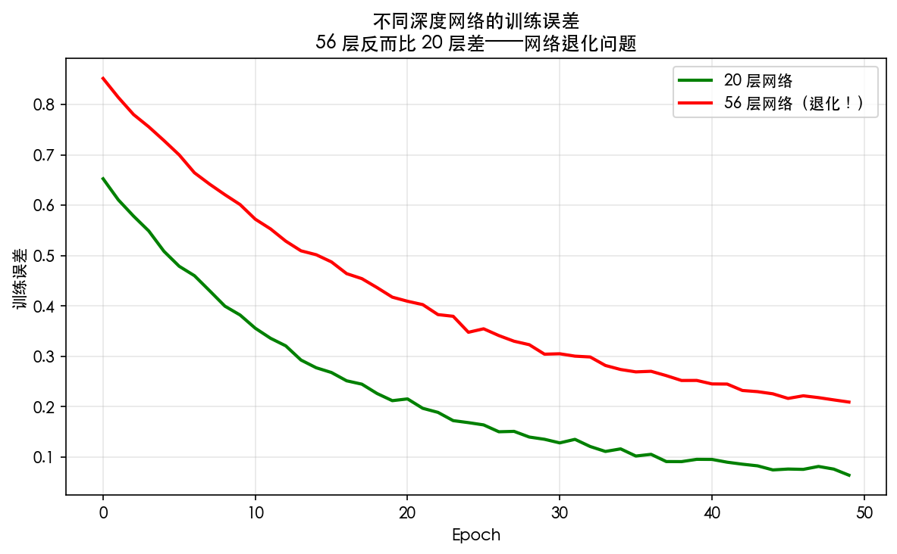
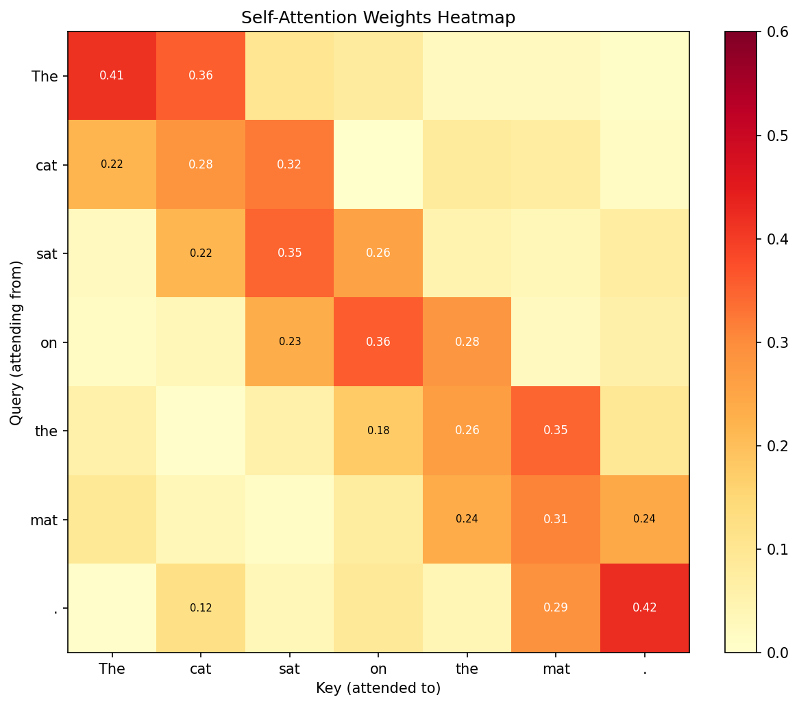
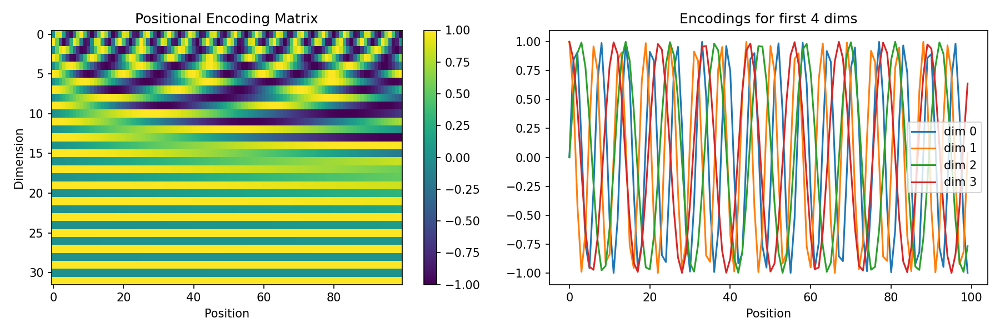

# 第 8 章 现代架构：从 ResNet 到 Transformer

> **目标**：**理解深度学习架构的演进脉络**——每个架构解决的核心数学问题是什么，从残差连接到 Transformer，用代码一步一步验证。

> **代码文件**：`code/ch08/`（4 个文件）

> **插图**：`images/ch08/` 目录（若干可视化图）

---

## 📋 本章学习目标

- [ ] 理解残差连接如何解决梯度消失
- [ ] 理解 RNN 的数学原理和局限性
- [ ] 理解注意力机制的数学本质
- [ ] 理解 Transformer 的完整架构
- [ ] 能用 PyTorch 实现简化版 Transformer

---

## 8-1 残差网络 ResNet 深入 ⭐

### 8-1-1 深层网络的困境

#### 实验现象

56 层网络比 20 层网络**训练误差更大**——这不是过拟合，因为训练误差本身都更大。



*图 8-1：网络退化——越深的网络反而越难优化。*

#### 梯度消失的数学分析

对于 $L$ 层网络，第 1 层的梯度需要穿过 $L-1$ 个激活函数导数：

$$
\frac{\partial C}{\partial W^{(1)}} = \underbrace{f'(u^{(L)}) \cdots f'(u^{(1)})}_{L \text{ derivatives}} \times \cdots
$$

- **Sigmoid** 导数范围 $(0, 0.25]$ → $L=10$ 时 $0.25^{10} \approx 10^{-6}$
- **ReLU** 导数范围 $\{0, 1\}$ → 缓解但不解决

### 8-1-2 残差连接的数学 ⭐

> **小精灵说**：残差连接就是给我们开了个「VIP 通道」！以前信息要穿过层层关卡（$F(x)$），很容易丢失。现在有了捷径 $y = F(x) + x$，梯度可以直达浅层——就像普通员工可以直接跟 CEO 汇报，不用经过层层审批！这也是 ResNet 能训练 1000+ 层的原因。

#### 核心思想

让梯度有一条「高速公路」直达浅层：

$$
y = F(x, \{W_i\}) + x
$$

- $F(x)$ 是要学习的残差映射（通常 2-3 层卷积）
- $x$ 是通过跳跃连接（shortcut）直接传递的恒等映射

#### 反向传播的数学

$$
\frac{\partial L}{\partial x} = \frac{\partial L}{\partial y} \cdot \frac{\partial y}{\partial x}
= \frac{\partial L}{\partial y} \cdot \left(1 + \frac{\partial F}{\partial x}\right)
$$

> **核心洞察**：梯度中有一个恒等项 $1$！即使 $\frac{\partial F}{\partial x} \to 0$，梯度也能通过 $1$ 直接传播到浅层。这就像给梯度修建了一条「高速公路」。

#### Python 实现 Residual Block

```python
class ResidualBlock(nn.Module):
    def __init__(self, in_channels, out_channels, stride=1):
        super().__init__()
        self.conv1 = nn.Conv2d(in_channels, out_channels, 3,
                               stride=stride, padding=1, bias=False)
        self.bn1 = nn.BatchNorm2d(out_channels)
        self.conv2 = nn.Conv2d(out_channels, out_channels, 3,
                               padding=1, bias=False)
        self.bn2 = nn.BatchNorm2d(out_channels)

        # 跳跃连接：维度不匹配时使用 1×1 卷积
        self.shortcut = nn.Sequential()
        if stride != 1 or in_channels != out_channels:
            self.shortcut = nn.Sequential(
                nn.Conv2d(in_channels, out_channels, 1,
                          stride=stride, bias=False),
                nn.BatchNorm2d(out_channels)
            )

    def forward(self, x):
        out = torch.relu(self.bn1(self.conv1(x)))
        out = self.bn2(self.conv2(out))
        out += self.shortcut(x)  # 跳跃连接 ⭐
        out = torch.relu(out)
        return out
```

---

## 8-2 循环神经网络与序列建模

### 8-2-1 RNN 的数学原理

#### 核心思想

RNN 的核心理念是**状态共享**——与全连接网络每层使用不同权重不同，RNN 在所有时间步共享同一组权重矩阵：

$$
\mathbf{h}_t = \tanh(\mathbf{W}_{xh} \mathbf{x}_t + \mathbf{W}_{hh} \mathbf{h}_{t-1} + \mathbf{b}_h)
$$

#### 参数说明

| 符号 | 含义 | 形状 |
|:----|:-----|:-----|
| $\mathbf{x}_t$ | 第 $t$ 步的输入 | $(d_{in},)$ |
| $\mathbf{h}_{t-1}$ | 上一步的隐状态 | $(d_{h},)$ |
| $\mathbf{h}_t$ | 当前步的隐状态 | $(d_{h},)$ |
| $\mathbf{W}_{xh}$ | 输入到隐状态的权重 | $(d_{in}, d_{h})$ |
| $\mathbf{W}_{hh}$ | 隐状态到隐状态的权重 | $(d_{h}, d_{h})$ |

#### 展开计算图

RNN 在时间维度上展开后，等价于一个非常深的**共享权重**的全连接网络：

```text
时间步展开：
h₀ → h₁ = f(x₁, h₀) → h₂ = f(x₂, h₁) → ... → h_T = f(x_T, h_{T-1})
  ↑                    ↑                          ↑
  W_xh, W_hh           W_xh, W_hh                 W_xh, W_hh（权重共享）
```

#### Python 一步实现

```python
def rnn_step(x_t, h_prev, W_xh, W_hh, b_h):
    """RNN 单步前向传播"""
    h_t = np.tanh(x_t @ W_xh + h_prev @ W_hh + b_h)
    return h_t

# 完整序列前向传播
def rnn_forward(X, h0, W_xh, W_hh, b_h):
    """X: (T, d_in), 输出: (T, d_h)"""
    h = h0
    outputs = []
    for t in range(len(X)):
        h = rnn_step(X[t], h, W_xh, W_hh, b_h)
        outputs.append(h)
    return np.array(outputs)
```

### 8-2-2 RNN 的梯度问题

反向传播通过时间（BPTT）会导致梯度连乘：

$$
\frac{\partial L}{\partial W} = \sum_{t=1}^T \frac{\partial L_t}{\partial h_t} \cdot \left(\prod_{k=2}^t \frac{\partial h_k}{\partial h_{k-1}}\right) \cdot \frac{\partial h_1}{\partial W}
$$

时间步长 $T$ 很大时，梯度连乘会指数级消失或爆炸。

> **核心洞察**：RNN 相当于一个在时间维度上展开的深层网络——时间步越长，网络越深，梯度消失越严重。这就是 LSTM/GRU 和 Transformer 出现的原因。

---

## 8-3 注意力机制深入 ⭐

### 8-3-1 什么是注意力？

> **小精灵说**：注意力机制就是让小精灵们开「全员信息共享会」！每个词（小精灵）都向所有其他词提问（Query）、展示自己（Key）、分享信息（Value）。$\text{softmax}(QK^T/\sqrt{d_k})$ 就是计算谁和谁更相关。与传统 RNN 不同，Attention 让所有位置直接对话！

**注意力 = 加权求和**——不是平等对待所有输入，而是关注重要部分。

#### 数学本质

在序列到序列的任务中，生成每个输出时，对不同位置的输入赋予不同权重：

$$
\text{Attention}(Q, K, V) = \text{softmax}\left(\frac{QK^T}{\sqrt{d_k}}\right) V
$$

| 符号 | 含义 | 类比 |
|:----|:-----|:-----|
| $Q$（Query） | 当前要关注什么 | 你在找什么 |
| $K$（Key） | 每个位置有什么信息 | 每个位置的内容标签 |
| $V$（Value） | 每个位置的实际信息 | 每个位置的实质内容 |

**直觉**：Query 和 Key 计算相似度（注意力分数），然后用分数加权 Value。

#### 缩放点积注意力

```python
def scaled_dot_product_attention(Q, K, V, mask=None):
    """缩放点积注意力"""
    d_k = Q.shape[-1]
    scores = Q @ K.transpose(-2, -1) / np.sqrt(d_k)  # 注意力分数

    if mask is not None:
        scores = scores.masked_fill(mask == 0, -1e9)  # 掩码

    attn_weights = torch.softmax(scores, dim=-1)  # 注意力权重
    output = attn_weights @ V                     # 加权求和
    return output, attn_weights
```

> **核心洞察**：注意力机制 = 软寻址——Query 是寻址信号，Key 是地址，Value 是存储内容。

---

## 8-4 Transformer 完整架构 ⭐

### 8-4-1 总体架构

Transformer 的核心设计思想：**抛弃循环结构，完全依赖注意力机制捕捉序列依赖**。下图是一个 Transformer Block 的完整结构（Encoder 中的一个层）：

```text
输出
  ↑
全连接层（输出投影）
  ↑
┌─────────────────────────────────────┐
│        Add & Norm（残差连接 + LayerNorm）  │
│           ↑                           │
│        前馈网络（FFN）                  │
│           ↑                           │
│        Add & Norm（残差连接 + LayerNorm）  │
│           ↑                           │
│    多头注意力（Multi-Head Attention）    │
│           ↑                           │
└─────────────────────────────────────┘
  ↑
位置编码 + 输入嵌入
  ↑
输入序列（Token IDs）
```

#### 四个核心组件的数学功能

| 组件 | 数学公式 | 功能 |
|:----|:---------|:-----|
| **多头注意力** | $\text{MultiHead}(Q,K,V) = \text{Concat}(\text{head}_1, \ldots, \text{head}_h)W_O$ | 捕捉序列中所有位置的依赖关系 |
| **前馈网络（FFN）** | $\text{FFN}(x) = W_2 \cdot \text{ReLU}(W_1 x + b_1) + b_2$ | 对每个位置独立做非线性变换 |
| **残差连接** | $x' = x + \text{Sublayer}(x)$ | 让梯度直接流过，解决深层网络退化 |
| **LayerNorm** | $\text{LayerNorm}(x) = \gamma \odot \frac{x - \mu}{\sigma} + \beta$ | 稳定训练，加速收敛 |

#### 为什么这样设计？

1. **注意力负责「交流」**：不同位置的 token 通过注意力机制互相交换信息
2. **FFN 负责「思考」**：每个 token 独立对融合后的信息做非线性变换
3. **残差连接确保「梯度高速公路」**：即使 100 层网络，梯度也能直接流回第一层
4. **LayerNorm 确保「数值稳定」**：防止激活值过大或过小导致的梯度消失/爆炸

#### Encoder 堆叠

实际 Transformer 不是单层，而是 $N$ 层堆叠（BERT Base = 12 层，BERT Large = 24 层）：

```python
class TransformerEncoder(nn.Module):
    """N 层 Transformer Encoder 堆叠"""
    def __init__(self, num_layers=6, d_model=512, n_heads=8, d_ff=2048):
        super().__init__()
        self.layers = nn.ModuleList([
            TransformerBlock(d_model, n_heads, d_ff)
            for _ in range(num_layers)
        ])

    def forward(self, x, mask=None):
        for layer in self.layers:
            x = layer(x, mask)
        return x
```

> **核心洞察**：Transformer 的精妙之处在于——它把「序列建模」这个复杂问题分解为「交流（注意力）」和「思考（FFN）」两个简单原语的交替堆叠。

### 8-4-2 多头注意力

**思想**：用多组 $Q, K, V$ 并行计算注意力，捕捉不同子空间的信息。

$$
\text{MultiHead}(Q, K, V) = \text{Concat}(\text{head}_1, \ldots, \text{head}_h) W_O
$$

其中 $\text{head}_i = \text{Attention}(QW_Q^i, KW_K^i, VW_V^i)$

### 8-4-3 位置编码

#### 为什么需要位置编码？

Transformer 的 Self-Attention 是**置换不变**（Permutation Invariant）的——打乱输入顺序，输出相同。但自然语言中顺序至关重要：「我打你」≠「你打我」。位置编码就是给模型提供**位置信号**。

#### 正弦位置编码公式

$$
PE_{(pos, 2i)} = \sin\left(\frac{pos}{10000^{2i/d_{model}}}\right)
$$

$$
PE_{(pos, 2i+1)} = \cos\left(\frac{pos}{10000^{2i/d_{model}}}\right)
$$

| 符号 | 含义 |
|:----|:-----|
| $pos$ | 词在序列中的位置（0, 1, 2, ...） |
| $i$ | 维度索引（0, 1, ..., $d_{model}/2$） |
| $d_{model}$ | 模型维度 |

#### 正弦编码的三个优美性质

1. **有界性**：每个值在 $[-1, 1]$ 之间，与词嵌入尺度兼容
2. **相对位置编码**：对任意偏移 $k$，$PE_{pos+k}$ 可以表示为 $PE_{pos}$ 的线性函数（利用和角公式）
3. **无需训练**：正弦公式是固定的，可以外推到训练时未见过的序列长度

#### Python 实现

```python
def sinusoidal_positional_encoding(max_len, d_model):
    """生成正弦位置编码"""
    pe = np.zeros((max_len, d_model))
    pos = np.arange(max_len).reshape(-1, 1)  # (max_len, 1)
    div = 10000 ** (np.arange(0, d_model, 2) / d_model)  # (d_model/2,)
    pe[:, 0::2] = np.sin(pos / div)   # 偶数维用 sin
    pe[:, 1::2] = np.cos(pos / div)   # 奇数维用 cos
    return torch.tensor(pe, dtype=torch.float32)

# 可视化：不同位置的编码
pe = sinusoidal_positional_encoding(100, 16)
plt.figure(figsize=(10, 6))
plt.imshow(pe.numpy().T, cmap='viridis', aspect='auto')
plt.xlabel('Position')
plt.ylabel('Dimension')
plt.colorbar(label='Value')
plt.title('Sinusoidal Positional Encoding')
plt.show()
```

### 8-4-4 最小 Transformer 实现

```python
class MultiHeadAttention(nn.Module):
    def __init__(self, d_model, n_heads):
        super().__init__()
        self.n_heads = n_heads
        self.d_k = d_model // n_heads
        self.W_Q = nn.Linear(d_model, d_model)
        self.W_K = nn.Linear(d_model, d_model)
        self.W_V = nn.Linear(d_model, d_model)
        self.W_O = nn.Linear(d_model, d_model)

    def forward(self, Q, K, V, mask=None):
        batch_size = Q.shape[0]
        # 线性变换 + 分头
        Q = self.W_Q(Q).view(batch_size, -1, self.n_heads, self.d_k).transpose(1, 2)
        K = self.W_K(K).view(batch_size, -1, self.n_heads, self.d_k).transpose(1, 2)
        V = self.W_V(V).view(batch_size, -1, self.n_heads, self.d_k).transpose(1, 2)
        # 缩放点积注意力
        scores = Q @ K.transpose(-2, -1) / np.sqrt(self.d_k)
        if mask is not None:
            scores = scores.masked_fill(mask == 0, -1e9)
        attn = torch.softmax(scores, dim=-1)
        out = attn @ V
        # 合并头
        out = out.transpose(1, 2).contiguous().view(
            batch_size, -1, self.n_heads * self.d_k
        )
        return self.W_O(out)


class TransformerBlock(nn.Module):
    def __init__(self, d_model, n_heads, d_ff):
        super().__init__()
        self.attention = MultiHeadAttention(d_model, n_heads)
        self.norm1 = nn.LayerNorm(d_model)
        self.ffn = nn.Sequential(
            nn.Linear(d_model, d_ff),
            nn.ReLU(),
            nn.Linear(d_ff, d_model)
        )
        self.norm2 = nn.LayerNorm(d_model)

    def forward(self, x, mask=None):
        # 多头注意力 + 残差连接 + LayerNorm
        attn_out = self.attention(x, x, x, mask)
        x = self.norm1(x + attn_out)
        # 前馈网络 + 残差连接 + LayerNorm
        ffn_out = self.ffn(x)
        x = self.norm2(x + ffn_out)
        return x
```

---

## 8-5 Transformer 可视化与理解

### 8-5-1 注意力权重可视化



*图 8-2：注意力权重可视化——深色表示高关注度。在翻译任务中，每个输出词会关注输入句子的不同位置。*

### 8-5-2 自注意力 vs 交叉注意力

| 类型 | Q, K, V 的来源 | 用途 |
|:----|:--------------|:-----|
| **自注意力** | 都来自同一个序列 | 捕捉序列内部依赖 |
| **交叉注意力** | Q 来自一个序列，K,V 来自另一个 | 捕捉两个序列的依赖 |

---

## 📦 本章代码清单

| 文件 | 内容 | 核心知识点 |
|:----|:-----|:----------|
| `ch08/NN08_resnet_block.py` | Residual Block 残差块实现 | 残差连接 |
| `ch08/NN08_attention.py` | 注意力机制从零实现 | Attention 核心 |
| `ch08/NN08_positional_encoding.py` | Sinusoidal 位置编码实现 | 位置编码 |



*图 8-3：Transformer 位置编码可视化。*
| 文件 | 内容 | 核心知识点 |
|:----|:-----|:----------|
| `ch08/NN08_transformer_encoder.py` | Transformer Encoder 完整实现 | Transformer 核心 |

---


---

## 8-6 从 RNN 到 LSTM/GRU：门控机制详解

### 8-6-1 RNN 的梯度消失问题——深入分析

$$
\mathbf{h}_t = \tanh(\mathbf{W}_{hh}\mathbf{h}_{t-1} + \mathbf{W}_{xh}\mathbf{x}_t + \mathbf{b}_h)
$$

在反向传播中，梯度需要沿着时间轴从 $t$ 时刻传播到 $t-k$ 时刻，涉及 $\frac{\partial \mathbf{h}_t}{\partial \mathbf{h}_{t-1}}$ 的连乘：

$$
\frac{\partial L}{\partial \mathbf{h}_{t-k}} = \frac{\partial L}{\partial \mathbf{h}_t} \prod_{i=1}^{k} \frac{\partial \mathbf{h}_{t-i+1}}{\partial \mathbf{h}_{t-i}}
$$

当 $\mathbf{W}_{hh}$ 的特征值 > 1 时，梯度指数增长（梯度爆炸）；当特征值 < 1 时，梯度指数衰减（梯度消失）。

> **小精灵说**：想象你在山谷里喊话，回声要传回 $k$ 秒前的位置。每传 1 秒，声音就衰减一次。传 10 秒后几乎听不见了——这就是梯度消失！而 LSTM 就像给回声加了「中继放大器」——每个时刻都能保持信号强度！

### 8-6-2 LSTM——长短期记忆网络

LSTM 的核心创新是**门控机制**——三个门（遗忘门、输入门、输出门）和一个记忆细胞（Cell State）：

$$\mathbf{f}_t = \sigma(\mathbf{W}_f[\mathbf{h}_{t-1}, \mathbf{x}_t] + \mathbf{b}_f) \quad \text{(forget gate)}$$

$$\mathbf{i}_t = \sigma(\mathbf{W}_i[\mathbf{h}_{t-1}, \mathbf{x}_t] + \mathbf{b}_i) \quad \text{(input gate)}$$

$$\tilde{\mathbf{C}}_t = \tanh(\mathbf{W}_C[\mathbf{h}_{t-1}, \mathbf{x}_t] + \mathbf{b}_C) \quad \text{(candidate memory)}$$

$$\mathbf{C}_t = \mathbf{f}_t \odot \mathbf{C}_{t-1} + \mathbf{i}_t \odot \tilde{\mathbf{C}}_t \quad \text{(cell state update)}$$

$$\mathbf{o}_t = \sigma(\mathbf{W}_o[\mathbf{h}_{t-1}, \mathbf{x}_t] + \mathbf{b}_o) \quad \text{(output gate)}$$

$$\mathbf{h}_t = \mathbf{o}_t \odot \tanh(\mathbf{C}_t) \quad \text{(hidden state)}$$

| 门 | 功能 | 取值范围 | 类比 |
|:--|:----|:--------|:----|
| 遗忘门 $\mathbf{f}_t$ | 决定丢弃多少旧记忆 | [0, 1] | 选择性遗忘 |
| 输入门 $\mathbf{i}_t$ | 决定写入多少新信息 | [0, 1] | 选择性记忆 |
| 输出门 $\mathbf{o}_t$ | 决定展示多少信息 | [0, 1] | 选择性表达 |

> **小精灵说**：LSTM 就像一个聪明的图书管理员！他有一个「记忆本」（Cell State）和一支「荧光笔」。看到新书（新输入），他会：
> 1. 决定哪些旧书记得要丢掉（遗忘门）
> 2. 决定新书中的哪些内容值得记下来（输入门）
> 3. 更新自己的记忆本（记忆细胞更新：$\mathbf{C}_t = \mathbf{f}_t \odot \mathbf{C}_{t-1} + \mathbf{i}_t \odot \tilde{\mathbf{C}}_t$）
> 4. 决定今天要跟别人分享哪些知识（输出门）
> 关键创新是「加法」操作——梯度可以通过 $\mathbf{C}_t = \mathbf{C}_{t-1} + \dots$ 直接传播，解决了 RNN 的梯度消失！

### 8-6-3 GRU——LSTM 的简化版

GRU（Gated Recurrent Unit）将 LSTM 的三个门简化为两个——**更新门**和**重置门**：

$$\mathbf{z}_t = \sigma(\mathbf{W}_z[\mathbf{h}_{t-1}, \mathbf{x}_t]) \quad \text{(update gate)}$$

$$\mathbf{r}_t = \sigma(\mathbf{W}_r[\mathbf{h}_{t-1}, \mathbf{x}_t]) \quad \text{(reset gate)}$$

$$\tilde{\mathbf{h}}_t = \tanh(\mathbf{W}[\mathbf{r}_t \odot \mathbf{h}_{t-1}, \mathbf{x}_t]) \quad \text{(candidate hidden state)}$$

$$\mathbf{h}_t = (1 - \mathbf{z}_t) \odot \mathbf{h}_{t-1} + \mathbf{z}_t \odot \tilde{\mathbf{h}}_t \quad \text{(hidden state)}$$

| 特征 | RNN | LSTM | GRU |
|:----|:---|:----|:----|
| 门控数量 | 0 | 3（遗忘+输入+输出） | 2（更新+重置） |
| 记忆单元 | 无 | 有（Cell State） | 无（只有隐藏状态） |
| 参数量 | 最少 | 最多 | 中等 |
| 梯度消失 | ❌ 严重 | ✅ 大幅缓解 | ✅ 缓解 |
| 训练速度 | 最快 | 最慢 | 中等 |

> **核心洞察**：GRU 是 LSTM 的「精简版」——用更少的参数实现了接近 LSTM 的效果。在实践中，LSTM 和 GRU 的选择通常取决于任务和数据量。LSTM 参数量大，适合数据充足的场景；GRU 更轻量，适合小数据集或快速迭代。

---

## 8-7 BERT vs GPT：预训练范式的对比

### 8-7-1 预训练 + 微调范式的兴起

2018 年是 NLP 的「Imagenet 时刻」。这一年，两个里程碑式的模型——BERT 和 GPT——开启了「预训练 + 微调」的新范式：

$$
\text{pretrain (unlabeled data)} \xrightarrow{\text{finetune (labeled data)}} \text{downstream model}
$$

| 模型 | 提出时间 | 参数量 | 预训练任务 | 架构 |
|:----|:--------|:------|:----------|:----|
| **GPT** | 2018.06 | 117M | 自回归语言模型（从左到右） | Transformer Decoder |
| **BERT** | 2018.10 | 340M | Masked LM + NSP（双向） | Transformer Encoder |

### 8-7-2 GPT：自回归范式

GPT 使用标准的 Transformer Decoder 架构（带 Masked Self-Attention），预训练任务很简单：**预测下一个词**：

$$L_{\text{GPT}} = -\sum_t \log P(w_t \mid w_1, w_2, \dots, w_{t-1})$$

这种「从左到右」的架构天然适合**文本生成**任务——因为它只能看到过去的信息，看不到未来的信息。

```python
# GPT 式自回归生成的简化逻辑
def gpt_generate(model, prompt, max_length=100):
    for _ in range(max_length):
        # 只能看到当前位置左边的 token
        logits = model(prompt)  # 使用 masked attention
        next_token = sample(logits[-1])
        prompt.append(next_token)
    return prompt
```

### 8-7-3 BERT：双向编码范式

BERT 使用 Transformer Encoder 架构（没有 masked attention），通过两个新颖的预训练任务学习双向上下文表示：

**Task 1：Masked Language Model（MLM）**

随机遮盖输入中 15% 的 token，让模型预测被遮盖的词：

```python
# MLM 示例
输入：我 [MASK] 深度 [MASK] 习     → 预测 [MASK] = ["爱", "学"]
```

$$
L_{\text{MLM}} = -\sum_{i \in \text{masked}} \log P(w_i \mid \mathbf{w}_{\backslash i})
$$

**Task 2：Next Sentence Prediction（NSP）**

判断两个句子是否为连续的上下文：

```python
[A = "我爱深度学习", B = "PyTorch 很好用"] → IsNext? ✅
[A = "我爱深度学习", B = "苹果很好吃"]     → NotNext? ✅
```

| 对比维度 | BERT | GPT |
|:--------|:----|:----|
| **注意力方式** | 双向（能看到左右） | 单向（只能看左边） |
| **预训练任务** | MLM + NSP | Autoregressive LM |
| **擅长任务** | 分类、NER、QA | 文本生成、对话 |
| **微调方式** | 加分类头 | Prompt-based |
| **代表模型** | BERT → RoBERTa → ALBERT | GPT-2 → GPT-3 → GPT-4 |

> **小精灵说**：BERT 就像「阅读理解大师」——它能看到整篇文章后再回答问题（双向注意力）。GPT 就像「故事接龙高手」——它只能看到已经写出的内容，然后接着往下写（单向注意力）。两者各有擅长：BERT 适合理解任务，GPT 适合生成任务！

---

## 8-8 现代架构设计模式

### 8-8-1 残差连接的变体

除了原始 ResNet 的 $y = F(x) + x$，后续工作提出了多种残差连接变体：

| 变体 | 公式 | 特点 |
|:----|:----|:----|
| **原始残差** | $y = F(x) + x$ | 最简单的恒等映射 |
| **Pre-activation** | $y = x + F(\text{BN}(x), \text{ReLU}(x))$ | 梯度更容易传播（ResNet v2） |
| **Dense 连接** | $y = [x, F(x)]$ | 拼接而非相加，特征复用（DenseNet） |

```python
# Pre-activation Residual Block
class PreActBlock(nn.Module):
    def __init__(self, in_planes, planes):
        super().__init__()
        self.bn1 = nn.BatchNorm2d(in_planes)
        self.conv1 = nn.Conv2d(in_planes, planes, 3, padding=1, bias=False)
        self.bn2 = nn.BatchNorm2d(planes)
        self.conv2 = nn.Conv2d(planes, planes, 3, padding=1, bias=False)
    
    def forward(self, x):
        out = self.conv1(F.relu(self.bn1(x)))
        out = self.conv2(F.relu(self.bn2(out)))
        return out + x  # 残差连接
```

### 8-8-2 Attention 的变体

| 变体 | 核心思想 | 代表工作 |
|:----|:--------|:--------|
| **多头注意力** | 多组 QKV 关注不同子空间 | Transformer |
| **Linear Attention** | 用核函数替代 Softmax，$O(n)$ 复杂度 | Linformer, Performer |
| **Flash Attention** | 分块计算+显存优化，加速 2-4x | FlashAttention (2022) |
| **Cross-Attention** | Q 来自一个序列，K,V 来自另一个 | Transformer Decoder |

### 8-8-3 归一化技术的演进

| 方法 | 操作 | 适用范围 |
|:----|:----|:--------|
| **BatchNorm** | 在 batch 维度归一化 | CNN（依赖 batch size） |
| **LayerNorm** | 在特征维度归一化 | Transformer/RNN（不依赖 batch） |
| **InstanceNorm** | 在单样本内归一化 | 图像风格迁移 |
| **GroupNorm** | 将通道分组归一化 | 小 batch 场景 |

$$
\operatorname{BatchNorm}:  \hat{x} = \frac{x - \mu_{\text{batch}}}{\sigma_{\text{batch}}} \quad \text{LayerNorm: } \hat{x} = \frac{x - \mu_{\text{layer}}}{\sigma_{\text{layer}}}
$$

> **核心洞察**：Transformer 使用 LayerNorm 而不是 BatchNorm，因为 NLP 任务中序列长度变化大，batch 维度不稳定。LayerNorm 在特征维度归一化，不受 batch size 和序列长度影响。

## 📖 本章小结


---

## 8-9 Vision Transformer（ViT）：当 Transformer 遇到图像

### 8-9-1 为什么要把 Transformer 用到图像上？

传统 CNN 依赖卷积的**局部连接**和**权值共享**两个归纳偏置（Inductive Bias）。Transformer 的 Self-Attention 则是一种全局操作——每个位置关注所有位置。

ViT（Vision Transformer，2020）的核心思想非常直接：**把图像切成 Patches，然后把每个 Patch 当作一个 Token 输入 Transformer**。

### 8-9-2 ViT 的完整流程

```text
输入图像 (224×224×3)
    ↓
分割成 Patches (16×16, 共 196 个)
    ↓
每个 Patch 展平并投影到 D 维
    ↓
加上位置编码（告诉 Transformer 每个 Patch 的位置）
    ↓
加上 [CLS] Token（用于分类）
    ↓
输入标准 Transformer Encoder（12 层）
    ↓
取 [CLS] Token 的输出 → 分类头 → 预测结果
```

#### Patch Embedding 的数学形式

$$
\mathbf{x}_p^i = \operatorname{Linear}(\operatorname{Flatten}(\operatorname{Patch}_i)), \quad i = 1, \dots, N
$$
$$
\mathbf{z}_0 = [\mathbf{x}_{\text{cls}}; \mathbf{x}_p^1 \mathbf{E}; \mathbf{x}_p^2 \mathbf{E}; \dots; \mathbf{x}_p^N \mathbf{E}] + \mathbf{E}_{\text{pos}}
$$

```python
import torch.nn as nn

class PatchEmbedding(nn.Module):
    def __init__(self, img_size=224, patch_size=16, in_channels=3, embed_dim=768):
        super().__init__()
        self.num_patches = (img_size // patch_size) ** 2  # 196
        self.proj = nn.Conv2d(in_channels, embed_dim, 
                              kernel_size=patch_size, stride=patch_size)
        # 等价于：将图像切成 patch → 每个 patch 展平 → 线性投影到 embed_dim
    
    def forward(self, x):
        # x: (B, 3, 224, 224)
        x = self.proj(x)  # (B, 768, 14, 14)
        x = x.flatten(2)  # (B, 768, 196)
        x = x.transpose(1, 2)  # (B, 196, 768) ← 196个token，每个768维
        return x
```

### 8-9-3 ViT 与 CNN 的对比

| 对比维度 | CNN | ViT |
|:--------|:---|:----|
| **感受野** | 局部（逐渐扩大） | **全局**（从第一层开始） |
| **归纳偏置** | 强（局部性+平移不变性） | **弱**（需要更多数据学习） |
| **数据需求** | 少（ImageNet 1M 即可） | **多**（需要 JFT-300M 预训练） |
| **计算复杂度** | $O(k^2 C^2 HW)$ | $O(N^2 D)$（$N$ 是 patch 数） |
| **高分辨率** | 可扩展（滑动窗口） | 受限（$N$ 随分辨率平方增长） |

> **核心洞察**：ViT 证明了 **「只要数据足够多，Transformer 可以打败 CNN」** 。在 ImageNet 上 ViT 表现一般（因为数据不够），但在 JFT-300M（3 亿张图）上预训练后，ViT 超越了一切 CNN 架构。这说明**数据的归纳偏置可以取代架构的归纳偏置**。

### 8-9-4 从 ViT 到 Swin Transformer

ViT 的一个主要问题是：Self-Attention 的计算复杂度是 $O(N^2)$，对于高分辨率图像来说不可接受。Swin Transformer（2021）提出了**层次化注意力**：

1. **窗口注意力**：只在局部窗口内做 Self-Attention（$O(\text{window}^2)$）
2. **窗口移位**：层与层之间移动窗口，让信息跨窗口流动
3. **层次化结构**：像 CNN 一样逐步降采样，构建特征金字塔

```text
Swin-T 的层级结构：
Stage 1: 分辨 H/4 × W/4,  通道 96   ← Patch Embedding
Stage 2: 分辨 H/8 × W/8,  通道 192  ← Patch Merging (降采样)
Stage 3: 分辨 H/16 × W/16, 通道 384  ← 多个 Swin Block
Stage 4: 分辨 H/32 × W/32, 通道 768  ← Patch Merging
```

> **小精灵说**：ViT 就像让所有小精灵开全体大会（全局注意力）——虽然信息最全面，但人太多了效率低。Swin Transformer 则改成「部门会议」（窗口注意力）——先各个部门内部讨论，再通过部门之间的信息交换（窗口移位）实现全公司信息流通。效率高得多！

---

## 8-10 现代架构设计原则总结

### 8-10-1 五大设计原则

纵观深度学习架构的演进，我们可以总结出五大通用设计原则：

| 原则 | 解决的问题 | 代表技术 |
|:----|:----------|:--------|
| **① 残差连接** | 深层网络退化与梯度消失 | ResNet, Transformer |
| **② 归一化** | 训练不稳定，内部协变量偏移 | BatchNorm, LayerNorm |
| **③ 注意力机制** | 长距离依赖建模 | Self-Attention, Cross-Attention |
| **④ 层次化设计** | 多尺度特征提取 | CNN 金字塔, Swin 层级 |
| **⑤ 稀疏计算** | 计算效率与可扩展性 | MoE, Window Attention |

### 8-10-2 经典架构的设计哲学

```text
ResNet:     深度优先 —— 用残差连接让梯度直达浅层
Transformer: 容量优先 —— 用注意力实现全局信息交互
ViT:         简化优先 —— 尽量少的架构归纳偏置，让数据说话
Swin:        效率优先 —— 在 Transformer 中引入 CNN 的层次化设计
GPT:         生成优先 —— 单向自回归，简洁而强大
BERT:        理解优先 —— 双向编码，深度理解上下文
```

### 8-10-3 未来趋势

1. **大一统架构**：Transformer 正在统一 CV、NLP、语音等领域
2. **线性注意力**：将 $O(N^2)$ 降为 $O(N)$，支持更长序列
3. **稀疏专家混合（MoE）**：用更多参数但更少计算
4. **状态空间模型**：如 Mamba，作为 Transformer 的替代方案

> **一句话总结**：现代深度学习架构的演进可以归结为一个核心问题——**如何在保持计算可行的前提下，让模型看到更大的上下文（更大的感受野/更长的序列）**。ResNet 用残差连接解决了深度问题，Transformer 用注意力解决了长距离依赖问题，ViT 证明了「更大数据 + 更少归纳偏置 = 更好性能」。


### 架构演进脉络

```text
RNN（2013） → LSTM/GRU（2014） → Attention（2017） → Transformer（2017） → ..., GPT, BERT
   │                │                  │                    │
 梯度消失         门控机制        软寻址机制          多头注意力 + 位置编码
```

### 核心数学公式

| 架构 | 核心公式 |
|:----|:---------|
| **ResNet** | $y = F(x) + x$（跳跃连接） |
| **RNN** | $\mathbf{h}_t = \tanh(\mathbf{W}_{xh} \mathbf{x}_t + \mathbf{W}_{hh} \mathbf{h}_{t-1})$ |
| **Attention** | $\text{Attention}(Q,K,V) = \text{softmax}(QK^T/\sqrt{d_k})V$ |
| **Transformer** | MultiHead + FFN + Add & Norm |

### 🧪 课后练习

#### 练习 1：残差连接实验

```python
import torch
import torch.nn as nn

# 实现一个 10 层的 Plain 网络和 10 层的 ResNet（带残差连接）
# 用 Kaiming Normal 初始化
# 对比训练 50 轮后的训练 loss 和验证精度
# 关键观察：深层 Plain 网络是否出现退化？
```

#### 练习 2：自注意力手动计算

给定三个 2x3 矩阵 Q, K, V（2 个 token，每个 3 维）：

Q = [[1,0,1],[0,1,0]], K = [[1,1,0],[0,1,1]], V = [[1,0],[0,1],[1,1]]

手动计算注意力输出：

1. 计算注意力分数矩阵 S = QK^T / sqrt(d_k)
2. 对每行应用 Softmax
3. 用注意力权重对 V 加权求和

#### 练习 3：位置编码可视化

实现 Sinusoidal 位置编码，并可视化不同维度的编码值随位置的变化。观察哪些维度变化快（高频），哪些变化慢（低频）。

#### 练习 4：多头注意力参数量计算

一个 Transformer 层：d_model=512，8 个注意力头，FFN 隐藏层 2048。计算：

- 单个注意力头的参数量（Q, K, V 投影 + 输出投影）
- 所有注意力头的总参数量
- FFN 层的参数量
- 该 Transformer 层的总参数量

#### 练习 5（挑战题）：从零实现一个小型 Transformer

用 PyTorch 实现一个 2 层 Transformer Encoder（不含预训练），在简单的序列分类任务上训练（如 IMDb 情感分类的子集）。


### 核心技术脉络

| 概念 | 核心公式 / 要点 |
|:----|:---------------|
| **深度瓶颈** | 更深 = 梯度消失 / 退化 |
| **ResNet** | y = F(x, {Wi}) + x  (短路连接让梯度直达) |
| **Bottleneck** | 256d -> 1x1 64d -> 3x3 64d -> 1x1 256d (先降维再升维) |
| **Self-Attention** | Attention(Q,K,V) = softmax(QK^T/sqrt(d_k))V (每个词看所有词) |
| **Multi-Head** | Concat(head_1, ..., head_h)W^O (多视角并行关注) |
| **Positional Encoding** | PE(pos,2i) = sin(pos/10000^{2i/d}) |
| **Transformer** | MultiHead + Add&Norm + FFN + Add&Norm |
| **BERT** | Masked LM + Next Sentence Prediction (双向理解上下文) |
| **GPT** | Autoregressive LM (单向生成文本) |

> **一句话总结**：现代深度学习架构的演进 = 解决梯度消失（ResNet）+ 解决序列依赖（Attention）+ 并行化（Transformer）。

---


### 核心概念回顾

| 概念 | 核心要点 |
|:----|:---------|
| **深度瓶颈** | 更深网络 → 梯度消失/爆炸 + 网络退化（Plain 网络深层反而不如浅层） |
| **ResNet 残差连接** | $y = F(x) + x$ 让梯度直达浅层，打破深度瓶颈 |
| **Bottleneck 设计** | 1×1 降维 → 3×3 卷积 → 1×1 升维，大幅减少参数量 |
| **Self-Attention** | $\text{Attention}(Q,K,V) = \text{softmax}(QK^T/\sqrt{d_k})V$，每个位置关注所有位置 |
| **多头注意力** | 多组 QKV 并行计算 → 拼接 → 投影，关注不同子空间 |
| **位置编码** | Sinusoidal PE：不同维度不同频率，让 Transformer 感知顺序 |
| **Transformer** | Encoder: MultiHead + Add&Norm + FFN + Add&Norm；Decoder: Masked MultiHead + Cross-Attention |

> **一句话总结**：现代深度学习架构的演进 = 解决梯度消失（ResNet）+ 解决序列依赖（Attention）+ 并行化（Transformer）。


### 核心公式速查

| 公式 | 说明 | 适用场景 |
|:----|:-----|:--------|
| $\mathbf{y} = F(\mathbf{x}, \{\mathbf{W}_i\}) + \mathbf{x}$ | 残差连接：跳跃连接 + 恒等映射 | **ResNet 核心** |
| $\text{Bottleneck}: 256 \xrightarrow{1\times1} 64 \xrightarrow{3\times3} 64 \xrightarrow{1\times1} 256$ | Bottleneck 降维-卷积-升维 | 深层 ResNet |
| $\text{Attention}(Q,K,V) = \text{softmax}\left(\frac{QK^T}{\sqrt{d_k}}\right)V$ | Scaled Dot-Product Attention | **Transformer 核心** |
| $\text{MultiHead}(Q,K,V) = \text{Concat}(\text{head}_1, \dots, \text{head}_h)\mathbf{W}^O$ | 多头注意力：并行关注不同子空间 | Transformer 编码器 |
| $\text{FFN}(\mathbf{x}) = \max(0, \mathbf{x}\mathbf{W}_1 + \mathbf{b}_1)\mathbf{W}_2 + \mathbf{b}_2$ | 前馈网络（含 ReLU） | Transformer 逐位置变换 |
| $\text{PE}_{(pos, 2i)} = \sin(pos/10000^{2i/d})$; $\text{PE}_{(pos, 2i+1)} = \cos(pos/10000^{2i/d})$ | Sinusoidal 位置编码 | 注入位置信息 |
| $\mathbf{h}_t = \tanh(\mathbf{W}_{xh}\mathbf{x}_t + \mathbf{W}_{hh}\mathbf{h}_{t-1} + \mathbf{b}_h)$ | RNN 隐藏状态更新 | 序列建模基础 |


← [第 7 章 训练技术](07-第7章-训练技术-优化器-正则化与损失函数.md) | [目录](README.md) | [第 9 章 大语言模型](09-第9章-大语言模型-训练-采样与推理.md) →
