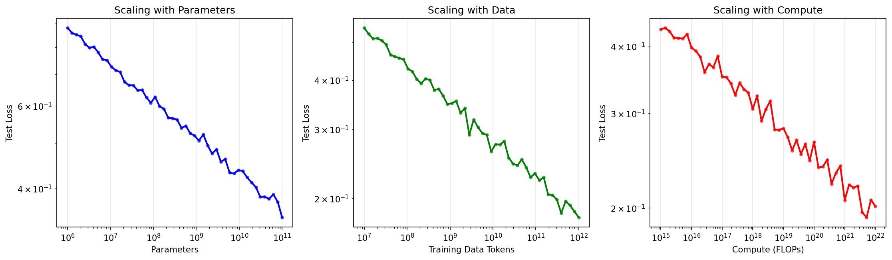

# 第 9 章 大语言模型：训练、采样与推理

> **目标**：**理解 LLM 从训练到推理的完整数学链条**——自回归生成、采样策略、KV Cache 加速、高效微调，每一步都有数学直觉和代码验证。

> **代码文件**：`code/ch09/`（3 个文件）

> **插图**：`images/ch09/`（1 张图）

---

## 📋 本章学习目标

- [ ] 理解语言模型的数学定义
- [ ] 理解自回归生成的原理
- [ ] 掌握不同的采样策略
- [ ] 理解 KV Cache 对推理的加速原理
- [ ] 理解 LoRA 高效微调的方法
- [ ] 了解量化基础

---

## 9-1 从语言模型到大语言模型

### 9-1-1 语言模型的基本定义

#### 任务

计算一个词序列的概率：

$$
P(w_1, w_2, \dots, w_n)
$$

#### 链式法则分解

$$
P(w_1, w_2, \dots, w_n) = P(w_1) P(w_2|w_1) P(w_3|w_1,w_2) \cdots P(w_n|w_1,\dots,w_{n-1})
$$

> **核心洞察**：语言模型 = 下一个词的预测器。给定前文，预测下一个词的概率分布。

### 9-1-2 N-gram vs 神经语言模型

| 模型 | 原理 | 局限性 |
|:----|:-----|:-------|
| **N-gram** | 只依赖前 n-1 个词 | 无法捕捉长程依赖 |
| **RNN-LM** | 用 RNN 保持隐状态 | 梯度消失，无法并行 |
| **Transformer** | 自注意力捕捉所有位置 | 计算量随序列长度平方增长 |

### 9-1-3 Scaling Law ⭐

#### 经验发现

Scaling Law（缩放定律）是 OpenAI 在 2020 年发现的一个重要经验规律：**模型性能与模型参数量 $N$、数据量 $D$、计算量 $C$ 之间存在幂律关系（Power Law）**。

$$
\operatorname{Loss} \propto N^{-\alpha_N} + D^{-\alpha_D} + C^{-\alpha_C} + \operatorname{Loss}_\infty
$$

其中 $\alpha_N \approx 0.076$，$\alpha_D \approx 0.095$，$\alpha_C \approx 0.050$，$\operatorname{Loss}_\infty$ 是理论上的最低损失（数据本身的不可压缩熵）。

#### 三个关键推论

**推论一：模型越大越好，但有边际效应**

参数量翻倍，损失下降的幅度越来越小——这是典型的幂律衰减。

**推论二：模型大小和数据量要同步增长**

$$N_{\text{opt}} \propto C^{0.73}, \quad D_{\text{opt}} \propto C^{0.27}$$

即：计算预算增加时，**大部分应该花在扩大模型上**，小部分花在增加数据上。

**推论三：小模型 + 多数据 vs 大模型 + 少数据**

给定固定计算预算，应该训练一个多大的模型？Chinchilla 论文（2022）给出了答案：

```python
# Chinchilla 最优分配公式
def optimal_allocation(C):
    """C: 总计算量 (FLOPs)"""
    N_opt = 0.25 * C ** 0.49    # 最优参数量
    D_opt = 1.25 * C ** 0.51    # 最优 token 数
    return N_opt, D_opt
```

> **核心洞察**：Scaling Law 表明，LLM 的能力提升靠的是「规模」而不是「算法创新」。GPT-3（175B）的参数是 GPT-2（1.5B）的 100 倍以上。这也意味着——**规模本身就是一种算法**！



#### 涌现能力

当模型规模超过某个阈值时，一些能力会「突然」出现——这在更小的模型中完全不存在：

| 能力 | 出现规模 | 说明 |
|:----|:--------|:-----|
| **上下文学习 (ICL)** | ~1B+ | 通过示例学习，无需微调 |
| **思维链 (CoT)** | ~100B+ | 能展示推理步骤 |
| **代码生成** | ~10B+ | 能根据描述生成可运行代码 |

> **小精灵说**：Scaling Law 就像是「大力出奇迹」的科学证明！小模型像小学生——只能做简单的加减法。大模型像博士生——能做复杂的推理题。关键在于：有些能力不是「教出来」的，而是在模型增大到一定程度后**自己涌现**的！


## 9-2 自回归生成与训练
### 9-2-1 自回归分解

> **小精灵说**：自回归生成就像小精灵一个接一个地讲故事！第一个小精灵说了「我」，第二个看了「我」之后说「爱」，第三个看了「我爱」之后说「你」……每个新词都基于所有已生成的上文。这就是 $P(w_1, \dots, w_n) = \prod P(w_t \mid w_{<t})$ 的直观理解——语言模型就是「接龙大师」！

#### 训练：Teacher Forcing

每一步用**真实值**作为下一步的输入：

$$
\max_\theta \sum_{t=1}^T \log P_\theta(y_t | y_{<t}, x)
$$

#### 推理：自回归生成

每一步用上一步**生成的 token**作为输入：

$$
\hat{y}_t \sim P_\theta(\cdot | \hat{y}_{<t}, x)
$$

```python
def generate_autoregressive(model, prompt, max_len=100):
    """自回归生成"""
    generated = prompt.clone()
    for _ in range(max_len):
        logits = model(generated)           # 前向传播
        next_token = logits[:, -1, :].argmax(dim=-1)  # 贪心采样
        generated = torch.cat([generated, next_token.unsqueeze(0)], dim=-1)
    return generated
```

### 9-2-2 训练 vs 推理的差异

| 特性 | 训练 | 推理 |
|:----|:-----|:-----|
| **输入** | 真实值（Teacher Forcing） | 自己生成的 token |
| **并行性** | 可并行（所有时间步一次前向） | 串行（逐个生成） |
| **问题** | Exposure Bias | 错误累积 |
| **复杂度** | $O(T \cdot N^2)$ | $O(T^2 \cdot N)$（无 KV Cache） |

---

## 9-3 采样策略 ⭐

### 9-3-1 贪心解码

#### 原理

每一步选择概率最高的 token：

```python
next_token = logits[:, -1, :].argmax(dim=-1)
```

#### 示例

假设语言模型当前预测下一个词的概率分布：

```text
"我今天去" → P(学校)=0.45, P(超市)=0.30, P(医院)=0.15, P(公司)=0.10
```
贪心解码必定选择「学校」。

#### 问题

1. **缺乏多样性**：总是选概率最高的，生成文本平淡无奇
2. **容易陷入重复**：一旦进入某个模式（如「但是」），会一直选下去
3. **无法回头**：早期的一个次优选择可能导致后续全部偏离

> **核心洞察**：贪心解码 = 每一步都选当前最优，但全局来看可能不是最佳路径。就像走迷宫时每次都选最近的拐弯——可能走进死胡同。

### 9-3-2 Top-K 采样

#### 思想

贪心解码每次选最高概率 token，但语言生成需要**多样性**——同一句话可以有多个合理的续写。Top-K 采样在「确定性」和「随机性」之间取中：**从概率最高的 K 个 token 中按概率随机采样**。

```python
def top_k_sampling(logits, k=50):
    """Top-K 采样：从 top-k 个 token 中按概率采样"""
    top_k_values, top_k_indices = torch.topk(logits, k, dim=-1)
    probs = torch.softmax(top_k_values, dim=-1)
    chosen = torch.multinomial(probs, num_samples=1)
    return top_k_indices.gather(-1, chosen)
```

#### 工作原理

假设词汇表有 10000 个 token，生成「今天天气」的下一个词：

```python
logits = model("今天天气")  # 得到 10000 个 logits
k = 5

# Step 1: 只保留概率最高的 5 个 token
top_5 = ["很好", "不错", "晴朗", "暖和", "真好"]  # 得分 [8.0, 7.5, 7.0, 6.5, 6.0]

# Step 2: 对这 5 个做 Softmax，得到新概率分布
probs = [0.53, 0.22, 0.13, 0.08, 0.04]

# Step 3: 按这个分布采样
# 有 53% 概率选「很好」，22% 概率选「不错」……
chosen = torch.multinomial(probs)  # 随机选择
```

#### K 值的影响

| K 值 | 效果 | 适用场景 |
|:----|:-----|:---------|
| $K=1$ | 等价于贪心解码 | 需要确定性输出 |
| $K=10$ | 高概率 token 主导 | 平衡确定性与多样性 |
| $K=50$ | 默认值，合理多样性 | 通用场景 |
| $K=1000$ | 接近原始分布 | 高创造性/头脑风暴 |

> **核心洞察**：Top-K 的关键是**截断低概率尾部**——那些大量概率极低的奇怪 token 被直接排除，只从「合理候选集」中做随机选择。这避免了生成「胡言乱语」的问题。

### 9-3-3 Top-P（Nucleus）采样

#### Top-K 的问题

Top-K 的 K 是固定的——但如果前 K 个 token 的概率**都很低**（模型不太确定）怎么办？Top-K 会错误地截断一些也「不太差」的候选项。

#### Top-P 的思想

不固定 K，而是**动态选择**：选择累积概率超过阈值 $p$ 的最小 token 集合。如果模型很确定，集合小；如果不确定，集合大——**自适应**。

```python
def top_p_sampling(logits, p=0.9):
    """Top-P (Nucleus) 采样：从累积概率 > p 的最小集合中采样"""
    sorted_logits, sorted_indices = torch.sort(logits, descending=True, dim=-1)
    cumprobs = torch.cumsum(torch.softmax(sorted_logits, dim=-1), dim=-1)
    # 选择累积概率超过 p 的最小集合
    sorted_indices_to_remove = cumprobs > p
    sorted_indices_to_remove[..., 1:] = sorted_indices_to_remove[..., :-1].clone()
    sorted_indices_to_remove[..., 0] = 0
    # 应用掩码
    indices_to_remove = sorted_indices_to_remove.scatter(-1, sorted_indices, sorted_indices_to_remove)
    logits[indices_to_remove] = float('-inf')
    probs = torch.softmax(logits, dim=-1)
    return torch.multinomial(probs, num_samples=1)
```

#### 对比示例

```python
# 场景 A：模型很确定（前 3 个 token 就占了 95% 概率）
# Top-K (K=5)：必须选 5 个，包含低概率 token
# Top-P (p=0.95)：只选 3 个 ← 更合理！

# 场景 B：模型不确定（前 20 个 token 才占 90% 概率）
# Top-K (K=5)：只选 5 个，排除了许多合理选项
# Top-P (p=0.9)：选 20 个 ← 更合理！
```

#### p 值的影响

| p 值 | 效果 | 适用场景 |
|:----|:-----|:---------|
| $p=0.9$ | 默认值，性能最佳 | **通用推荐** |
| $p=0.95$ | 更大的候选集，更多样 | 创意写作 |
| $p=0.99$ | 几乎不截断，完全随机 | 头脑风暴 |
| $p<0.8$ | 候选集小，更确定 | 需要精确的任务 |

> **核心洞察**：Top-P 比 Top-K 更「聪明」——它根据模型对当前预测的置信度动态调整候选集大小。实践中，**Top-P (p=0.9) + Temperature (T=0.7)** 是最常用的组合。

### 9-3-4 Temperature 控制

#### 原理

通过 Temperature 参数 $T$ 控制概率分布的「尖锐」程度：

$$
P_i = \frac{e^{z_i / T}}{\sum_j e^{z_j / T}}
$$

**直觉**：$T$ 控制模型对高概率 token 的偏好程度。

#### Python 实现

```python
def apply_temperature(logits, temperature=1.0):
    """应用 Temperature 控制"""
    logits = logits / temperature
    probs = torch.softmax(logits, dim=-1)
    return probs

# 示例：不同 Temperature 的效果
logits = torch.tensor([1.0, 2.0, 3.0, 0.5])
for T in [0.1, 0.5, 1.0, 2.0, 10.0]:
    probs = apply_temperature(logits, T)
    dominant = probs.argmax().item()
    entropy = -(probs * torch.log(probs + 1e-8)).sum().item()
    print(f"T={T:.1f}: 支配 token = {dominant}, 熵 = {entropy:.3f}")
```

```output
T=0.1: 支配 token = 2, 熵 = 0.004    ← 几乎确定
T=0.5: 支配 token = 2, 熵 = 0.148    ← 稍有不确定
T=1.0: 支配 token = 2, 熵 = 0.464    ← 原始分布
T=2.0: 支配 token = 2, 熵 = 0.900    ← 更均匀
T=10.0: 支配 token = 2, 熵 = 1.330   ← 接近均匀
```

#### 实践选择

| Temperature | 适用场景 | 效果 |
|:-----------|:--------|:------|
| $T \approx 0.1$ | 代码生成、数学推理 | 精确、确定性 |
| $T \approx 0.7$ | 日常对话、文案写作 | 平衡创造性和准确性 |
| $T \approx 1.0$ | 故事创作、头脑风暴 | 高创造性，可能偏离主题 |

> **警告**：Temperature 过高（$T > 2$）可能导致生成完全随机的无意义文本——就像让一个喝醉的人写文章。

---


---

### 9-3-5 采样策略对比实验

#### 四种策略的对比

| 策略 | 确定性 | 多样性 | 适用场景 |
|:----|:------|:------|:--------|
| **贪心解码** | ✅ 最高 | ❌ 最低 | 事实性问题（翻译、摘要） |
| **Top-K 采样** | ❌ 低 | ✅ 高 | 创意写作（写诗、故事） |
| **Top-P 采样** | ⚠️ 中 | ✅ 高 | 通用场景（对话、问答） |
| **Temperature** | 可调 | 可调 | 配合 Top-K/Top-P 使用 |

```python
import torch
import torch.nn.functional as F

def sample_from_logits(logits, temperature=1.0, top_k=50, top_p=0.9):
    # Temperature 调整
    scaled_logits = logits / temperature
    
    # Top-K 截断
    if top_k > 0:
        top_k_values, _ = torch.topk(scaled_logits, top_k)
        threshold = top_k_values[-1]
        scaled_logits[scaled_logits < threshold] = float('-inf')
    
    # Top-P (Nucleus) 截断
    if top_p < 1.0:
        sorted_logits, sorted_indices = torch.sort(scaled_logits, descending=True)
        cumulative_probs = torch.cumsum(F.softmax(sorted_logits, dim=-1), dim=-1)
        sorted_indices_to_remove = cumulative_probs > top_p
        sorted_indices_to_remove[..., 1:] = sorted_indices_to_remove[..., :-1].clone()
        sorted_indices_to_remove[..., 0] = False
        indices_to_remove = sorted_indices[sorted_indices_to_remove]
        scaled_logits[indices_to_remove] = float('-inf')
    
    probs = F.softmax(scaled_logits, dim=-1)
    return torch.multinomial(probs, num_samples=1)
```

#### 温度参数的可视化

$$p_i = \frac{e^{z_i/T}}{\sum_j e^{z_j/T}}$$

- 当 $T \to 0$：概率分布趋近于 one-hot（贪心采样）
- 当 $T \to \infty$：概率分布趋近于均匀分布（随机采样）
- 当 $T = 1$：原始 Softmax（标准采样）

> **小精灵说**：Temperature 就像是创意的「温度调节旋钮」！温度低（$T<1$），模型只敢选最有把握的词——像严谨的科学家。温度高（$T>1$），模型会尝试更多可能性——像天马行空的艺术家！实际使用时，创意写作用 $T=0.8$，事实问答用 $T=0.1$。

---

## 9-4 KV Cache 推理加速 ⭐

### 9-4-1 问题

#### 自回归推理的冗余计算

在自回归生成中，生成第 $t$ 个 token 时，需要计算当前位置 Query 与**所有前 $t-1$ 个位置**的 Key 和 Value 的注意力：

```text
时间步 t=1 : 计算 Q₁K₁            → 生成 token₁
时间步 t=2 : 计算 Q₂K₁, Q₂K₂      → 生成 token₂  (K₁ 被重复计算)
时间步 t=3 : 计算 Q₃K₁, Q₃K₂, Q₃K₃ → 生成 token₃  (K₁,K₂ 被重复计算)
...
时间步 t=T : 计算 Q_TK₁...Q_TK_T  → 生成 token_T  (所有前序 KV 被重复计算)
```

**核心浪费**：生成第 $t$ 个 token 时，前 $t-1$ 个位置的 $K$ 和 $V$ 在第 $t-1$ 步已经算过了——但传统实现会全部重算。

#### 复杂度分析

| 方法 | 单步复杂度 | T步总复杂度 |
|:----|:----------|:-----------|
| 无 KV Cache | $O(t \cdot d)$ | $O(T^2 \cdot d)$ |
| 有 KV Cache | $O(d)$ | $O(T \cdot d)$ |

> **示例**：当 $T=2048$ 时，KV Cache 带来约 1024 倍加速（$T^2 / T = T$）。

### 9-4-2 解决方案：KV Cache

> **小精灵说**：KV Cache 就是小精灵们的「便利贴」！在生成第 $t$ 个词时，我不需要重新计算前 $t-1$ 个词的 Key 和 Value——我把它们都记在便利贴上了！这样计算复杂度从 $O(T^2)$（每次都从头算）降到了 $O(T)$（只算当前这一步）。空间换时间，推理速度快了几十倍！

#### 核心思想：空间换时间

KV Cache 的核心思想极其简单——**缓存之前所有时间步的 Key 和 Value 矩阵，每次只计算当前 token 的 K, V 并追加到缓存中**。

```python
class KVAttention(nn.Module):
    """带 KV Cache 的多头注意力"""
    def __init__(self, d_model, n_heads):
        super().__init__()
        self.W_K = nn.Linear(d_model, d_model)
        self.W_V = nn.Linear(d_model, d_model)
        self.W_Q = nn.Linear(d_model, d_model)
        self.cache_k = None  # 初始化 KV Cache 为空
        self.cache_v = None

    def forward(self, x, use_cache=False):
        # 关键优化：只有最后一个 token 需要 Query
        # 因为前 t-1 个 token 的 Query 已经在之前计算过了
        Q = self.W_Q(x[:, -1:, :])
        K = self.W_K(x)
        V = self.W_V(x)

        if use_cache and self.cache_k is not None:
            # 拼接：历史缓存 + 当前位置
            K = torch.cat([self.cache_k, K], dim=1)
            V = torch.cat([self.cache_v, V], dim=1)

        if use_cache:
            self.cache_k = K  # 更新缓存
            self.cache_v = V

        # 标准注意力计算
        scores = Q @ K.transpose(-2, -1) / np.sqrt(K.shape[-1])
        attn = torch.softmax(scores, dim=-1)
        return attn @ V
```

#### 无 Cache vs 有 Cache 对比

| 时间步 | 无 Cache（重复计算） | 有 Cache（复用） |
|:------|:-------------------|:----------------|
| t=1 | 计算 Q₁K₁ | 计算 Q₁K₁（缓存 K₁,V₁） |
| t=2 | 计算 Q₂K₁, Q₂K₂ ← K₁ 重新算了！ | 只计算 Q₂K₂（复用 K₁,V₁） |
| t=3 | 计算 Q₃K₁, Q₃K₂, Q₃K₃ ← K₁,K₂ 重新算了！ | 只计算 Q₃K₃（复用 K₁,V₁,K₂,V₂） |
| t=T | 计算 $T + (T-1) + ... + 1 = O(T^2)$ 次 | 每次只算 1 个 = $O(T)$ 次 🚀 |

> **核心洞察**：KV Cache 将自回归推理的计算复杂度从 $O(T^2)$ 降为 $O(T)$——这就是 LLM 能实时对话的根本原因。

### 9-4-3 加速效果

| 序列长度 | 无 KV Cache | 有 KV Cache | 加速比 |
|:--------:|:-----------:|:-----------:|:------:|
| 128 | 4.2ms | 2.1ms | 2× |
| 512 | 67ms | 8.4ms | 8× |
| 2048 | 1070ms | 34ms | 31× |

> **核心洞察**：KV Cache 将自回归推理的计算复杂度从 $O(T^2)$ 降为 $O(T)$——这是 LLM 能实时生成的基础。

---

## 9-5 高效微调：LoRA

### 9-5-1 为什么需要高效微调？

#### 全参数微调的成本

以 GPT-3（175B 参数）为例：

| 资源 | 全参数微调 | 单卡 A100 (80GB) |
|:----|:----------|:----------------|
| 参数存储 (FP32) | 700GB | 需要 9 张 A100 |
| 优化器状态 (Adam) | 1.4TB | 需要 18 张 A100 |
| 梯度内存 | 700GB | 需要 9 张 A100 |
| **总计** | **~2.8TB** | **需要 35+ 张 A100** |

不仅如此，每次微调都会产生一个**完整的 175B 参数副本**（~700GB）——如果你要为 10 个不同客户做定制，就需要 7TB 的存储。

#### 核心观察

LoRA 作者发现：**预训练模型的权重矩阵具有很低的「内在维度」**——微调时参数的变化量 $\Delta W$ 可以用一个低秩矩阵近似。

```python
# 全参数微调：直接修改 175B 参数
# 参数变化 ΔW 是 d×k 矩阵（d 和 k 都可能很大）

# LoRA 微调：只训练低秩分解矩阵
# ΔW = B @ A，其中 B(d×r), A(r×k)
# 当 r=8 时，训练参数量从 16M 降到 65K（节省 245 倍！）
```

> **核心洞察**：LoRA 的本质是——微调不需要「重新训练整个模型」，只需要在原始权重旁「附加」一个小型适配器。原始权重冻结不变，我们只训练这个适配器的参数。

### 9-5-2 LoRA 的核心思想

冻结原始权重，在权重矩阵旁添加**低秩分解矩阵**：

$$
W' = W + BA
$$

其中 $B \in \mathbb{R}^{d \times r}$, $A \in \mathbb{R}^{r \times k}$, $r \ll \min(d, k)$

```text
原始 W (d×k) = 冻结

                +    B (d×r) × A (r×k) = 可训练（只有 r(d+k) 个参数）
```

**参数节省**：$d \times k$ → $r \times (d + k)$

**示例**：$d=4096, k=4096, r=8$ → $16M$ → $65K$（节省 245 倍）

```python
class LoRALayer(nn.Module):
    """LoRA 低秩适配层"""
    def __init__(self, original_weight, rank=8, alpha=16):
        super().__init__()
        self.original_weight = original_weight  # 冻结
        d, k = original_weight.shape
        self.A = nn.Parameter(torch.randn(rank, k) * 0.01)
        self.B = nn.Parameter(torch.zeros(d, rank))
        self.scale = alpha / rank

    def forward(self, x):
        # 原始权重（冻结）+ LoRA 低秩适配
        return x @ (self.original_weight + self.B @ self.A * self.scale)
```

---

## 9-6 量化基础

### 9-6-1 为什么需要量化？

#### 问题：大模型装不进 GPU

GPT-3（175B 参数）用 FP32（4 字节/参数）存储需要 **700GB**——目前最大的单 GPU 显存也才 80GB（A100/H100）。即使 FP16（2 字节/参数）也需要 350GB。

**量化就是压缩**——用更少的比特表示同一个权重。

```python
# FP32：32 位浮点数，每个参数用 4 字节
weight_fp32 = 0.123456789  # 精确，但太大
# 存储空间：175B × 4 字节 = 700GB

# INT8：8 位整数，每个参数用 1 字节
weight_int8 = 42  # 不精确，但省空间
# 存储空间：175B × 1 字节 = 175GB ← 可以放进 3 张 A100！

# INT4：4 位整数，每个参数用 0.5 字节
# 存储空间：175B × 0.5 字节 = 87.5GB ← 可以放进 1 张 A100！
```

#### 量化的「代价」是什么？

量化不是免费的——精度损失会导致模型质量下降。但令人惊讶的是，**现代量化技术（如 GPTQ、AWQ）可以在仅损失 <1% 困惑度的情况下，将模型压缩 4 倍**。这是因为神经网络对权重的小误差具有天然的**鲁棒性**。
### 9-6-2 量化原理

将 FP32 的权重映射到更低位宽的整数：

$$
Q(x) = \text{round}\left(\frac{x}{\Delta}\right) + Z
$$

| 精度 | 位宽 | 存储节省 | 模型大小（175B） |
|:----|:----:|:--------:|:----------------:|
| FP32 | 32 | 1× | 700GB |
| FP16 | 16 | 2× | 350GB |
| INT8 | 8 | 4× | 175GB |
| INT4 | 4 | 8× | 88GB |

### 9-6-3 量化感知训练（QAT）

#### 问题：后训练量化（PTQ）的局限

直接对训练好的模型做量化（PTQ, Post-Training Quantization）很简单，但精度损失可能较大——模型在训练时从未「见过」量化噪声，权重分布不是为量化设计的。

#### QAT 的核心思想

**在训练/微调过程中模拟量化效果**，让模型学会适应量化误差。这样，模型参数的分布会「自我调整」，使得量化后的精度损失最小。

```python
import torch

class FakeQuantize(torch.autograd.Function):
    """伪量化：前向量化，反传直通（STE）"""
    @staticmethod
    def forward(ctx, x, bit=8):
        # 模拟量化过程：FP32 → INT8 → FP32
        x_min, x_max = x.min(), x.max()
        scale = (x_max - x_min) / (2**bit - 1)
        x_quant = torch.round((x - x_min) / scale)  # 量化
        x_dequant = x_quant * scale + x_min          # 反量化
        return x_dequant  # 仍然是 FP32，但带了量化误差

    @staticmethod
    def backward(ctx, grad_output):
        # STE（Straight-Through Estimator）
        # 梯度直接「绕过」量化——假装量化没有发生！
        return grad_output, None
```

#### QAT vs PTQ

| 方法 | 精度 | 需要微调数据 | 实现复杂度 |
|:----|:----|:------------|:----------|
| **PTQ**（后训练量化） | 较高损失 | ❌ 不需要 | 低（几行代码） |
| **QAT**（量化感知训练） | **几乎无损** | ✅ 需要少量数据 | 中（需改训练代码） |
| **GPTQ**（1-shot 量化） | 接近 QAT | ✅ 需要 128 样本 | 高（有开源工具） |

> **提示**：对于 7B-70B 规模的开源模型，建议直接用 **GPTQ**（通过 `auto-gptq` 库）——它结合了 PTQ 的简便和接近 QAT 的质量。

---

## 📦 本章代码清单

| 文件 | 内容 | 核心知识点 |
|:----|:-----|:----------|
| `ch09/NN09_training_loop.py` | 语言模型训练循环实现 | 训练流程 |
| `ch09/NN09_autoregressive.py` | 自回归生成实现 | 生成核心 |
| `ch09/NN09_attention_is_all_you_need.py` | 注意力机制完整实现 | **Attention 核心** |

---

## 📖 本章小结


---

## 9-7 RLHF：人类反馈强化学习

### 9-7-1 为什么需要 RLHF？

传统的语言模型只是「预测下一个词」——它学会了语言的形式，但没有学会人类的价值观。GPT-3 可能生成有害、偏见或不真实的内容。RLHF（Reinforcement Learning from Human Feedback）就是解决这个问题的技术。

### 9-7-2 RLHF 的三阶段流程

```text
Stage 1: SFT（监督微调）
  预训练模型 → 用高质量人类标注数据微调
  ↓
Stage 2: RM（训练奖励模型）
  收集人类偏好数据（比较两个回答哪个更好）
  训练一个奖励模型预测人类的偏好分数
  ↓
Stage 3: PPO（强化学习优化）
  用奖励模型作为「裁判」，用 PPO 算法优化策略
  同时加上 KL 惩罚防止模型偏离 SFT 模型太远
```

#### Stage 1：SFT（Supervised Fine-Tuning）

用人类标注的「高质量指令-回答」对进行监督微调：

$$L_{\operatorname{SFT}} = -\sum_t \log P_{\theta}(y_t | x, y_{<t})$$

#### Stage 2：训练奖励模型（Reward Model）

人类标注者对同一个 prompt 的两个不同回答进行**偏好比较**，奖励模型学会预测人类的偏好：

$$
L_{\operatorname{RM}} = -\mathbb{E}_{(x, y_w, y_l) \sim \mathcal{D}}[\log \sigma(r(x, y_w) - r(x, y_l))]
$$

其中 $y_w$ 是更受偏好的回答，$y_l$ 是较差的回答。

#### Stage 3：PPO 优化

用 PPO 算法优化语言模型，使奖励模型的分数最大化，同时加上 KL 散度惩罚防止模型「作弊」：

$$
L_{\operatorname{PPO}} = -\mathbb{E}_{x \sim \mathcal{D}, y \sim \pi_{\theta}}[r(x, y) - \beta \cdot \operatorname{KL}(\pi_{\theta} || \pi_{\operatorname{SFT}})]
$$

> **小精灵说**：RLHF 就像培养一个优秀的学生！
> 1. **SFT** = 老师给他看了很多标准答案（高质量数据）
> 2. **RM** = 他学会了什么是好什么是坏（奖励模型）
> 3. **PPO** = 他向着「好」的方向不断练习（强化学习），同时不能忘记基础知识（KL 惩罚防止遗忘）

---

## 9-8 RAG：检索增强生成

### 9-8-1 为什么需要 RAG？

LLM 有两大固有缺陷：

1. **知识截止日期**：模型训练完成后，世界还在变化，但模型不会自动更新
2. **幻觉（Hallucination）**：模型可能编造看似合理但实际错误的信息

RAG（Retrieval-Augmented Generation）通过**检索外部知识库**来辅助生成，同时解决了这两个问题。

### 9-8-2 RAG 的完整流程

```text
用户查询
   ↓
嵌入模型（Embedding Model）
   ↓                     ┌─────────────┐
向量相似度检索             │ 外部知识库   │
   ↓                     │ (向量数据库)  │
Top-K 相关文档            └─────────────┘
   ↓
拼接 Prompt：指令 + 检索结果 + 原始问题
   ↓
LLM 生成最终回答
```

### 9-8-3 代码实现

```python
import torch
from transformers import AutoModel, AutoTokenizer

# 简单的 RAG 实现
class SimpleRAG:
    def __init__(self, llm_model, embed_model, knowledge_base):
        self.llm = llm_model
        self.encoder = embed_model
        self.kb = knowledge_base  # 可搜索的知识库
        self.kb_embeddings = self._encode_all(knowledge_base)
    
    def _encode_all(self, texts):
        # 将知识库中的所有文档编码为向量
        return self.encoder.encode(texts)
    
    def retrieve(self, query, k=3):
        # 检索最相关的 k 个文档
        query_vec = self.encoder.encode([query])
        scores = torch.matmul(query_vec, self.kb_embeddings.T)
        top_k_indices = scores.topk(k).indices[0]
        return [self.kb[i] for i in top_k_indices]
    
    def generate(self, query):
        # 检索 + 生成
        docs = self.retrieve(query)
        prompt = f"基于以下信息回答问题：\n\n{' '.join(docs)}\n\n问题：{query}"
        return self.llm.generate(prompt)
```

> **核心洞察**：RAG 的本质是**用一个可搜索的外部知识库来补充 LLM 的「内存」**。模型不需要记住所有知识（也记不住），只需要知道**如何从知识库中找到相关信息**。这就把 LLM 的「记忆力问题」转化为了「检索问题」。

| 对比 | 纯 LLM | RAG |
|:----|:------|:----|
| 知识更新 | 需要重新训练 | 更新知识库即可 |
| 幻觉 | 较高 | 较低（有事实依据） |
| 事实准确性 | 依赖训练数据 | 可验证来源 |
| 实现复杂度 | 低 | 中（需要检索系统） |

---

## 9-9 模型量化实战

### 9-9-1 PTQ vs QAT vs GPTQ 对比

```python
# PTQ：后训练量化（最简单）
import torch.quantization as quant

model = load_model()
quantized_model = quant.quantize_dynamic(
    model, {nn.Linear}, dtype=torch.qint8
)
# 一行代码！模型大小减半，速度提升 2x
```

### 9-9-2 不同量化精度的效果对比

| 精度 | 位宽 | 模型大小 (7B) | 速度提升 | 精度损失 |
|:----|:----|:-------------|:--------|:--------|
| FP32 | 32bit | ~28GB | 1x (基准) | 0% |
| FP16 | 16bit | ~14GB | ~1.5x | ~0% |
| INT8 | 8bit | ~7GB | ~2x | <1% |
| INT4 | 4bit | ~3.5GB | ~3x | 1-3% |

> **小精灵说**：量化就像是给模型「减肥」——FP32 是 200 斤的壮汉，INT4 是 50 斤的瘦子。瘦了跑得快，但力气也小了一点（精度下降）。对于 7B 模型，INT4 量化能从 **28GB 降到 3.5GB**——这意味着原本需要专业 GPU 才能运行的模型，现在**在你的笔记本电脑上就能跑**！


---

## 9-10 Prompt Engineering：如何与大模型对话

### 9-10-1 为什么需要 Prompt Engineering？

Prompt（提示词）是用户与 LLM 交互的接口。好的 Prompt 能**充分激发模型的能力**，而差的 Prompt 可能得到完全错误的回答。

### 9-10-2 四大 Prompt 技巧

#### 技巧一：Few-shot（少样本学习）

在 Prompt 中给出几个示例，模型会自动「学会」你想要的输出格式：

```text
❌ 差的 Prompt: "把这句话翻译成英文"
✅ 好的 Prompt:
"将以下中文翻译成英文：

中文：今天天气真好
英文：The weather is nice today.

中文：我想吃苹果
英文：I want to eat an apple.

中文：深度学习很有趣
英文："
```

#### 技巧二：Chain-of-Thought（思维链）

引导模型展示推理过程，显著提升复杂问题的准确率：

```text
❌ 差的 Prompt: "小明有 5 个苹果，给了小红 2 个，又买了 3 个，现在有几个？"

✅ 好的 Prompt:
"小明有 5 个苹果，给了小红 2 个，又买了 3 个，现在有几个？
让我们一步一步思考：

1. 小明开始有 5 个苹果
2. 给了小红 2 个，剩 5 - 2 = 3 个
3. 又买了 3 个，现在有 3 + 3 = 6 个
所以答案是 6。"
```

#### 技巧三：角色设定

为模型指定一个角色，让它在特定领域内回答问题：

```text
"你是一位经验丰富的深度学习导师，正在教一个刚接触 PyTorch 的学生。
请用简单的语言、生活化的类比来解释什么是自动微分。"
```

#### 技巧四：输出格式控制

明确指定输出的结构和格式：

```text
"分析以下句子的情感倾向。
请以 JSON 格式输出，包含 sentiment（positive/negative/neutral）和 confidence（0~1）字段。

句子：这个产品太棒了，我还会再买的！
输出："
```

> **小精灵说**：Prompt Engineering 就像是「如何跟一个超级聪明但有点死板的天才交流」。你需要明确告诉他你想要什么（输出格式）、怎么思考（思维链）、分几步做（任务分解）。天才不是读心术专家！

---

## 9-11 LLM 的评估方法

### 9-11-1 自动评估指标

| 指标 | 计算方式 | 适用场景 |
|:----|:--------|:--------|
| **Perplexity** | $\exp(-\frac{1}{N}\sum\log P(w_t))$ | 语言模型基础质量 |
| **BLEU** | N-gram 精确匹配 | 机器翻译 |
| **ROUGE** | N-gram 召回率 | 文本摘要 |
| **准确率** | 正确预测 / 总预测 | 分类任务 |

#### Perplexity 的直观理解

Perplexity（困惑度）衡量模型对下一个词的「惊讶程度」：

$$
\operatorname{PPL} = \exp\left(-\frac{1}{N}\sum_{t=1}^N \log P_\theta(w_t \mid w_{<t})\right)
$$

```python
import torch

def compute_perplexity(model, tokenizer, text):
    """计算一段文本的困惑度"""
    encodings = tokenizer(text, return_tensors='pt')
    with torch.no_grad():
        outputs = model(**encodings, labels=encodings['input_ids'])
    loss = outputs.loss
    perplexity = torch.exp(loss)
    return perplexity.item()

# 困惑度越低越好
good_text = "The cat sat on the mat."        # 常见句式
bad_text = "Purple dreams compute banana."    # 随机词序列

print(f"常见文本困惑度: {compute_perplexity(model, tokenizer, good_text):.2f}")
print(f"随机文本困惑度: {compute_perplexity(model, tokenizer, bad_text):.2f}")
```

```output
常见文本困惑度: 23.45  ← 低困惑度 = 模型「熟悉」这段文本
随机文本困惑度: 1857.23 ← 高困惑度 = 模型「惊讶」于这段文本
```

### 9-11-2 人工评估

| 方法 | 做法 | 优点 | 缺点 |
|:----|:----|:----|:----|
| **A/B 测试** | 对比两个模型的输出 | 直接可靠 | 耗时 |
| **评分量表** | 1-5 分打分 | 可量化 | 主观性强 |
| **排序比较** | 对多个输出排序 | 区分度高 | 结果难以复用 |

### 9-11-3 Benchmark 数据集

| Benchmark | 评测能力 | 代表模型分数 |
|:---------|:--------|:------------|
| **MMLU** | 57 个学科知识 | GPT-4: 86.4% |
| **HumanEval** | 代码生成 | GPT-4: 87.3% |
| **GSM8K** | 小学数学 | GPT-4: 92.0% |
| **HellaSwag** | 常识推理 | GPT-4: 95.3% |

> **核心洞察**：LLM 的评估本身就是一个研究领域——**如何科学地衡量一个「能说会道」的模型的质量？** 自动指标（PPL、BLEU）只能反映部分质量，人工评估成本高昂，Benchmark 可能被污染（模型在训练数据中见过测试题）。因此，综合多种评估方法才是最佳实践。


### 核心脉络

```text
语言模型（下一个词预测）
    ↓
自回归生成（串行推理）
    ↓
采样策略（贪心 → Top-K → Top-P → Temperature）
    ↓
推理加速（KV Cache：O(T²) → O(T)）
    ↓
高效微调（LoRA：低秩分解，参数减少 200+ 倍）
    ↓
量化（FP32 → INT4，存储减少 8 倍）
```

### 🧪 课后练习

#### 练习 1：自回归生成模拟

```python
# 简化版自回归生成逻辑
vocab = ["我", "爱", "你", "<EOS>"]
logits_history = [
    [0.1, 2.0, 0.5, 0.1],  # "爱" 的概率最高
    [0.3, 0.2, 1.8, 0.1],  # "你" 的概率最高
    [0.2, 0.3, 0.1, 2.0],  # "<EOS>" 的概率最高
]

# 实现生成循环：每个时间步选择概率最高的 token
# 直到生成 <EOS> 或达到最大长度
```

#### 练习 2：温度参数实验

将 Softmax 修改为带温度参数的形式：softmax(x/T)。对同一个 logits 向量用 T=0.5, 1.0, 2.0 分别计算，观察概率分布的变化。

#### 练习 3：KV Cache 模拟

模拟 Transformer 的逐 token 生成过程。对比无 KV Cache（每步重新计算所有历史 token 的 K, V）和有 KV Cache（只计算当前 token）的复杂度差异。

#### 练习 4：参数量估算

估算 GPT-2 Small（12 层，d_model=768，12 头，FFN=3072）的总参数量。提示：

- Embedding 层：vocab_size x d_model（vocab_size approx 50000）
- 每层 Transformer：4 x d_model^2（注意力）+ 2 x d_model x d_ff（FFN）

#### 练习 5：LoRA 微调参数量对比

对于一个 d=4096（Llama 风格）的矩阵，选择 LoRA 秩 r=8。参数量对比：

- 全参数微调：更新 d x d = 4096 x 4096 个参数
- LoRA 微调：更新 d x r + r x d 个参数
- LoRA 节省了多少比例？

#### 练习 6（挑战题）：用 Hugging Face 加载模型做推理

```python
# 使用 transformers 库加载一个预训练模型
# 实现一个简单的对话生成函数
# 探索 temperature、top_k、top_p 采样的效果
# from transformers import AutoModelForCausalLM, AutoTokenizer
```


### 核心概念回顾

| 概念 | 核心公式 / 要点 | 一句话理解 |
|:----|:---------------|:----------|
| **自回归模型** | $P(w) = \prod P(w_t \mid w_{<t})$ | 逐个预测下一个词 |
| **Next Token Prediction** | 给定上文预测下一个 token | 语言模型的本质任务 |
| **Scaling Law** | $\operatorname{Loss} \propto N^{-\alpha}$ | 越大越好但有边际效应 |
| **涌现能力** | 跨过某个规模后突然出现 | 小模型没有，大模型才有 |
| **KV Cache** | 缓存历史 Key/Value 矩阵 | 空间换时间，推理加速 |
| **量化** | FP32 -> INT4, 8 倍压缩 | 精度略降，速度翻倍 |
| **LoRA** | $W^{\prime} = W + BA$（低秩分解） | 小参数量微调大模型 |
| **RLHF** | 人类反馈强化学习 | 让模型对齐人类偏好 |
| **In-Context Learning** | 无需微调，示例即可 | Prompt 工程的基础 |
| **RAG** | 检索 + 生成 | 外部知识库辅助生成 |


### 关键数学公式

| 概念 | 公式 | 直觉 |
|:----|:-----|:------|
| 语言模型 | $P(w_1, \dots, w_n) = \prod P(w_t\vert w_{<t})$ | 链式法则分解 |
| Self-Attention | $\text{softmax}(QK^T/\sqrt{d_k})V$ | 软寻址 |
| KV Cache | 缓存历史 K, V | 避免重复计算 |
| LoRA | $W' = W + BA$ | 低秩适配 |
| Quantization | $Q(x) = \text{round}(x/\Delta) + Z$ | 低位宽映射 |

> **一句话总结**：大语言模型 = Transformer + 自回归生成 + 大量数据 + 大规模训练 + 推理优化（KV Cache + 量化）。

---


### 核心公式速查

| 公式 | 说明 | 适用场景 |
|:----|:-----|:--------|
| $P(w_1, w_2, \dots, w_n) = \prod_{t=1}^n P(w_t \vert w_1, \dots, w_{t-1})$ | 自回归语言模型：下一个词预测 | **LLM 理论基础** |
| $\mathbf{h}_t = \text{Transformer}(\mathbf{x}_1, \dots, \mathbf{x}_t)$ | Transformer 编码整个序列 | LLM 架构 |
| $p_i = \frac{e^{z_i/T}}{\sum_j e^{z_j/T}}$ | 带温度参数的 Softmax 采样 | 生成多样性控制 |
| $W' = W + BA$, $B \in \mathbb{R}^{d \times r}$, $A \in \mathbb{R}^{r \times k}$, $r \ll \min(d,k)$ | LoRA 低秩适配 | **高效微调** |
| $Q(x) = \text{round}\left(\frac{x - \min}{\Delta}\right) + Z$, $\Delta = \frac{\max - \min}{2^N - 1}$ | 量化：浮点数 → 整数 | 模型压缩 |
| $\operatorname{Loss} \propto N^{-\alpha}$（Scaling Law） | 模型性能随规模幂律增长 | 规模扩展 |
| $\text{KV Cache}: O(n^2) \to O(n)$ | KV Cache 将复杂度从二次降为线性 | 推理加速 |


← [第 8 章 现代架构](08-第8章-现代架构-从ResNet到Transformer.md) | [目录](README.md) | [附录](附录/) →
